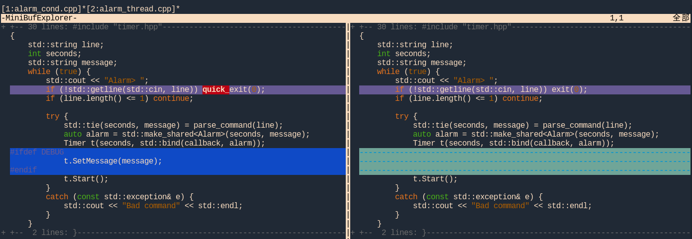

基于C++标准库实现定时器
=======================

定时器类是多线程编程中经常设计到的工具类  
简单的定时器原理其实很简单（是不是有点GNU is not unix的味道;）：

- 创建一个新线程
- 在那个线程里等待
- 等待指定时长后做任务

python标准库中就有这么一个定时器类：threading.Timer  
此类表示一个操作应该在等待一定的时间之后运行 --- 相当于一个定时器。  
Timer 类是 Thread 类的子类，因此可以像一个自定义线程一样工作。  
与线程一样，通过调用 start() 方法启动定时器。 而 cancel() 方法可以停止计时器（在计时结束前）。

例如：

```python
def hello():
    print("hello, world")

t = Timer(30.0, hello)
t.start()  # after 30 seconds, "hello, world" will be printed
```

**class threading.Timer(interval, function, args=None, kwargs=None)**
    创建一个定时器，在经过 interval 秒的间隔事件后，将会用参数 args 和关键字参数 kwargs 调用 function。  
    如果 args 为 None （默认值），则会使用一个空列表。如果 kwargs 为 None （默认值），则会使用一个空字典。

**start()**
    启动定时器。

**cancel()**
    停止定时器并取消执行计时器将要执行的操作。仅当计时器仍处于等待状态时有效。

接下来我将给出两种C++的Timer实现，接口类似于python的threading.Timer，不过精度为秒级的，其原因有二：

- 实现代码参考了Posix多线程编程里的alarm实例程序，为了方便大家对比C语言版本的实现，这里也以秒为单位
- 避免一上来过多的涉及C++标准库中`<chrono>`的用法，使代码逻辑更清晰的集中在定时器相关的部分

当然，作为一个在产品级代码中可用的Timer，精度至少应该在毫秒级才行，所以文章最后也会给出精度在微秒的代码实现的链接。

首先，给出C++版本的Timer的接口定义：  
几乎完全仿照python的threading.Timer,

```cpp
class Timer {
public:
    typedef std::function<void ()> Callback;

    Timer(int interval, Callback function); 
    void start();
    void cancel(); 
};
```

- Callback：类型为std::function<void ()>，即返回类型为void的“函数”，当然在C++里可以是普通函数，函数对象，lambda等。
- Timer(interval, function)：构造函数，创建一个Timer，interval秒后到期（相对于调用start函数时的时间点），回调函数为function。
- start()：启动定时器。
- cancel()：停止定时器并取消执行计时器将要执行的操作。

在给出C++的实现前，我们先给出测试驱动程序。测试驱动程序来源于《Posix多线程程序设计》（英文原版书名为Programming with POSIX Threads）里的闹钟实例程序。  
而我接下来的介绍顺序源于我的编码实现顺序，如下：

- 先给出书中基于pthread的多线程版本的实例代码，C代码
- 将C版本的代码转化成等价的python代码，基于threading.Timer接口实现的版本
- 将python版本的代码，转化成C++版本，并基于C++的Timer类接口，得到C++的Timer类的测试驱动代码
- 实现C++版的Timer类，并且编译测试驱动代码，运行验证

那么，我先给出基于pthread的多线程版本的实例代码，C代码：

```c
/*
 * alarm_fork.c
 *
 * This version of alarm.c uses pthread_create to create a
 * separate thread to wait for each alarm to expire.
 */
#include <pthread.h>
#include "errors.h"

typedef struct alarm_tag {
    int         seconds;
    char        message[64];
} alarm_t;

void *alarm_thread (void *arg)
{
    alarm_t *alarm = (alarm_t*)arg;
    int status;

    status = pthread_detach (pthread_self ());
    if (status != 0)
        err_abort (status, "Detach thread");
    sleep (alarm->seconds);
    printf ("(%d) %s\n", alarm->seconds, alarm->message);
    free (alarm);
    return NULL;
}

int main (int argc, char *argv[])
{
    int status;
    char line[128];
    alarm_t *alarm;
    pthread_t thread;

    while (1) {
        printf ("Alarm> ");
        if (fgets (line, sizeof (line), stdin) == NULL) exit (0);
        if (strlen (line) <= 1) continue;
        alarm = (alarm_t*)malloc (sizeof (alarm_t));
        if (alarm == NULL)
            errno_abort ("Allocate alarm");

        /*
         * Parse input line into seconds (%d) and a message
         * (%64[^\n]), consisting of up to 64 characters
         * separated from the seconds by whitespace.
         */
        if (sscanf (line, "%d %64[^\n]", 
            &alarm->seconds, alarm->message) < 2) {
            fprintf (stderr, "Bad command\n");
            free (alarm);
        } else {
            status = pthread_create (
                &thread, NULL, alarm_thread, alarm);
            if (status != 0)
                err_abort (status, "Create alarm thread");
        }
    }
}
```
代码的完整说明参见《Posix多线程程序设计》 1.5.3章节，这里就不再搬运原文了。

接下来是移植成python版本的代码：
```python
#!/usr/bin/env python3

from threading import Timer

class Alarm:
    def __init__(self, seconds:int, message:str):
        self.seconds = seconds
        self.message = message

def callback(alarm:Alarm):
    print("({}) {}\n".format(alarm.seconds, alarm.message))

if __name__ == "__main__":
    while True:
        line = input("Alarm> ")
        if len(line) <= 1:
            continue

        try:
            seconds, *message = line.split(' ')
            alarm = Alarm(int(seconds), ' '.join(message))
            t = Timer(interval=int(seconds), function=callback, args=(alarm, ))
            t.start()
        except:
            print("Bad command")

```
python版本的代码大家有兴趣的可以在本地运行一下，看看效果;)

再然后，我把这段代码翻译成C++版本的，基于C++的Timer类接口：
```cpp
#include "timer.hpp"
#include <cstdlib>
#include <string>
#include <memory>
#include <iostream>

struct Alarm {
    Alarm(int seconds_, const std::string& message_): 
        seconds(seconds_), message(message_) {
    }

    int seconds;
    std::string message;
};

void callback(std::shared_ptr<Alarm> alarm) {
    std::cout << "(" << alarm->seconds << ") " << alarm->message << std::endl;
}

std::tuple<int, std::string> parse_command(const std::string& line) {
    auto pos = line.find(' ');
    if (pos == std::string::npos)
        throw std::runtime_error("invalid line: separator not found");

    int seconds = std::stoi(line.substr(0, pos));
    std::string message = line.substr(pos+1);
    return std::make_tuple(seconds, message);
}

int main()
{
    std::string line;
    int seconds;
    std::string message;
    while (true) {
        std::cout << "Alarm> ";
        if (!std::getline(std::cin, line)) exit(0);
        if (line.length() <= 1) continue;

        try {
            std::tie(seconds, message) = parse_command(line);
            auto alarm = std::make_shared<Alarm>(seconds, message);
            Timer t(seconds, std::bind(callback, alarm));
            t.start();
        } 
        catch (const std::exception& e) {
            std::cout << "Bad command" << std::endl;
        }
    }
}
```
这样我们就有了C++版本Timer类的测试驱动程序，并且可以跟C和python版本的代码对比运行。

接下来给出C++版本的基于创建线程的Timer实现：
```cpp
#pragma once

#include <thread>
#include <chrono>
#include <atomic>
#include <functional>

class Timer {
public:
    typedef std::function<void ()> Callback;

    Timer(int interval, Callback function) {
        pimpl = std::make_shared<Impl>(interval, function);
    }

    void start() {
        std::thread t([pimpl=pimpl]() {
            if(!pimpl->active.load()) return;
            std::this_thread::sleep_for(std::chrono::seconds(pimpl->interval));
            if(!pimpl->active.load()) return;
            pimpl->function();
        });
        t.detach();
    }

    void cancel() {
        pimpl->active.store(false);
    }

private:
    struct Impl {
        Impl(int interval_, Callback function_): interval(interval_), function(function_) {}

        int interval;
        Callback function;
        std::atomic<bool> active{true};
    };

private:
    std::shared_ptr<Impl> pimpl;
};
```
C++实现部分，基本上是C版本的代码抽离和封装，并把相关函数替换成C++标准库的实现而已。不过Timer类麻雀虽小，但五脏俱全，其中用到的C++标准库组件有：
- std::function：用于抽象到期回调函数
- std::shared_ptr：用于管理Timer::Impl的生命周期
- std::atomic：用于cancel Timer的flag，保证线程安全
- std::thread：用于Timer线程，sleep指定时间，然后调用回调函数
- std::chrono：C++标准库中时间相关的实现都在其中
- C++ lambda：Timer线程的target函数，捕获了this->pimpl，保证了Timerl::Impl对象不会因为Timer对象的析构而析构

这里还用的了Pimpl惯用法，虽然目前是把接口和实现都放在了头文件里，但标准的做法是Timer的成员函数实现和Timer::Impl实现都放到源文件中，  
这样头文件里可以去掉除了std::shared_ptr和std::function以外的依赖。

这个Timer类的实现优缺点是十分明显的：优点是代码简洁，一目了然，缺点是太过简洁，每个Timer需要一个线程去运行，系统资源消耗大。  
于是就引出了基于条件变量版本的Timer，实现“参考”了《Posix多线程程序设计》3.3.4章节提到闹钟实例的最终版本（与其说“参考”，改成“直译”也不为过;）。

照例，我先给出基于pthread的条件变量版本的实例代码，C代码：
```c
/*
 * alarm_cond.c
 *
 * This is an enhancement to the alarm_mutex.c program, which
 * used only a mutex to synchronize access to the shared alarm
 * list. This version adds a condition variable. The alarm
 * thread waits on this condition variable, with a timeout that
 * corresponds to the earliest timer request. If the main thread
 * enters an earlier timeout, it signals the condition variable
 * so that the alarm thread will wake up and process the earlier
 * timeout first, requeueing the later request.
 */
#include <pthread.h>
#include <time.h>
#include "errors.h"

/*
 * The "alarm" structure now contains the time_t (time since the
 * Epoch, in seconds) for each alarm, so that they can be
 * sorted. Storing the requested number of seconds would not be
 * enough, since the "alarm thread" cannot tell how long it has
 * been on the list.
 */
typedef struct alarm_tag {
    struct alarm_tag    *link;
    int                 seconds;
    time_t              time;   /* seconds from EPOCH */
    char                message[64];
} alarm_t;

pthread_mutex_t alarm_mutex = PTHREAD_MUTEX_INITIALIZER;
pthread_cond_t alarm_cond = PTHREAD_COND_INITIALIZER;
alarm_t *alarm_list = NULL;
time_t current_alarm = 0;

/*
 * Insert alarm entry on list, in order.
 */
void alarm_insert (alarm_t *alarm)
{
    int status;
    alarm_t **last, *next;

    /*
     * LOCKING PROTOCOL:
     * 
     * This routine requires that the caller have locked the
     * alarm_mutex!
     */
    last = &alarm_list;
    next = *last;
    while (next != NULL) {
        if (next->time >= alarm->time) {
            alarm->link = next;
            *last = alarm;
            break;
        }
        last = &next->link;
        next = next->link;
    }
    /*
     * If we reached the end of the list, insert the new alarm
     * there.  ("next" is NULL, and "last" points to the link
     * field of the last item, or to the list header.)
     */
    if (next == NULL) {
        *last = alarm;
        alarm->link = NULL;
    }
#ifdef DEBUG
    printf ("[list: ");
    for (next = alarm_list; next != NULL; next = next->link)
        printf ("%d(%d)[\"%s\"] ", next->time,
            next->time - time (NULL), next->message);
    printf ("]\n");
#endif
    /*
     * Wake the alarm thread if it is not busy (that is, if
     * current_alarm is 0, signifying that it's waiting for
     * work), or if the new alarm comes before the one on
     * which the alarm thread is waiting.
     */
    if (current_alarm == 0 || alarm->time < current_alarm) {
        current_alarm = alarm->time;
        status = pthread_cond_signal (&alarm_cond);
        if (status != 0)
            err_abort (status, "Signal cond");
    }
}

/*
 * The alarm thread's start routine.
 */
void *alarm_thread (void *arg)
{
    alarm_t *alarm;
    struct timespec cond_time;
    time_t now;
    int status, expired;

    /*
     * Loop forever, processing commands. The alarm thread will
     * be disintegrated when the process exits. Lock the mutex
     * at the start -- it will be unlocked during condition
     * waits, so the main thread can insert alarms.
     */
    status = pthread_mutex_lock (&alarm_mutex);
    if (status != 0)
        err_abort (status, "Lock mutex");
    while (1) {
        /*
         * If the alarm list is empty, wait until an alarm is
         * added. Setting current_alarm to 0 informs the insert
         * routine that the thread is not busy.
         */
        current_alarm = 0;
        while (alarm_list == NULL) {
            status = pthread_cond_wait (&alarm_cond, &alarm_mutex);
            if (status != 0)
                err_abort (status, "Wait on cond");
            }
        alarm = alarm_list;
        alarm_list = alarm->link;
        now = time (NULL);
        expired = 0;
        if (alarm->time > now) {
#ifdef DEBUG
            printf ("[waiting: %d(%d)\"%s\"]\n", alarm->time,
                alarm->time - time (NULL), alarm->message);
#endif
            cond_time.tv_sec = alarm->time;
            cond_time.tv_nsec = 0;
            current_alarm = alarm->time;
            while (current_alarm == alarm->time) {
                status = pthread_cond_timedwait (
                    &alarm_cond, &alarm_mutex, &cond_time);
                if (status == ETIMEDOUT) {
                    expired = 1;
                    break;
                }
                if (status != 0)
                    err_abort (status, "Cond timedwait");
            }
            if (!expired)
                alarm_insert (alarm);
        } else
            expired = 1;
        if (expired) {
            printf ("(%d) %s\n", alarm->seconds, alarm->message);
            free (alarm);
        }
    }
}

int main (int argc, char *argv[])
{
    int status;
    char line[128];
    alarm_t *alarm;
    pthread_t thread;

    status = pthread_create (
        &thread, NULL, alarm_thread, NULL);
    if (status != 0)
        err_abort (status, "Create alarm thread");
    while (1) {
        printf ("Alarm> ");
        if (fgets (line, sizeof (line), stdin) == NULL) exit (0);
        if (strlen (line) <= 1) continue;
        alarm = (alarm_t*)malloc (sizeof (alarm_t));
        if (alarm == NULL)
            errno_abort ("Allocate alarm");

        /*
         * Parse input line into seconds (%d) and a message
         * (%64[^\n]), consisting of up to 64 characters
         * separated from the seconds by whitespace.
         */
        if (sscanf (line, "%d %64[^\n]", 
            &alarm->seconds, alarm->message) < 2) {
            fprintf (stderr, "Bad command\n");
            free (alarm);
        } else {
            status = pthread_mutex_lock (&alarm_mutex);
            if (status != 0)
                err_abort (status, "Lock mutex");
            alarm->time = time (NULL) + alarm->seconds;
            /*
             * Insert the new alarm into the list of alarms,
             * sorted by expiration time.
             */
            alarm_insert (alarm);
            status = pthread_mutex_unlock (&alarm_mutex);
            if (status != 0)
                err_abort (status, "Unlock mutex");
        }
    }
}
```

代码有些长，代码说明见《Posix多线程程序设计》3.3.4章节，我这里啰嗦几句，简单总结一下，基于条件变量实现定时器的原理：
- 程序维护了一个有序的定时器列表，顺序按照到期时间从小到大排列
- 独立的alarm_thread线程函数，实现定时器到期回调的逻辑，通过条件变量的pthread_cond_wait函数，处理定时器列表为空的情况，以及等待队列中最早的定时器到期，以及有更早的定时器插入队列的情况
- 函数alarm_insert函数，实现将定时器插入到定时器列表的逻辑，并在定时器列表原先为空的情况下，或者在插入的定时器到期时间早于定时间列表中最早到期时，通知alarm_thread线程，唤醒pthread_cond_wait函数。

由于基于pthread的条件变量版本的实例代码中，增加了DEBUG宏和调试代码，所以我的C++版本的测试驱动程序也需要做相应的调整：
```cpp
#include "timer.hpp"
#include <cstdlib>
#include <string>
#include <memory>
#include <iostream>

struct Alarm {
    Alarm(int seconds_, const std::string& message_): 
        seconds(seconds_), message(message_) {
    }

    int seconds;
    std::string message;
};

void callback(std::shared_ptr<Alarm> alarm) {
    std::cout << "(" << alarm->seconds << ") " << alarm->message << std::endl;
}

std::tuple<int, std::string> parse_command(const std::string& line) {
    auto pos = line.find(' ');
    if (pos == std::string::npos)
        throw std::runtime_error("invalid line: separator not found");

    int seconds = std::stoi(line.substr(0, pos));
    std::string message = line.substr(pos+1);
    return std::make_tuple(seconds, message);
}

int main()
{
    std::string line;
    int seconds;
    std::string message;
    while (true) {
        std::cout << "Alarm> ";
        if (!std::getline(std::cin, line)) quick_exit(0);
        if (line.length() <= 1) continue;

        try {
            std::tie(seconds, message) = parse_command(line);
            auto alarm = std::make_shared<Alarm>(seconds, message);
            Timer t(seconds, std::bind(callback, alarm));
#ifdef DEBUG
            t.set_message(message);
#endif
            t.start();
        } 
        catch (const std::exception& e) {
            std::cout << "Bad command" << std::endl;
        }
    }
}
```
其实修改就只有两处：
    - 将exit改成了quick_exit（因为下面的C++实现里，对应于C版本的alarm_thread线程是detach的，exit时会挂起在cond的wait上）
    - 增加t.set_message调用，用来打印debug信息



接下来给出条件变量版本的C++的Timer类实现，如果C版本的代码看得懂，那C++版本的代码就可以说是一目了然，毕竟C++的版本是“直译”过来的。

```cpp
#pragma once

#include <functional>
#include <memory>

class Timer {
public:
    typedef std::function<void ()> Callback;

    Timer(int interval, Callback function); 
    void start();
    void cancel(); 

#ifdef DEBUG
    void set_message(const std::string& message);
#endif

public:
    struct Impl; 

private:
    std::shared_ptr<Impl> pimpl;
};
```
首先来看Timer的头文件，这里就看出Pimpl惯用法的优势了，头文件里完全剥离了对`<chrono>、<thread>、<atomic>`的依赖。
另外，增加了set_message接口，用于实现C版本中DEBUG宏中的调试信息打印

下面是Timer的源文件，代码和C版本的一样，有点儿长：
```cpp
#include "timer.hpp"
#include <list>
#include <memory>
#include <chrono>
#include <atomic>
#include <mutex>
#include <condition_variable>
#include <thread>

#ifdef DEBUG
#include <iostream>
#endif

using Clock = std::chrono::system_clock;
using TimePoint = Clock::time_point; 
using Seconds = std::chrono::seconds;
using AlarmPtr = std::shared_ptr<Timer::Impl>;

#ifdef DEBUG
namespace {

std::ostream& operator<<(std::ostream& out, const TimePoint& tp) {
    using namespace std::chrono;
    auto d = duration_cast<seconds>(tp.time_since_epoch());
    out << d.count();
    return out;
}

template <typename Rep, typename Preiod>
std::ostream& operator<<(std::ostream& out, const std::chrono::duration<Rep, Preiod>& d) {
    using namespace std::chrono;
    auto s = duration_cast<seconds>(d);
    out << s.count();
    return out;
}

}   // namespace
#endif

class Timer::Impl {
public:
    Impl(int interval_, Callback function_): interval(interval_), function(function_) {
    }

    void setup_alarm() {
        time = Clock::now() + Seconds(interval);
    }

    int interval;
    Timer::Callback function;
    TimePoint time;
    std::atomic<bool> active{true};

#ifdef DEBUG
    std::string message;
#endif
};

class AlarmLooper {
public:
    AlarmLooper() = default; 
    AlarmLooper(const AlarmLooper&) = delete;
    void operator=(const AlarmLooper&) = delete;

    void thread_safety_insert(AlarmPtr alarm) {
        std::unique_lock<std::mutex> lock(alarm_mutex);
        insert(alarm);
    }

    void insert(AlarmPtr alarm);
    void run();

private:
    std::list<AlarmPtr> alarm_list;
    TimePoint current_alarm;
    std::mutex alarm_mutex;
    std::condition_variable alarm_cond;
};

/*
 * Insert alarm entry on list, in order.
 */
void AlarmLooper::insert(AlarmPtr alarm) {
    auto first = alarm_list.begin();
    auto last = alarm_list.end();

    /*
     * LOCKING PROTOCOL:
     * 
     * This routine requires that the caller have locked the
     * alarm_mutex!
     */
    for ( ; first != last; ++first) {
        if ((*first)->time >= alarm->time) {
            alarm_list.insert(first, alarm);
            break;
        }
    }

    /*
     * If we reached the end of the list, insert the new alarm there. 
     */
    if (first == last) {
        alarm_list.push_back(alarm);
    }
	
#ifdef DEBUG
    std::cout << "[list:";
    for (auto item : alarm_list) {
        std::cout << item->time << "(" << (item->time - Clock::now()) << ")[\""
                << item->message << "\"] ";
    }
    std::cout << "]\n" << std::flush;
#endif

    /*
     * Wake the alarm thread if it is not busy (that is, if
     * current_alarm is 0, signifying that it's waiting for
     * work), or if the new alarm comes before the one on
     * which the alarm thread is waiting.
     */
    if (current_alarm == TimePoint{} || alarm->time < current_alarm) {
        current_alarm = alarm->time;
        alarm_cond.notify_one();
    }
}

/*
 * The alarm thread's start routine.
 */
void AlarmLooper::run() {
    AlarmPtr alarm;
    TimePoint now;
    bool expired;
    std::cv_status status;

    /*
     * Loop forever, processing commands. The alarm thread will
     * be disintegrated when the process exits. Lock the mutex
     * at the start -- it will be unlocked during condition
     * waits, so the main thread can insert alarms.
     */
    std::unique_lock<std::mutex> lock(alarm_mutex);
    while (true) {
        /*
         * If the alarm list is empty, wait until an alarm is
         * added. Setting current_alarm to 0 informs the insert
         * routine that the thread is not busy.
         */
        current_alarm = TimePoint{};
        while (alarm_list.empty()) {
            alarm_cond.wait(lock);
        }

        alarm = alarm_list.front();
        alarm_list.pop_front();
        now = Clock::now();
        expired = false;
        if (alarm->time > now) {
#ifdef DEBUG
            std::cout << "[waiting: " << alarm->time << "(" << (alarm->time - Clock::now()) << ")\""
                << alarm->message << "\"\n" << std::flush; 
#endif
            current_alarm = alarm->time;
            while (current_alarm == alarm->time) {
                status = alarm_cond.wait_until(lock, alarm->time);
                if (status == std::cv_status::timeout) {
                    expired = true;
                    break;
                } 
            }
            if (!expired) {
                insert(alarm);
            }
        } else {
            expired = true;
        }

        if (expired) {
            if (alarm->active) {
                alarm->function();
            }
        }
    }
}

class TimerThread {
public:
    TimerThread(); 
    void insert_alarm(std::shared_ptr<Timer::Impl> timer);
    bool is_in_looper_thread() {
        return std::this_thread::get_id() == looper_thread.get_id();
    }

    static TimerThread& get_instance() {
        static TimerThread timer_thread;
        return timer_thread;
    }

private:
    AlarmLooper alarm_looper;
    std::thread looper_thread;
};

TimerThread::TimerThread() {
    looper_thread = std::thread(&AlarmLooper::run, &alarm_looper);
    looper_thread.detach();
}

void TimerThread::insert_alarm(std::shared_ptr<Timer::Impl> pimpl) {
    if (is_in_looper_thread()) {
        alarm_looper.insert(pimpl);
    } else {
        alarm_looper.thread_safety_insert(pimpl);
    }
}

Timer::Timer(int interval, Callback function) {
    pimpl = std::make_shared<Impl>(interval, function);
}

void Timer::start() {
    pimpl->setup_alarm();
    TimerThread::get_instance().insert_alarm(pimpl);
}

void Timer::cancel() {
    pimpl->active = false;
}

#ifdef DEBUG
void Timer::set_message(const std::string& message) {
    pimpl->message = message;
}
#endif
```

实现原理和C版本的一致（要不说是“直译”呢;），具体的映射关系如下：
- AlarmLooper类：封装了C版本的函数alarm_thread、alarm_insert逻辑，AlarmLooper::run对应alarm_thread，AlarmLooper::insert对应alarm_insert
- TimerThread类：作为单例类，管理运行AlarmLooper::run的线程
- 然后就是std::list替代了C手写的链表
- std::mutex和std::conditon_variable替代了pthread_mutex_t和pthread_cond_t结构体和函数。

最后，我来简单说明一下我为什么实现C++版本Timer类，以及可以改进优化的方向。  

理由方面：

- C版本的代码很优秀，通过将C版本的代码移植并封装成C++版本，可以提高我对timer实现的算法理解，封装过程也是对C++的OOP的一次实践
- 实现为Python的threading.Timer接口，则是认识到python接口的简洁性
- Timer类具备一定的通用性，可以在其他项目中复用，考虑到目前C++标准库（截至C++20）中还没有类似的timer类，以及其他第三方库（例如boost，libuv等）都相对比较重
- C++版本依赖于C++标准库，而C++标准库是跨平台的，所以Timer类也是跨平台的（当然，如果把C版本的pthread函数替换成C11标准库的线程函数也能达到同样目的）

改进方面：

- 条件变量版本的C++实现中，alarm_looper的线程是detach的，造成主线程exit时，alarm_looper的线程会因为cond的wait，把整个进程挂起，
  所以需要在AlarmLooper增加stop()接口及实现，使得可以通知AlarmLooper::run结束循环并返回（从而使alarm_looper的线程退出），然后，
  TimerThread类里，alarm_looper的线程不是detach的，而是在TimerThread类的析构函数里通知alarm_looper的线程stop，并join它。
- 到期时间的精度是秒级的，实际应用中往往需要更高精度的timer
- std::list可以替换某些已序的数据结构（比如std::multi_set）以提高性能，list的平均插入时间（保证有序的前提下）时O(n)的

最后的最后，给出文章中提到的所有代码的完整实现链接：
- 基于thread的C++的Timer类实现，精度秒级，[工程代码](https://github.com/hexu1985/Collection.Of.Cpp.Utility.Tools/tree/master/alarm/cxx/thread)
- 基于thread的C++的Timer类实现，精度微秒级，[工程代码](https://github.com/hexu1985/Collection.Of.Cpp.Utility.Tools/tree/master/code/threading.Timer/recipe-03)
- 基于条件变量的C++的Timer类实现，精度秒级，[工程代码](https://github.com/hexu1985/Collection.Of.Cpp.Utility.Tools/tree/master/alarm/cxx/cond)
- 基于条件变量的C++的Timer类实现，精度秒级，并增加了AlarmLooper的stop接口，[工程代码](https://github.com/hexu1985/Collection.Of.Cpp.Utility.Tools/tree/master/code/threading.Timer/recipe-02)
- 基于条件变量的C++的Timer类实现，精度微秒级，并增加了AlarmLooper的stop接口，[工程代码](https://github.com/hexu1985/Collection.Of.Cpp.Utility.Tools/tree/master/code/threading.Timer/recipe-04)

**2024/02/08日追加内容：**  
一般的Timer的接口都是支持一次性(alarm once)和周期性(alarm period)两种模式的，python的threading.Timer接口显然只支持alarm once模式，
虽然也可以通过在alarm once回调函数里再次创建timer的方式等价的实现alarm period模式，
不过我最近参考[A Simple Timer in C++](https://www.fluentcpp.com/2018/12/28/timer-cpp/)的接口，实现了支持alarm period模式的Timer，
这里也一并分享出来
- [A Simple Timer in C++](https://github.com/99xt/timercpp.git)原始版本：基于thread实现，接口为精度毫秒级，[工程代码](https://github.com/hexu1985/Collection.Of.Cpp.Utility.Tools/tree/master/code/timer/origin)
- 我的版本-1：基于thread实现，接口参数改成C++11的chrono::duration类型，[工程代码](https://github.com/hexu1985/Collection.Of.Cpp.Utility.Tools/tree/master/code/timer/recipe-01)
- 我的版本-2：基于条件变量实现，接口同A Simple Timer in C++，也为精度毫秒级，[工程代码](https://github.com/hexu1985/Collection.Of.Cpp.Utility.Tools/tree/master/code/timer/recipe-02)
- 我的版本-3：基于条件变量实现，接口同版本-1，接口参数改成C++11的chrono::duration类型，[工程代码](https://github.com/hexu1985/Collection.Of.Cpp.Utility.Tools/tree/master/code/timer/recipe-03)


### 参考文档：

- 《Posix多线程程序设计（Programming with POSIX Threads）》
- [3.11.0 Documentation » The Python Standard Library » Concurrent Execution » threading](https://docs.python.org/3/library/threading.html)
- [A Simple Timer in C++](https://www.fluentcpp.com/2018/12/28/timer-cpp/)

