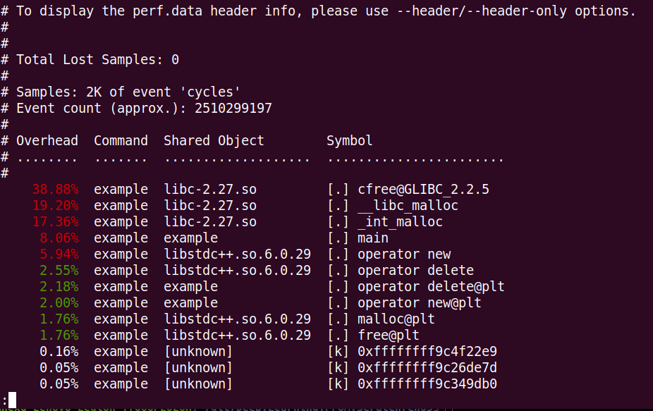
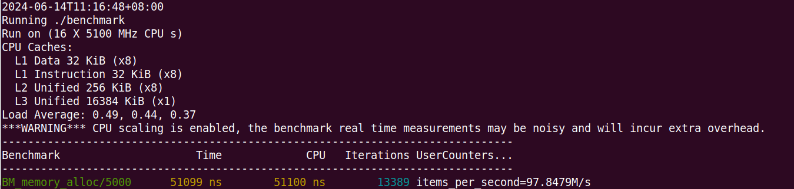
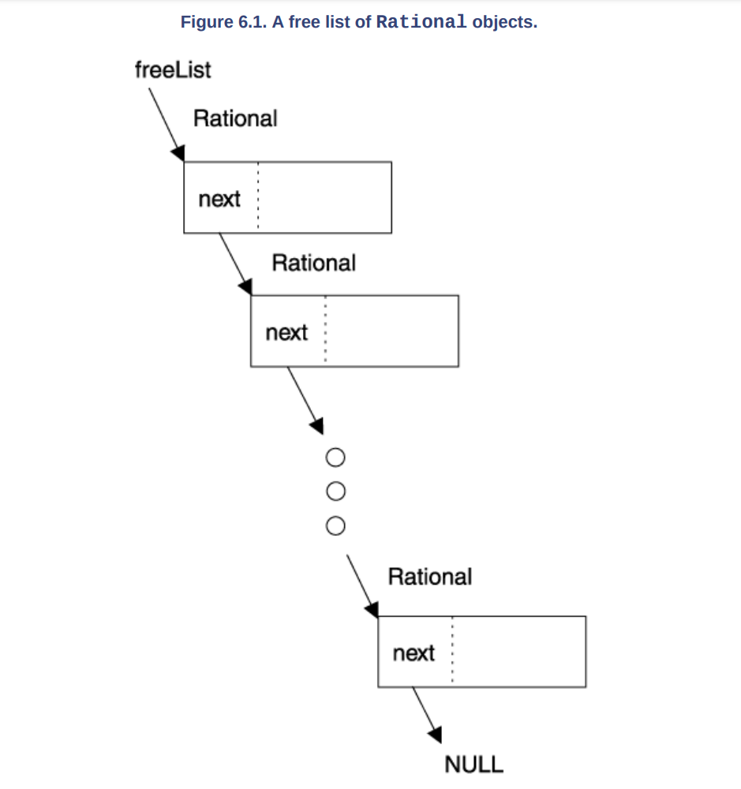
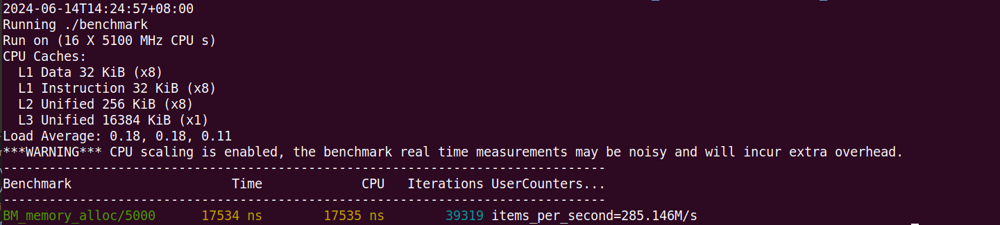
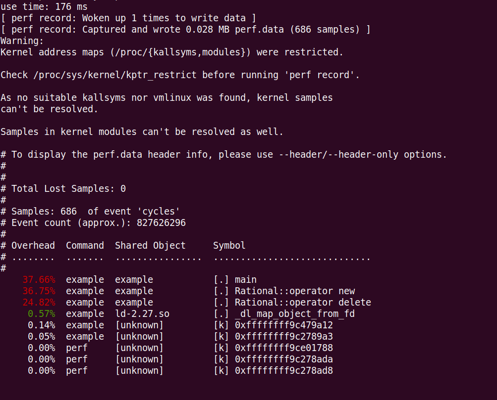
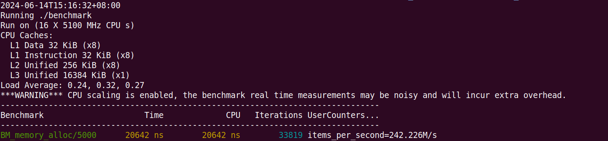
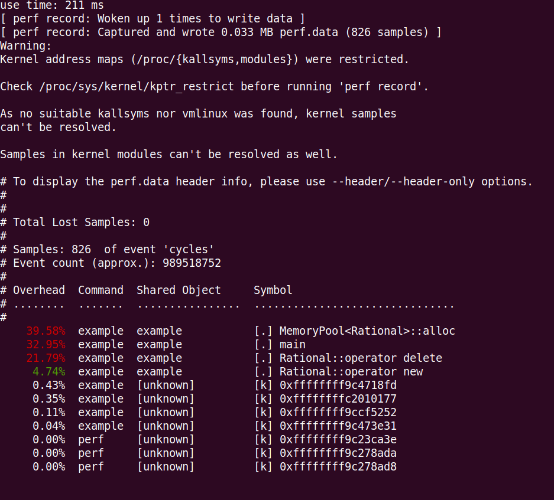
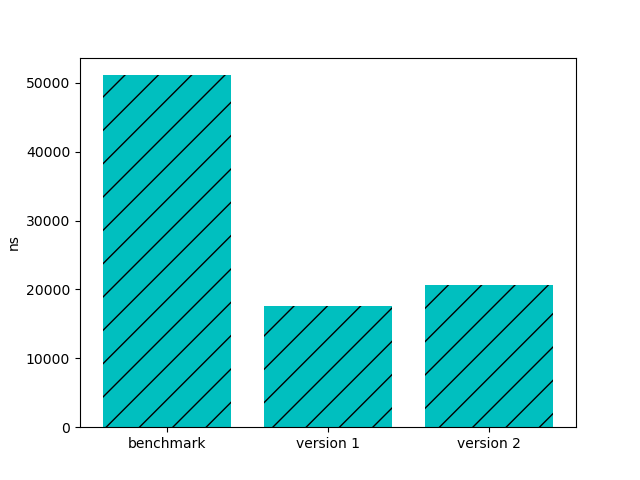

### C++性能优化之内存池

本篇文章不会一上来就介绍内存池的实现，也不会赘述内存池是如何提高性能，
以及“通用”内存管理为什么有额外开销，因为有很多书介绍这方面内容，且比我要讲得好。

本文旨在以内存池的实现为题，介绍一个简单的性能优化过程和常用的性能测试工具：
- linux的perf性能分析器
- Google Benchmark库

我们从性能优化的第一步开始：测试。这里的测试有如下几个目的：
- 发现性能的确不行：给出实际的时延或吞吐量，结合期望的时延或吞吐量，证明的确需要优化。
  这里引用高纳德老爷子那句名言：
  ```
  我们应当忘记小的性能改善，百分之九十七的情况下，过早优化都是万恶之源。
        ——高德纳
  ```
  只有通过测试数据，定量（而不是定性）分析，才能知道何时优化才不是过早优化。
- 找到性能热点：给出函数的时间占比，找到真正需要优化的函数或代码段。
- 获取基准性能测试数据：作为后续优化的基准数据，量化后续优化的性能提升，以及判断何时该停下继续优化的脚步。

我们这篇文章就是介绍内存优化的，所以我们会给出第一步的性能测试的完整例子，但跳过第一条（发现性能的确不行），
我们假设我们的确需要优化内存分配管理这块，但第二条和第三条还是会通过测试得出结论，证明性能热点的确在通用
的内存管理部分（标准库的 new()、delete() 以及 malloc() 和 free() 函数）。

**基准测试**

话已够多，还是先上代码吧（代码实现主要来自《Efficient C++: Performance Programming Techniques》，中文版叫《提高C++性能的编译技术》）。

假设我们有一个表示有理数的类，定义在rational.hpp头文件里：

```cpp
#pragma once

class Rational {
public:
	Rational(int a = 0, int b = 1): n(a), d(b) {}

private:
	int n;	// Numerator
	int d;	// Denominator
};
```

假设我们要反复申请和释放大量 Rational 对象，下面就给出基准性能测试代码: example.cpp

```cpp
#include <iostream>
#include <chrono>

#include "rational.hpp"

using namespace std;

int main()
{
	Rational* array[5000];

	// 此处开始计时
	auto start = chrono::steady_clock::now();

	for (int j = 0; j < 10000; j++) {
		for (int i = 0; i < 5000; i++) {
			array[i] = new Rational(i);
		}
		for (int i = 0; i < 5000; i++) {
			delete array[i];
		}
	}

	// 此处停止计时
	auto end = chrono::steady_clock::now();

	cout << "use time: " << chrono::duration_cast<chrono::milliseconds>(end-start).count() << " ms" << endl;

	return 0;
}
```

完整的工程链接在：[benchmark](https://github.com/hexu1985/Collection.Of.Cpp.Utility.Tools/tree/master/code/memory_pool/benchmark)

编译并运行代码：

```shell
$ clang++ -g -O3 -mavx2 -Wall -pedantic    example.cpp   -o example
$ ./example 
use time: 519 ms
```

单看这个实例运行输出的时延值，其实毫无意义，接下来，我们通过linux的perf性能分析器，先来找出热点函数，
具体命令如下：

```shell
$ sudo bash -c "echo -1 > /proc/sys/kernel/perf_event_paranoid"
$ perf record ./example
$ perf report --stdio
```

我们就会得到如下输出：



从这个结果来看，我们可以发现，90%的时间都花在了 new() 和 delete() 以及它们底层调用的 malloc() 和 free() 相关的内存管理函数上。
有了这个测试结果，我们才有必要进行优化内存管理和实现内存池的依据。
当然，这个测试代码是量身定做的，并不具备通用性，但实际项目中，通过linux性能分析工具perf发现性能热点的套路还是可以复用的。

接下来我们要测试具体的时延，作为性能优化的性能基准，虽然example.cpp中基于chrono::steady_clock的计时结果可以作为时延统计数据，
但我这里还是给出用更加专业的工具进行测试的结果：基于Google Benchmark库，Benchmark库的安装和使用这里不做介绍，
不熟悉的同学可以自行去网上搜索资料，或者直接访问<https://github.com/google/benchmark>。

我们将example.cpp中的内循环提取出来，独立成 new_delete_rational() 函数，得出使用Google Benchmark库测试的程序：benchmark.cpp

```cpp
#include <memory>

#include "rational.hpp"
#include "benchmark/benchmark.h"

void new_delete_rational(Rational* array[], int times) {
    for (int i = 0; i < times; i++) {
        array[i] = new Rational(i);
    }
    for (int i = 0; i < times; i++) {
        delete array[i];
    }
}

void BM_memory_alloc(benchmark::State& state) {
    int N = state.range(0);
    std::unique_ptr<Rational* []> array(new Rational* [N]);
    for (auto _ : state) {
        new_delete_rational(array.get(), N);
    }
    state.SetItemsProcessed(N*state.iterations());
}

#define ARGS ->Arg(5000)

BENCHMARK(BM_memory_alloc) ARGS;

BENCHMARK_MAIN();
```

编译并运行代码：

```shell
$ clang++ -o benchmark benchmark.cpp -g -O3 -mavx2 -Wall -pedantic -I/home/hexu/local/google_benchmark/include -Wl,-rpath,/home/hexu/local/google_benchmark/lib -Wl,--enable-new-dtags -L/home/hexu/local/google_benchmark/lib -pthread -lbenchmark
$ ./benchmark 
```

我们就会得到如下输出：



通过上面的结果，我们可以知道在特定CPU配置和系统负载情况下的 new_delete_rational() 的时延：51099 ns（由于是单线程模式下，墙上时钟和CPU时钟结果一样）。

有了基准测试数据，以及测试性能的统一方式，我们接下来就可以开始实现我们的内存池了。

**内存池版本1：专用 Rational 内存管理器**

为避免频繁地使用默认内存管理器，Rational 类要维护一个预先分配的 Rational 对象的静态连接列表，该列表列出空闲的可用对象。
当需要 Rational 对象时，可以从空闲列表中取出一个，使用后再把它放回空闲列表以便今后分配。

我们声明了一个辅助结构来连接空闲列表的相邻元素。

```cpp
class NextOnFreeList {
public:
    NextOnFreeList* next;
};
```

空闲列表被声明为一个由NextOnFreeList元素组成的列表。

```cpp
class Rational {
public:
    // ...

private:
	static NextOnFreeList* freeList;

private:
    // ...
};
```

虽然空闲列表的每个元素都声明为 NextOnFreeList 结构，但是它们仍然是 Rational 对象。
创建一个元素时，我们给它分配足够大的空间以包含 Rational 对象。
为了遍历对象，每个 Rational 对象的前几个字节均用于指向空闲列表的下一个对象。
我们可以通过把 Rational 对象转换成指向 NextOnFreeList 类型的指针来实现。

这样，该空闲列表有双重身份：其一是 Rational 对象内存的序列，其二是 NextOnFreeList 元素的序列。



将空闲列表声明为 Rational 类的静态成员， Rational 的操作符 new() 和 delete() 可以管理该静态列表。
这两个操作符重载了对应的全局操作符。

```cpp
class Rational {
public:
    enum { EXPANSION_SIZE = 32 };

	Rational(int a = 0, int b = 1): n(a), d(b) {}

	void* operator new(size_t size); 
	void operator delete(void* doomed, size_t size);

	static void newMemPool() { expandTheFreeList(); }
	static void deleteMemPool();

	static void expandTheFreeList();

private:
	static NextOnFreeList* freeList;

private:
	int n;	// Numerator
	int d;	// Denominator
};
```

new() 从空闲列表头部分配一个 Rational 对象所需的内存。如果列表为空，就扩展列表。

```cpp
void* Rational::operator new(size_t size) {
    if (nullptr == freeList) {
        expandTheFreeList();
    }

    NextOnFreeList* head = freeList;
    freeList = head->next;

    return head;
}
```

delete() 把 Rational 对象的内存直接添加到空闲列表的头部，以释放一个 Rational 对象内存。

```cpp
void Rational::operator delete(void* doomed, size_t size) {
    NextOnFreeList* head = static_cast<NextOnFreeList*>(doomed);

    head->next = freeList;
    freeList = head;
}
```

当空闲列表用完时，需要从堆上分配更多的 Rational 对象内存。

```cpp
void Rational::expandTheFreeList() {
	size_t size = (sizeof(Rational) > sizeof(NextOnFreeList*)) ?
		sizeof(Rational) : sizeof(NextOnFreeList*);

	NextOnFreeList* runner = reinterpret_cast<NextOnFreeList*>(new char[size]);

	freeList = runner;
	for (int i = 0; i < EXPANSION_SIZE; i++) {
		runner->next =
			reinterpret_cast<NextOnFreeList*>(new char[size]);
		runner = runner->next;
	}
	runner->next = nullptr;
}
```

完整的工程链接在：[recipe-01](https://github.com/hexu1985/Collection.Of.Cpp.Utility.Tools/tree/master/code/memory_pool/recipe-01)

编译并运行代码：

```shell
$ clang++ -o example example.cpp rational.cpp -g -O3 -mavx2 -Wall -pedantic
$ ./example 
use time: 168 ms
```

直观的看到，性能的确有一定的提升，我们再使用Google Benchmark库测试的程序跑一遍：

```shell
$ clang++ -o benchmark benchmark.cpp rational.cpp -g -O3 -mavx2 -Wall -pedantic -I/home/hexu/local/google_benchmark/include -Wl,-rpath,/home/hexu/local/google_benchmark/lib -Wl,--enable-new-dtags -L/home/hexu/local/google_benchmark/lib -pthread -lbenchmark
$ ./benchmark
```

我们就会得到如下输出：



17534 ns这个结果和基于chrono::steady_clock的计时统计是一致的。

然后我们再来看看热点分布。命令和之前的一样：

```shell
$ sudo bash -c "echo -1 > /proc/sys/kernel/perf_event_paranoid"
$ perf record ./example
$ perf report --stdio
```

运行命令，我们会得到如下输出：



对比之前的热点分析结果，我发现两件事情：
- main() 函数的时间占比从8.06%提升到37.66%：由于测试程序总用时下降，main() 函数占比占高是正常的。
- malloc() 和 free() 函数的相关项消失了：由于我们自己实现了内存管理，所以 malloc() 和 free() 的调用次数明显下降。

虽然为 Rational 专用定制的内存管理，不是最优实现，但也达到了性能提升的目的，而且我们通过测试工具和测试数据验证了优化的效果。

作为C++语言实现的内存池，是不可能绕开模板（template）的，文章的最后，我们给出基于模板实现的“固定大小对象的内存池”。

**版本2：固定大小对象的内存池**

由于几乎是把版本1的代码直译成模板形式，所以我就话不多说，直接上代码吧：

memory_pool.hpp函数里，定义了 MemoryPool 模板类，模板参数类型 T 指定了内存池的对象类型（其实只依赖了对象的大小而已）。

```cpp
#pragma once

#include <cstddef>
#include <new>

template <class T>
class MemoryPool {
public:
	MemoryPool(size_t size = EXPANSION_SIZE);
	virtual ~MemoryPool();

	inline void* alloc(size_t size);
	inline void free(void* someElement);

private:
    struct MemoryChunk {
        MemoryChunk* next;
    };

    MemoryChunk* freeList = nullptr;
	
	enum { EXPANSION_SIZE = 32 };

	void expandTheFreeList(int howMany = EXPANSION_SIZE);
};

template <class T>
MemoryPool<T>::MemoryPool(size_t size) {
	expandTheFreeList(size);
}

template <class T>
MemoryPool<T>::~MemoryPool() {
	for (MemoryChunk* nextPtr = freeList; freeList != nullptr; nextPtr = freeList) {
		freeList = freeList->next;
		delete [] reinterpret_cast<char*>(nextPtr);
	}
}

template <class T>
void* MemoryPool<T>::alloc(size_t) {
	if (!freeList) {
		expandTheFreeList();
	}

	MemoryChunk* head = freeList;
	freeList = head->next;

	return head;
}

template <class T>
void MemoryPool<T>::free(void* doomed) {
	MemoryChunk* head = static_cast<MemoryChunk*>(doomed);

	head->next = freeList;
	freeList = head;
}

template <class T>
void MemoryPool<T>::expandTheFreeList(int howMany) {
	size_t size = (sizeof(T) > sizeof(MemoryChunk*)) ?
		sizeof(T) : sizeof(MemoryChunk*);

	MemoryChunk* runner = reinterpret_cast<MemoryChunk*>(new char[size]);

	freeList = runner;
	for (int i = 0; i < howMany; i++) {
		runner->next =
			reinterpret_cast<MemoryChunk*>(new char[size]);
		runner = runner->next;
	}
	runner->next = nullptr;
}
```

rational.hpp里 Rational 类的调整是：不再需要维护它自己的空闲列表。这项任务委托给了 MemoryPool 类。

```cpp
#pragma once

#include "memory_pool.hpp"

class Rational {
public:
	Rational(int a = 0, int b = 1): n(a), d(b) {}

	void* operator new(size_t size); 
	void operator delete(void* doomed, size_t size); 

	static void newMemPool() { memPool = new MemoryPool<Rational>(64); }
	static void deleteMemPool() { delete memPool; }

private:
	static MemoryPool<Rational>* memPool;

private:
	int n;	// Numerator
	int d;	// Denominator
};
```

至于性能测试代码，几乎没有变化。

完整的工程链接在：[recipe-02](https://github.com/hexu1985/Collection.Of.Cpp.Utility.Tools/tree/master/code/memory_pool/recipe-02)

编译并运行代码：

```shell
$ clang++ -o example example.cpp rational.cpp -g -O3 -mavx2 -Wall -pedantic
$ ./example 
use time: 202 ms
```

直观的看到，性能相比针对 Rational 专用的内存管理器，性能略微有所下降，原因分析是因为多了一层 MemoryPool 的成员函数调用的开销。

我们再使用Google Benchmark库测试的程序跑一遍：

```shell
$ clang++ -o benchmark benchmark.cpp rational.cpp -g -O3 -mavx2 -Wall -pedantic -I/home/hexu/local/google_benchmark/include -Wl,-rpath,/home/hexu/local/google_benchmark/lib -Wl,--enable-new-dtags -L/home/hexu/local/google_benchmark/lib -pthread -lbenchmark
$ ./benchmark
```

我们就会得到如下输出：



20642 ns这个结果和基于chrono::steady_clock的计时统计是一致的。

然后我们再来看看热点分布。命令和之前的一样：

```shell
$ sudo bash -c "echo -1 > /proc/sys/kernel/perf_event_paranoid"
$ perf record ./example
$ perf report --stdio
```

运行命令，我们会得到如下输出：



对比版本1的热点分析结果，我又发现了两件事情：
- new() 加上 MemoryPool::alloc() 的时间略微大于 Rational 专用内存管理版本的 new()，印证了我说的多一层函数调用的开销。
- 没有发现 MemoryPool::free() 的时间占比，以及 delete() 的时间和 Rational 专用内存管理版本的 delete() 时间大致相同，
  猜测是因为 MemoryPool::free() 被 inline 到了 delete() 里。

至此，我们将三种版本（基准版本、版本1、版本2）的性能数据（Google Benchmark给出）结果可视化显示出来：



**总结**

性能优化需要测试数据和测试工具（方法）的支撑，无论是发现性能瓶颈，还是验证性能优化效果。

本篇文章就到此结束，感谢各位同学的阅读。

为了完整性，我还列出了这里没介绍的其他版本的线程池的实现：
- 单线程内存池--版本3：可变大小内存管理器 [recipe-03](https://github.com/hexu1985/Collection.Of.Cpp.Utility.Tools/tree/master/code/memory_pool/recipe-03)
- 单线程内存池--版本2：固定大小对象的内存池，非模板实现 [recipe-04](https://github.com/hexu1985/Collection.Of.Cpp.Utility.Tools/tree/master/code/memory_pool/recipe-04)
- 多线程内存池 [recipe-05](https://github.com/hexu1985/Collection.Of.Cpp.Utility.Tools/tree/master/code/memory_pool/recipe-05)
- 单线程内存池：固定大小对象的内存池，内存池的大小也是编译期指定的，模板实现 [recipe-06](https://github.com/hexu1985/Collection.Of.Cpp.Utility.Tools/tree/master/code/memory_pool/recipe-06)


**参考文档：**
- 《提高C++性能的编译技术》（Efficient C++: Performance Programming Techniques）
- Google Benchmark: <https://github.com/google/benchmark>
