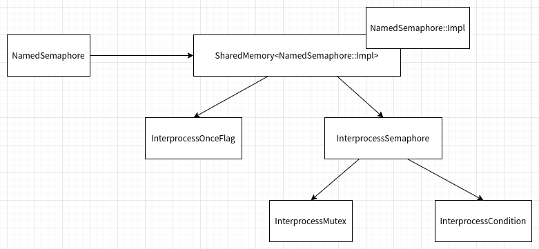

## Posix信号量的C++接口设计与实现

本文介绍一种Posix信号量的实现，以及对应C++类封装和接口。

信号量的实现原理主要参考《UNIX网络编程卷2  进程间通信  (第2版)》这本书中的
10.15章节，使用内存映射I/O实现信号量。不过底层改成了基于共享内存的实现，
而共享内存部分，则是复用了《C++封装Posix API之共享内存》文章中SharedMemory模板类。
除此之外，C++类封装的Posix信号量接口，参考了boost库的类和接口命名。


出于完整性的考虑，我还是会给出Posix信号量的基本介绍，完整的介绍可以参考《UNIX网络编程卷2  进程间通信  (第2版)》这本书。

**POSIX信号量**

POSIX信号量进程是3种 IPC(Inter-Process Communication) 机制之一，3种 IPC 机制源于 POSIX.1 的实时扩展。
Single UNIX Specification 将3种机制（消息队列，信号量和共享存储）置于可选部分中。
在 SUSv4 之前，POSIX 信号量接口已经被包含在信号量选项中。
在 SUSv4 中，这些接口被移至了基本规范，而消息队列和共享存储接口依然是可选的。

信号量是一种用于进程或线程间同步和互斥的机制。
它是一种计数器，用于统计当前可用资源的数量，控制对共享资源的访问。
信号量可以用于多个进程或线程之间的同步操作，以确保它们按照预期的顺序执行。

信号量的值可以是任意非负整数。当一个进程或线程需要访问一个共享资源时，它会尝试对信号量进行操作。
信号量的操作包括等待（wait）和发送（post）。

- 等待操作（wait）：申请资源时，如果信号量的值大于0，表示资源可用，进程或线程可以继续执行，并将信号量的值减1。
  如果信号量的值为0，表示资源不可用，进程或线程会被阻塞等待，直到信号量的值大于0。（P操作）

- 发送操作（post）：释放资源时，将信号量的值加1，并唤醒等待该信号量的进程或线程。
  这样，其他进程或线程就可以继续执行。（V操作）

接下来，我就按照自顶向下，从接口到实现，从实现到使用示例的顺序介绍NamedSemaphore类

**NamedSemaphore类的介绍**

首先给出NamedSemaphore类的定义：

named_semaphore.hpp
```cpp
#include "interprocess_semaphore.hpp"
#include "shared_memory.hpp"
#include "interprocess_once.hpp"

class NamedSemaphore {
public:
    NamedSemaphore() noexcept;
    ~NamedSemaphore();

    NamedSemaphore(NamedSemaphore&& other); 
    NamedSemaphore& operator= (NamedSemaphore&& other); 

    void post();
    void wait();
    bool try_wait();
    int get_value();

    static bool exists(const char* name) noexcept;
    static bool remove(const char* name) noexcept;

    static NamedSemaphore create_only(const char* name, unsigned int value);
    static NamedSemaphore open_or_create(const char* name, unsigned int value);
    static NamedSemaphore open_only(const char* name);

private:
    NamedSemaphore(const NamedSemaphore&) = delete;
    NamedSemaphore& operator= (const NamedSemaphore&) = delete;

    struct Impl {
        InterprocessOnceFlag once_flag;
        InterprocessSemaphore semaphore;
    };

    explicit NamedSemaphore(SharedMemory<Impl>&& impl);
    NamedSemaphore(SharedMemory<Impl>&& impl, unsigned int value);

private:
    SharedMemory<Impl> impl_;
};
```

我们根据NamedSemaphore类的头文件可以看出支持以下接口：
- 首先NamedSemaphore类支持默认构造，也就是说一个空的信号量，在空的信号量上的任何操作（成员函数）都是未定义的。
- 静态成员函数create_only、open_or_create、open_only，简单的工厂函数，创建或打开有名信号量，对应于POSIX的sem_open接口。
- 移动构造函数和移动赋值运算符，配合工厂函数，创建和移动有名信号量
- 成员函数wait和try_wait，实现等待操作（wait），对应于POSIX的sem_wait、sem_trywait接口。
- 成员函数post，发送操作（post），对应于POSIX的sem_post接口。
- 成员函数get_value，返回信号量计数器的当前值，对应于POSIX的sem_getvalue接口。
- 静态成员函数exists，判断指定有名信号量是否存在。
- 镜头成员函数remove，删除指定有名信号量，对应于POSIX的sem_unlink接口。


首先，给出NameSemaphore类实现的依赖关系，如下图：



