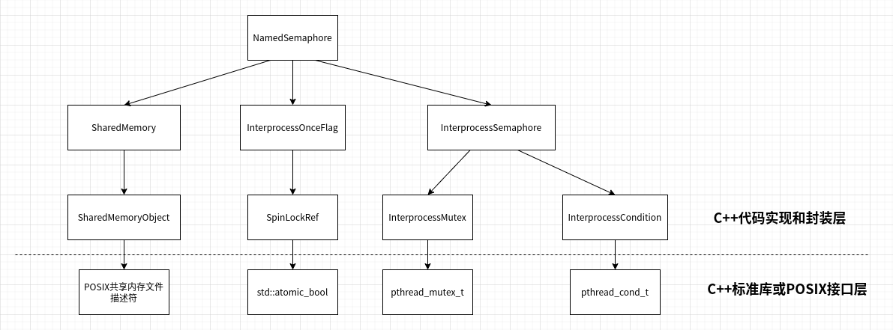

## Posix信号量的C++类设计与实现

本文介绍Posix信号量的一种实现，以及对应C++类的接口与实现。

信号量的实现原理主要参考了《UNIX网络编程卷2  进程间通信  (第2版)》这本书中的
10.15章节，书中是使用内存映射I/O实现信号量，而我这里是改成了基于共享内存的实现，
而共享内存的功能部分，则是复用了《C++封装Posix API之共享内存》文章中SharedMemory模板类。
除此之外，C++类封装的Posix信号量接口命名，参考了boost库的信号量类的接口命名。


出于完整性的考虑，我还是会给出Posix信号量的基本介绍，更详细的说明可以参考《UNIX网络编程卷2  进程间通信  (第2版)》这本书。

**POSIX信号量**

POSIX信号量进程是3种 IPC(Inter-Process Communication) 机制之一，3种 IPC 机制源于 POSIX.1 的实时扩展。
Single UNIX Specification 将3种机制（消息队列，信号量和共享存储）置于可选部分中。
在 SUSv4 之前，POSIX 信号量接口已经被包含在信号量选项中。
在 SUSv4 中，这些接口被移至了基本规范，而消息队列和共享存储接口依然是可选的。

信号量是一种用于进程或线程间同步和互斥的机制。
它是一种计数器，用于统计当前可用资源的数量，控制对共享资源的访问。
信号量可以用于多个进程或线程之间的同步操作，以确保它们按照预期的顺序执行。

信号量的值可以是任意非负整数。当一个进程或线程需要访问一个共享资源时，它会尝试对信号量进行操作。
信号量的操作包括等待（wait）和发送（post）。

- 等待操作（wait）：申请资源时，如果信号量的值大于0，表示资源可用，进程或线程可以继续执行，并将信号量的值减1。
  如果信号量的值为0，表示资源不可用，进程或线程会被阻塞等待，直到信号量的值大于0。（P操作）

- 发送操作（post）：释放资源时，将信号量的值加1，并唤醒等待该信号量的进程或线程。
  这样，其他进程或线程就可以继续执行。（V操作）

接下来，我就按照自顶向下，从接口到实现，从实现到使用示例的顺序介绍NamedSemaphore类

**NamedSemaphore类的介绍**

首先给出NamedSemaphore类的定义：

named_semaphore.hpp
```cpp
#include "interprocess_semaphore.hpp"
#include "shared_memory.hpp"
#include "interprocess_once.hpp"

class NamedSemaphore {
public:
    NamedSemaphore() noexcept;
    ~NamedSemaphore();

    NamedSemaphore(NamedSemaphore&& other); 
    NamedSemaphore& operator= (NamedSemaphore&& other); 

    void post();
    void wait();
    bool try_wait();
    int get_value();

    static bool exists(const char* name) noexcept;
    static bool remove(const char* name) noexcept;

    static NamedSemaphore create_only(const char* name, unsigned int value);
    static NamedSemaphore open_or_create(const char* name, unsigned int value);
    static NamedSemaphore open_only(const char* name);

private:
    NamedSemaphore(const NamedSemaphore&) = delete;
    NamedSemaphore& operator= (const NamedSemaphore&) = delete;

    struct Impl {
        InterprocessOnceFlag once_flag;
        InterprocessSemaphore semaphore;
    };

    explicit NamedSemaphore(SharedMemory<Impl>&& impl);
    NamedSemaphore(SharedMemory<Impl>&& impl, unsigned int value);

private:
    SharedMemory<Impl> impl_;
};
```

我们根据NamedSemaphore类的头文件可以看出支持以下接口：
- 首先NamedSemaphore类支持默认构造，也就是说一个空的信号量，在空的信号量上的任何操作（成员函数）都是未定义的。
- 静态成员函数create_only、open_or_create、open_only，是简单的工厂函数，用于创建或打开有名信号量，对应于POSIX的sem_open接口。
- 移动构造函数和移动赋值运算符，配合工厂函数，创建和移动有名信号量
- 成员函数wait和try_wait，实现等待操作（wait），对应于POSIX的sem_wait、sem_trywait接口。
- 成员函数post，发送操作（post），对应于POSIX的sem_post接口。
- 成员函数get_value，返回信号量计数器的当前值，对应于POSIX的sem_getvalue接口。
- 静态成员函数exists，判断指定有名信号量是否存在。
- 镜头成员函数remove，删除指定有名信号量，对应于POSIX的sem_unlink接口。

然后我们看看NamedSemaphore的实现，首先是成员变量，NamedSemaphore类就包含一个成员变量`impl_`，
这个成员变量是一个`SharedMemory<Impl>`类型的对象，而Impl是一个嵌套在NamedSemaphore类中的结构体，
该结构体又包含两个成员变量：once_flag和semaphore，semaphore是一个InterprocessSemaphore类的对象，
这个类对应于无名信号量（支持进程间共享），once_flag是InterprocessOnceFlag类的对象，
目的是防止多进程创建同名的有名信号量时的条件竞争，具体的说，
是为了保证`impl_.semaphore`对象的构造函数被调用且只调用一次，功能类似于pthread_once函数的功能，
但是要支持多进程环境。

NamedSemaphore类的完整实现代码，这里就不贴出来了（文章最后会给出完整工程代码的github链接），
我们只给出两个片段来说明NamedSemaphore实现的基本思路，其他成员函数的实现类似。

首先，给出创建一个新的NamedSemaphore的过程和实现步骤，
一般创建一个新的NamedSemaphore的客户代码类似如下：

```cpp
// 只创建
NamedSemaphore sem{NamedSemaphore::create_only(FLAGS_name.c_str(), FLAGS_initial_value)};

// 创建或打开
NamedSemaphore sem{NamedSemaphore::open_or_create(FLAGS_name.c_str(), FLAGS_initial_value)};
```

这段用户代码，先调用了NamedSemaphore::create_only（或者NamedSemaphore::open_or_create）创建一个
NamedSemaphore对象，并通过NamedSemaphore的移动构造函数，把资源转移到sem对象。

我们以看一下NamedSemaphore里的相关函数的实现：

```cpp
NamedSemaphore NamedSemaphore::create_only(const char* name, unsigned int value) {
    return NamedSemaphore{SharedMemory<Impl>::create_only(name), value};
}

NamedSemaphore NamedSemaphore::open_or_create(const char* name, unsigned int value) {
    return NamedSemaphore{SharedMemory<Impl>::open_or_create(name), value};
}

NamedSemaphore::NamedSemaphore(SharedMemory<Impl>&& impl, unsigned int value): impl_(std::move(impl)) {
    InterprocessOnceFlag& once_flag = impl_.get().once_flag;
    InterprocessSemaphore* semaphore = &impl_.get().semaphore;
    interprocess_call_once(once_flag, [semaphore, value]() { new (semaphore) InterprocessSemaphore(value); });
}
```

NamedSemaphore::create_only（或者NamedSemaphore::open_or_create）做的事情就是
先创建了共享内存`SharedMemory<Impl>`对象，然后把`SharedMemory<Impl>`对象move给NamedSemaphore的一个私有构造函数，
这个私有构造函数就是利`impl_.once_flag`（InterprocessOnceFlag）的功能，保证`impl_.semaphore`被构造，并且只被构造一回。


然后我们再看看信号量的发送操作（post）接口实现：

```cpp
void NamedSemaphore::post() {
    return impl_.get().semaphore.post();
}
```

我们发现该接口就是利用SharedMemory，将调用转发到共享内存上的InterprocessSemaphore::post。

接下来，我们就会根据类的依赖关系，对实现代码自顶向下的一路剖析下去，
比如，我们会先看SharedMemory、InterprocessOnceFlag和InterprocessSemaphore类的接口和实现。
至于剖析到哪一个层面才算尽头呢？就本文来说，最底层会追溯到POSIX接口或C++标准库。

为了不至于迷失在底层类的具体实现中，我先给出NamedSemaphore类实现的依赖关系，
我这里按层级简单的划分了一下，如下图：



以这张图为索引，我将从上到下分别介绍。

首先是，SharedMemory类，针对这个类，我之前有文章完整介绍了实现，这里就不重复介绍了，
有兴趣的同事可以看一下《C++封装Posix API之共享内存》这篇文章。

[SharedMemory的完整的工程代码](https://github.com/hexu1985/Collection.Of.Cpp.Utility.Tools/tree/master/code/shared_memory/recipe-04/src)


接下来我将介绍InterprocessOnceFlag类。

**InterprocessOnceFlag类的介绍**

前面介绍过，在NamedSemaphore类实现里，是通过InterprocessOnceFlag类的对象，来保证
是为了保证`impl_.semaphore`对象的构造函数被调用且只调用一次。

并且提到InterprocessOnceFlag功能类似于pthread_once函数的功能，那我们就先看看
InterprocessOnceFlag类的定义和相关接口：

interprocess_once.hpp
```cpp
#pragma once

#include <atomic>
#include <functional>

static_assert(ATOMIC_BOOL_LOCK_FREE == 2, "atomic_bool need lock free");

struct InterprocessOnceFlag {
    std::atomic_bool lock{false};
    int execute_state = 0;
};

void interprocess_call_once(InterprocessOnceFlag& flag, std::function<void()> fn);
```

InterprocessOnceFlag类包含两个成员变量：lock和execute_state，其中
lock是个std::atomic_bool类型，用于实现进程间同步锁，所以这里要求std::atomic_bool本身是lock_free的，
通过下面的编译期检查保证：

```cpp
static_assert(ATOMIC_BOOL_LOCK_FREE == 2, "atomic_bool need lock free");
```

通过interprocess_call_once函数，我们将需要执行且只执行一次的函数和InterprocessOnceFlag对象关联起来，
而这个接口可以看出跟pthread_once非常相似。所以使用上也是非常类似。

接下来我将介绍interprocess_call_once函数的实现：

interprocess_once.cpp
```cpp
#include "interprocess_once.hpp"

#include <thread>
#include <mutex>
#include <chrono>

using namespace std::literals;

namespace {

class SpinLockRef {
public:
    SpinLockRef(std::atomic_bool& flag): flag_(flag) {
    }

    void lock() {
        while (flag_.exchange(true, std::memory_order_acquire)) {
            std::this_thread::yield();
        }
    }

    void unlock() {
        flag_.store(false, std::memory_order_release);
    }

    bool try_lock() {
        return !flag_.exchange(true, std::memory_order_acquire);
    }

private:
    std::atomic_bool& flag_;
};

enum class ExecuteState {
    Not_yet_executed = 0,
    Executing = 1,
    Executed = 2,
};

}   // namespace

void interprocess_call_once(InterprocessOnceFlag& flag, std::function<void()> fn) {
    SpinLockRef lock(flag.lock);
    while (true) {
        std::unique_lock<SpinLockRef> scoped_lock(lock);

        int& execute_state = flag.execute_state;
        if (execute_state == (int) ExecuteState::Executed) {
            break;
        }

        if (execute_state == (int) ExecuteState::Executing) {
            scoped_lock.unlock();
            std::this_thread::sleep_for(10us);
            continue;
        }

        if (execute_state == (int) ExecuteState::Not_yet_executed) {
            execute_state = (int) ExecuteState::Executing;
        }

        try {
            fn();
            execute_state = (int) ExecuteState::Executed;
            break;
        } catch (...) {
            execute_state = (int) ExecuteState::Not_yet_executed;
            throw;  // rethrow
        }
    }
}
```

interprocess_call_once函数就是一个大循环：
- 循环里先通过`flag.lock`获取同步锁，这里是通过std::atomic_bool实现了一个自旋锁。
- 获取到锁的进程会检查`flag.execute_state`，而execute_state会处于三种状态之一：`Not_yet_executed` 、 `Executing` 和 `Executed`
    + 如果execute_state当前状态是`Executed`，说明一次性函数`fn`已经被正常执行过了（没抛出异常）
    + 如果execute_state当前状态是`Executing`，说明有另外一个进程正在执行`fn`函数，
      所以当前进程选择解开同步锁，并sleep一小段时间（这里可以优化），然后进入下一次循环，重新获取同步锁并检查状态
    + 如果execute_state当前状态是`Not_yet_executed`，说明还没有其他进程执行一次性函数`fn`，
      所以当前进程将execute_state设置成`Executing`状态，然后调用`fn`，如果调用成功，则把execute_state设置成`Executed`，
      如果`fn`抛出异常，则把execute_state设置成`Not_yet_executed`，然后在把异常rethrow。

至于SpinLockRef类的实现，就是一个自旋锁实现，有兴趣的可以参考书《C++并发编程实战》的5.2.2章节。

