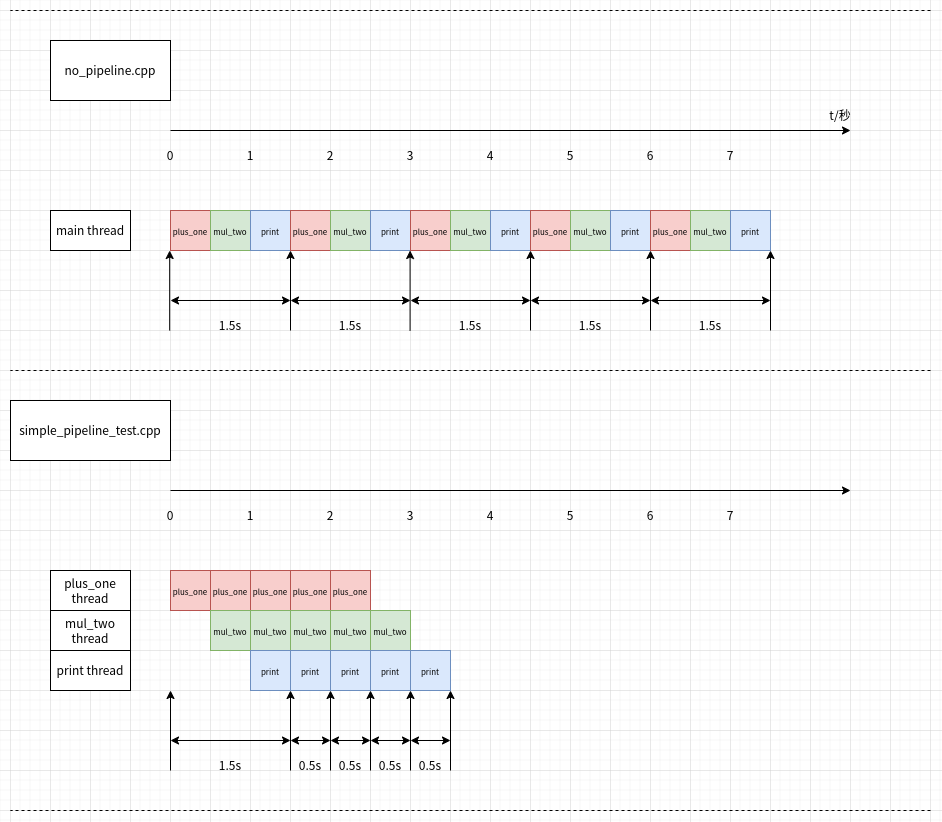

基于C++标准库实现流水线模式
===========================

本文将介绍一个C++实现的流水线模式，包括相关的接口和类框架：

### 流水线的原理

首先，我们给出流水线模式的定义，这里引用《Programming with POSIX® Threads》（David R. Butenhof）里
的原话给出解释：

> Pipeline
>
> In pipelining, a stream of “data items” is processed serially by an ordered set
> of threads (Figure 4.1). Each thread performs a specific operation on each item in
> sequence, passing the data on to the next thread in the pipeline.
>
> For example, the data might be a scanned image, and thread A might process
> an image array, thread B might search the processed data for a specific set of features, and thread C might collect the serial stream of search results from thread B
> into a report. Or each thread might perform a single step in some sequence of
> modifications on the data.


概括的说，有一组线程，每个线程反复地在数据系列集上执行同一种操作，
并把操作结果传递个下一个步骤的其他线程，这就是“流水线”方式。

了解了流水线模式的定义，接下来，我们用面向对象的方式，拆分流水线中的各个对象（角色或类）。包括：
- 数据源（data source）
- 管道（pipe）
- 过滤器（data filter）
- 数据接收（data sink）

这几种对象在图中(Figure 4.1)的对应关系标注如下：


用“管道和过滤器”这组对象重述的“流水线”工作模式就是：

> 系统整体的任务可以根据不同的处理阶段分解成单一的小任务。
> 每一个加工步骤都可以通过一个过滤器实现。
> 每两个过滤器通过一个管道进行连接。
> 过滤器读取数据并按照顺序加工数据。
> 过滤器读入数据经过转换，变成输出的数据。

而数据源、过滤器和数据接收之间的通过管道连接的方式，也将“流水线”方式重新表示成下图：


当然这张图（图5-15）相比前面的图(Figure 4.1)，做了简化，把原先的三个过滤器简化成了一个，
在实际应用中，过滤器的个数应该是没有限制的。

### C++语言实现

接下来，我们逐步给出C++语言实现的流水线模式

**STEP1**

我先给出类图，便于后面讲解代码。


类图中的类名称几乎和“流水线”模式里的对象命名一一对应，
除了一个ProcessNode（工作节点）接口类，这个类是为了便于
Pipeline类可以在一个vector里统一管理数据源、过滤器和数据接收对象而抽出的接口基类。

**STEP2**

在给出C++实现源码之前，我们先给出一个C风格（基于函数调用链）的示例代码，
这么做出于两方面考虑：
- 逻辑等价的基于函数调用的示例代码更容易理解，从而可以更好的理解“流水线”方式的逻辑
- 对比“流水线”方式的实现，可以看出性能的提升

示例代码源文件为no_pipeline.cpp
```cpp
// no_pipeline.cpp
#include <chrono>
#include <iostream>
#include <iomanip>
#include <thread>

using namespace std;
using namespace std::chrono;

int plus_one(int x) {
    this_thread::sleep_for(milliseconds(500));
    return x + 1;
}

int mul_two(int x) {
    this_thread::sleep_for(milliseconds(500));
    return x * 2;
}

std::string print(int x) {
    this_thread::sleep_for(milliseconds(500));
    return std::to_string(x);
}


int main() {
    cout << fixed << setprecision(1);
    for (int i = 0; i < 5; i++) {
        auto start_time = system_clock::now();
        auto output = print(mul_two(plus_one(i)));
        auto end_time = system_clock::now();
        cout << output << ": " << duration<double>(end_time-start_time).count() << "s" << endl;
    }
}
```

代码很简单，从0到4的整数，每个数据分别经历3个步骤：分别是+1、$\times 2$、转成字符串类型。
循环中记录每个数据的处理时延，每个处理函数中增加了一行sleep 0.5秒语句，以模拟实际代码中的时间消耗。

如果我们编译并运行示例代码，会得到如下输出：

```
2: 1.5s
4: 1.5s
6: 1.5s
8: 1.5s
10: 1.5s
```

符合每个函数0.5秒的处理时间，总共三个函数处理：1.5秒。


**STEP3**

接下来就是C++实现，堆代码的过程了，我们先给出Pipe的定义。

Pipe类定义在pipeline.hpp头文件中：

```cpp
// pipeline.hpp
#include "limitedsize_queue.hpp"

template <typename T>
using Pipe = std::shared_ptr<limitedsize_queue<T>>;

template <typename T>
Pipe<T> make_pipe()
{
    return Pipe<T>(new limitedsize_queue<T>{});
}

template <typename T>
Pipe<T> make_pipe(size_t max_size)
{
    return Pipe<T>(new limitedsize_queue<T>(max_size));
}
```

这里Pipe是个模板别名，是个指向`limitedsize_queue<T>`的共享指针。
`limitedsize_queue<T>`的完整实现在limitedsize_queue.hpp中

```cpp
// limitedsize_queue.hpp
#pragma once
#include <mutex>
#include <condition_variable>
#include <queue>
#include <limits>

template<typename T>
class limitedsize_queue {
private:
    mutable std::mutex mut;
    std::queue<T> data_queue;
    std::condition_variable not_empty_cond;
    std::condition_variable not_full_cond;
    size_t max_size;

public:
    limitedsize_queue(size_t max_size_=std::numeric_limits<size_t>::max()): max_size(max_size_)
    {}

    void push(const T& new_value)
    {
        std::unique_lock<std::mutex> lk(mut);
        not_full_cond.wait(lk,[this]{return !is_full();});

        data_queue.push(new_value);
        not_empty_cond.notify_one();
    }

    void push(T&& new_value)
    {
        std::unique_lock<std::mutex> lk(mut);
        not_full_cond.wait(lk,[this]{return !is_full();});

        data_queue.push(std::move(new_value));
        not_empty_cond.notify_one();
    }

    void pop(T& value)
    {
        std::unique_lock<std::mutex> lk(mut);
        not_empty_cond.wait(lk,[this]{return !is_empty();});

        value=std::move(data_queue.front());
        data_queue.pop();
        not_full_cond.notify_one();
    }

    bool try_push(const T& new_value)
    {
        std::lock_guard<std::mutex> lk(mut);
        if (is_full()) {
            return false;
        }

        data_queue.push(new_value);
        not_empty_cond.notify_one();
    }

    bool try_pop(T& value)
    {
        std::lock_guard<std::mutex> lk(mut);
        if (is_empty()) {
            return false;
        }

        value=std::move(data_queue.front());
        data_queue.pop();
        not_full_cond.notify_one();
    }

    bool empty() const
    {
        std::lock_guard<std::mutex> lk(mut);
        return is_empty();
    }

    bool full() const
    {
        std::lock_guard<std::mutex> lk(mut);
        return is_full();
    }

    size_t size() const
    {
        std::lock_guard<std::mutex> lk(mut);
        return data_queue.size();
    }

    size_t capacity() const
    {
        std::lock_guard<std::mutex> lk(mut);
        return max_size;
    }

private:
    bool is_empty() const 
    {
        return data_queue.empty();
    }

    bool is_full() const
    {
        return data_queue.size() >= max_size;
    }
};
```

没耐心的读者可以跳过`limitedsize_queue<T>`的实现，只要知道
`limitedsize_queue<T>`是一个指定最大长度的线程安全队列即可。

**STEP4**

再下来，是类图中剩下部分的定义和实现：

头文件是pipeline.hpp
```cpp
// pipeline.hpp
#pragma once

#include <memory>
#include <vector>
#include "limitedsize_queue.hpp"

template <typename T>
using Pipe = std::shared_ptr<limitedsize_queue<T>>;

template <typename T>
Pipe<T> make_pipe()
{
    return Pipe<T>(new limitedsize_queue<T>{});
}

template <typename T>
Pipe<T> make_pipe(size_t max_size)
{
    return Pipe<T>(new limitedsize_queue<T>(max_size));
}

class ProcessNode {
public:
    ProcessNode();
    virtual ~ProcessNode();

    virtual void start() = 0;
    virtual void stop() = 0;
};

template <typename T>
class DataSource: public ProcessNode {
public:
    DataSource(Pipe<T> pipe_): pipe(pipe_) {}
    ~DataSource() override {}

protected:
    void put(T value)
    {
        pipe->push(std::move(value));
    }

private:
    Pipe<T> pipe;
};

template <typename IT, typename OT>
class DataFilter: public ProcessNode {
public:
    DataFilter(Pipe<IT> in_pipe_, Pipe<OT> out_pipe_):
        in_pipe(in_pipe_), out_pipe(out_pipe_)
    {}

    ~DataFilter() override {}

protected:
    void get(IT& value)
    {
        in_pipe->pop(value);
    }

    void put(OT value)
    {
        out_pipe->push(std::move(value));
    }

private:
    Pipe<IT> in_pipe;
    Pipe<OT> out_pipe;
};

template <typename T>
class DataSink: public ProcessNode {
public:
    DataSink(Pipe<T> pipe_): pipe(pipe_) {}
    ~DataSink() override {}

protected:
    void get(T& value)
    {
        pipe->pop(value);
    }

private:
    Pipe<T> pipe;
};

class Pipeline {
public:
    Pipeline();
    virtual ~Pipeline();

    void start();
    void stop();

    void add_process_node(std::shared_ptr<ProcessNode> process_node);
    void clear();

protected:
    std::vector<std::shared_ptr<ProcessNode>> process_nodes;
};
```

源文件是pipeline.cpp

```cpp
// pipeline.cpp
#include "pipeline.hpp"

ProcessNode::ProcessNode()
{
}

ProcessNode::~ProcessNode()
{
}

Pipeline::Pipeline()
{
}

Pipeline::~Pipeline()
{
    stop();
    clear();
}

void Pipeline::start()
{
    for (auto process_node : process_nodes) {
        process_node->start();
    }
}

void Pipeline::stop()
{
    for (auto process_node : process_nodes) {
        process_node->stop();
    }
}

void Pipeline::clear()
{
    process_nodes.clear();
}

void Pipeline::add_process_node(std::shared_ptr<ProcessNode> process_node)
{
    process_nodes.push_back(process_node);
}
```

代码一目了然，这里就不再赘述了。
唯一需要说明的是，DataSource、DataFilter、DataSink和Pipeline类
并不是可以实际在项目中使用具体类，除了Pipeline以外，
DataSource、DataFilter和DataSink都还是抽象类（为什么？），
还是需要进一步继承或扩展。


**STEP5**

为了以“流水线”方式实现no_pipeline.cpp示例代码的等价逻辑，
我们给出一组Simple开头的具体类，分别从DataSource、DataFilter、DataSink和Pipeline类
继承扩展而来，话不多说，直接show code：

实现代码都是模板代码，所以只有头文件，在simple_pipeline.hpp中

```cpp
#pragma once

#include <thread>
#include <functional>
#include <atomic>
#include <vector>
#include <boost/any.hpp>
#include "pipeline.hpp"

template <typename T>
class SimpleDataSource: public DataSource<T> {
public:
    SimpleDataSource(std::function<bool(T&)> product_func_, Pipe<T> pipe_)
        : DataSource<T>(pipe_), done(false), product_func(product_func_)
    {}

    void start() override
    {
        if (worker.joinable()) {
            return;
        }
        worker = std::thread(&SimpleDataSource::worker_thread,this);
    }

    void stop() override
    {
        if (!worker.joinable()) {
            return;
        }
        done = true;
        worker.join();
    }

    ~SimpleDataSource() override
    {
        stop();
    }

private:
    void worker_thread()
    {
        T value;
        while(!done)
        {
            if (!product_func(value)) {
                break;
            }
            this->put(value);
        }
    }

private:
    std::atomic_bool done;
    std::function<bool(T&)> product_func;
    std::thread worker;
};


template <typename IT, typename OT>
class SimpleDataFilter: public DataFilter<IT,OT> {
public:
    SimpleDataFilter(std::function<OT(IT)> filter_func_, Pipe<IT> in_pipe_, Pipe<OT> out_pipe_)
        : DataFilter<IT,OT>(in_pipe_, out_pipe_), done(false), filter_func(filter_func_)
    {}

    void start() override
    {
        if (worker.joinable()) {
            return;
        }
        worker = std::thread(&SimpleDataFilter::worker_thread,this);
    }

    void stop() override
    {
        if (!worker.joinable()) {
            return;
        }
        done = true;
        worker.join();
    }

    ~SimpleDataFilter() override
    {
        stop();
    }

private:
    void worker_thread()
    {
        IT arg;
        OT res;
        while(!done)
        {
            this->get(arg);
            res = filter_func(std::move(arg));
            this->put(res);
        }
    }

private:
    std::atomic_bool done;
    std::function<OT(IT)> filter_func;
    std::thread worker;
};


template <typename T>
class SimpleDataSink: public DataSink<T> {
public:
    SimpleDataSink(std::function<void(T&)> consume_func_, Pipe<T> pipe_)
        : DataSink<T>(pipe_), done(false), consume_func(consume_func_)
    {}

    void start() override
    {
        if (worker.joinable()) {
            return;
        }
        worker = std::thread(&SimpleDataSink::worker_thread,this);
    }

    void stop() override
    {
        if (!worker.joinable()) {
            return;
        }
        done = true;
        worker.join();
    }

    ~SimpleDataSink() override
    {
        stop();
    }

private:
    void worker_thread()
    {
        T value;
        while(!done)
        {
            this->get(value);
            consume_func(value);
        }
    }

private:
    std::atomic_bool done;
    std::function<void(T&)> consume_func;
    std::thread worker;
};

template <typename SourceDataType, typename SinkDataType>
class SimplePipeline: public Pipeline {
public:
    SimplePipeline()
    {
        pipes.push_back(make_pipe<SourceDataType>());
    }

    SimplePipeline& add_data_source(std::function<bool(SourceDataType&)> product_func)
    {
        auto source_data_pipe = boost::any_cast<Pipe<SourceDataType>>(pipes.front());
        auto data_source = std::shared_ptr<ProcessNode>(
                new SimpleDataSource<SourceDataType>(product_func, source_data_pipe));
        add_process_node(data_source);
        return *this;
    }

    template <typename IT, typename OT>
    SimplePipeline& add_data_filter(std::function<OT(IT)> filter_func)
    {
        auto in_pipe = boost::any_cast<Pipe<IT>>(pipes.back());

        auto out_pipe = make_pipe<OT>();
        pipes.push_back(out_pipe);

        auto data_filter = std::shared_ptr<ProcessNode>(
                new SimpleDataFilter<IT, OT>(filter_func, in_pipe, out_pipe));
        add_process_node(data_filter);
        return *this;
    }

    SimplePipeline& add_data_sink(std::function<void(SinkDataType&)> consume_func)
    {
        auto sink_data_pipe = boost::any_cast<Pipe<SinkDataType>>(pipes.back());
        auto data_sink = std::shared_ptr<ProcessNode>(
                new SimpleDataSink<SinkDataType>(consume_func, sink_data_pipe));
        add_process_node(data_sink);
        return *this;
    }

    void get(SinkDataType& value)
    {
        auto sink_data_pipe = boost::any_cast<Pipe<SinkDataType>>(pipes.back());
        sink_data_pipe->pop(value);
    }

    void put(const SourceDataType& value)
    {
        auto source_data_pipe = boost::any_cast<Pipe<SourceDataType>>(pipes.front());
        source_data_pipe->push(value);
    }

private:
    std::vector<boost::any> pipes;
};
```

接下来我们分别介绍一个每个类的接口和实现：

- SimpleDataSource
    `SimpleDataSource<T>`接收`bool(T&)`类型的函数或函数对象（通过`std::function<bool(T&)>`擦除类型），
    另外接收一个`Pipe<T>`作为数据源的输出Pipe（但是从整个流水线而言，看作输入Pipe），
    start时会启动一个独立线程，循环调用函数，并将获取到的数据塞入管道中

- SimpleDataFilter
    `SimpleDataFilter<IT, OT>`接收`OT(IT)`类型的函数或函数对象（通过`std::function<OT(IT)>`擦除类型），
    另外接收两个`Pipe<IT>`和`Pipe<OT>`作为过滤器的输入和输出Pipe，
    start时会启动一个独立线程，每次从输入Pipe读取一个数据作为参数调用函数，在将函数结果写入输出Pipe

- SimpleDataSink
    `SimpleDataSink<T>`接收`void(T&)`类型的函数或函数对象（通过`std::function<void(T&)>`擦除类型），
    另外接收一个`Pipe<T>`作为数据源的输入Pipe（但是从整个流水线而言，看作输出Pipe），
    start时会启动一个独立线程，每次从管道中读取一个数据作为参数调用函数

- SimplePipeline
    `SimplePipeline<SourceDataType, SinkDataType>`支持一个数据源，然后依次接多个过滤器的方式构建流水线，
    最后的数据接收函数是可选的。

**STEP6**

最后给出simple_pipeline_test.cpp：将no_pipeline.cpp的代码改成用SimplePipeline类实现。

```cpp
#include <chrono>
#include <iostream>
#include <iomanip>
#include <vector>
#include "simple_pipeline.hpp"

using namespace std;
using namespace std::chrono;

class data_provider {
public:
    data_provider(): i(0) {}

    bool operator() (int& value)
    {
        if (i >= 5) {
            return false;
        }
        value = i;
        i += 1;
        return true;
    }

private:
    int i;
};

int plus_one(int x) {
    this_thread::sleep_for(milliseconds(500));
    return x + 1;
}

int mul_two(int x) {
    this_thread::sleep_for(milliseconds(500));
    return x * 2;
}

std::string print(int x) {
    this_thread::sleep_for(milliseconds(500));
    return std::to_string(x);
}

int main() {
    SimplePipeline<int, std::string> pipeline;
    pipeline.add_data_source(std::function<bool(int&)>{data_provider{}})
            .add_data_filter(std::function<int(int)>{plus_one})
            .add_data_filter(std::function<int(int)>{mul_two})
            .add_data_filter(std::function<std::string(int)>{print});
    cout << fixed << setprecision(1);
    std::string output;
    pipeline.start();
    while (true) {
        auto start_time = system_clock::now();
        pipeline.get(output);
        auto end_time = system_clock::now();
        cout << output << ": " << duration<double>(end_time-start_time).count() << "s" << endl;
    }
}
```

我们可以看出通过beyond compare工具，对比no_pipeline.cpp和simple_pipeline_test.cpp代码，
直观的看出代码做了那些修改：


然后我们编译simple_pipeline_test.cpp并运行，可以得到如下运行结果：

```
2: 1.5s
4: 0.5s
6: 0.5s
8: 0.5s
10: 0.5s
```

原因是为啥呢？答案就出在下图：



至此，基于C++标准库实现流水线模式的完整介绍结束，按照惯例，最后给出完整的项目示例代码。

[完整的工程代码](https://github.com/hexu1985/Collection.Of.Cpp.Utility.Tools/tree/master/code/pipeline/recipe-03)


### 参考文档：

- 《Posix多线程程序设计（Programming with POSIX Threads）》
- 《软件架构与模式（Joachim Goll）》
- [Python 流水线示例 - 知乎](https://zhuanlan.zhihu.com/p/675873139)
