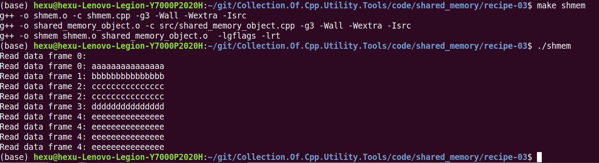

## C++封装Posix API之共享内存

本文介绍将Posix共享内存相关API封装成C++类的过程。
本文主要分为以下部分：

- Posix共享内存API介绍及示例
- C++封装类的实现以及示例

至于C++封装类的好处与代价，留给读者自己判断;)

### Posix共享内存API介绍及示例

注：这里的API介绍和示例都来自《UNIX网络编程卷2  进程间通信  (第2版)》这本书。

Posix.1提供了两种在无亲缘关系进程间共享内存区的方法：
- 内存映射文件(memory-mapped file)，由open函数打开，由mmap函数把所得到的描述符映射到当前进程空间地址中的一个文件。
- 共享内存区对象(shared-memory object)，由shm_open函数打开一个Posix.1 IPC名字，所返回的描述符由mmap函数映射到当前进程的地址空间。

这两种技术都需要调用mmap，差别在于作为mmap的参数之一的描述符的获取手段：通过open或通过shm_open。


本文主要介绍的就是基于shm_open相关接口的共享内存技术，具体接口列表如下：
- shm_open
- shm_unlink
- mmap
- munmap
- ftruncate
- fstat

我们接下来分别介绍每个接口的含义：


**shm_open函数**

shm_open用于创建一个新的Posix共享内存对象或打开一个已存在的Posix共享内存对象。

传递给shm_open函数的名字参数随后由希望共享该内存区的任何其他进程使用。

```c
SHM_OPEN(3)                Linux Programmer's Manual               SHM_OPEN(3)
NAME
       shm_open,  shm_unlink  -  create/open  or  unlink  POSIX  shared memory
       objects
SYNOPSIS
       #include <sys/mman.h>
       #include <sys/stat.h>        /* For mode constants */
       #include <fcntl.h>           /* For O_* constants */
       int shm_open(const char *name, int oflag, mode_t mode);

       Link with -lrt.
```

返回：若成功则非负描述符，若出错则为-1。

shm_open参数说明：

- oflag参数不能设置O_WRONLY标志
- 和mq_open、sem_open不同，shm_open的mode参数总是必须指定，当指定了O_CREAT标志时，mode为用户权限位，否则将mode设为0

shm_open的返回值是一个描述符，它随后用作mmap的第五个参数fd。


**shm_unlink函数**

shm_unlink用于从系统中删除一个Posix共享内存对象。

删除一个名字不会影响对于其底层支撑对象的现有引用，直到对于该对象的引用全部关闭为止。

```c
SHM_OPEN(3)                Linux Programmer's Manual               SHM_OPEN(3)
NAME
       shm_open,  shm_unlink  -  create/open  or  unlink  POSIX  shared memory
       objects
SYNOPSIS
       #include <sys/mman.h>
       #include <sys/stat.h>        /* For mode constants */
       #include <fcntl.h>           /* For O_* constants */
       int shm_unlink(const char *name);

       Link with -lrt.
```

返回：若成功则为0，若出错则为-1。


**mmap函数**

mmap函数把一个文件或一个Posix共享内存对象映射到调用进程的地址空间，使用该函数有三个目的：

- 使用普通文件以提供内存映射IO
- 使用特殊文件以提供匿名内存映射
- 使用Posix共享内存对象以提供Posix共享内存区

本文中主要用于：使用Posix共享内存对象以提供Posix共享内存区

```c
MMAP(2)                    Linux Programmer's Manual                   MMAP(2)

NAME
       mmap, munmap - map or unmap files or devices into memory

SYNOPSIS
       #include <sys/mman.h>

       void *mmap(void *addr, size_t length, int prot, int flags,
                  int fd, off_t offset);

       See NOTES for information on feature test macro requirements.
```

返回：若成功则为被映射区的起始地址，若出错则为MAP_FAILED。

mmap参数解析：

- addr指定映射内存的起始地址，通常设为NULL，让内核自己决定起始地址
- length是被映射到调用进程地址空间中的字节数，它从被映射文件fd开头起第offset个字节处开始算，offset通常设为0，下图展示了这个映射关系
- prot指定对映射内存区的保护，通常设为PROT_READ | PROT_WRITE
    + PORT_READ     -> 可读
    + PORT_WRITE    -> 可写
    + PORT_EXEC     -> 可执行
    + PORT_NONE     -> 数据不可访问
- flags必须在MAP_SHARED和MAP_PRIVATE这两个标志中选择指定一个，进程间共享内存需要使用MAP_SHARED
    + MAP_SHARED  -> 变动是共享的
    + MAP_PRIVATE  -> 变动是私自的
    + MAP_FIXED        -> 准确的解析addr参数
- 可移植的代码应把addr设为NULL，并且flags不指定MAP_FIXED


mmap成功返回后，fd参数可以关闭。该操作对由于mmap建立的映射关系没有影响。


**munmap函数**

mmap建立的映射关系通过munmap删除，其中addr是mmap返回的地址，length是映射区的大小，同mmap的参数length。

```c
MMAP(2)                    Linux Programmer's Manual                   MMAP(2)

NAME
       mmap, munmap - map or unmap files or devices into memory

SYNOPSIS
       #include <sys/mman.h>

       int munmap(void *addr, size_t length);

       See NOTES for information on feature test macro requirements.
```

返回：若成功则为0，若出错则为-1。

调用munmap后，再次访问这些地址将导致向调用进程产生一个SIGSEGV信号。


**ftruncate函数**

处理mmap的时候，普通文件或Posix共享内存对象的大小都可以通过调用ftruncate设置。

```c
TRUNCATE(2)                Linux Programmer's Manual               TRUNCATE(2)
NAME
       truncate, ftruncate - truncate a file to a specified length
SYNOPSIS
       #include <unistd.h>
       #include <sys/types.h>
       int truncate(const char *path, off_t length);
       int ftruncate(int fd, off_t length);
```

返回：若成功则为0，若出错则为-1。

- 对于普通文件，若文件长度大于length，额外的数据会被丢弃；若文件长度小于length，则扩展文件大小到length
- 对于Posix共享内存对象，ftruncate把该对象的大小设置成length字节

我们调用ftruncate来指定新创建的Posix共享内存对象大小，或者修改已存在的Posix共享内存对象大小。

- 创建新的Posix共享内存对象时指定大小是必须的，否则访问mmap返回的地址会报bus error错误
- 当打开一个已存在的Posix共享内存对象时，可以调用fstat来获取该对象的信息


**fstat函数**

当打开一个已存在的共享内存区对象时，我们可调用 fstat来获取有关该对象的信息。

```c
STAT(2)                    Linux Programmer's Manual                   STAT(2)
NAME
       stat, fstat, lstat - get file status
SYNOPSIS
       #include <sys/types.h>
       #include <sys/stat.h>
       #include <unistd.h>
       int fstat(int fd, struct stat *buf);
```

返回：若成功则为0，若出错则为-1。

stat结构有12个或以上的成员，然而当fd指代一个内存共享区对象时，只有四个成员含有信息。

```c
struct stat {
  mode_t    st_mode;    /* protection */
  uid_t     st_uid;     /* user ID of owner */
  gid_t     st_gid;     /* group ID of owner */
  off_t     st_size;    /* total size, in bytes */
};
```

---

接口介绍完了，我们接下来给出使用Posix共享内存的示例程序。[完整的工程代码](https://github.com/hexu1985/Collection.Of.Cpp.Utility.Tools/tree/master/posix/shared_memory/examples)
首先给出示例程序列表：
- shmcreate
- shmunlink
- shmwrite
- shmread

**shmcreate程序**

shmcreate程序以某个指定的名字和长度创建一个共享内存区对象。

源码：shmcreate.cpp

```cpp
#include <sstream>
#include <gflags/gflags.h>

#include "posix_api.hpp"

DEFINE_string(name, "shm_test", "shared memory name");
DEFINE_uint32(length, 1024, "shared memory length");
DEFINE_bool(check_exists, false, "check shared memory already exists");

std::string usage(const char* prog) {
    std::ostringstream os;
    os << "\nusage: " << prog << " [--check_exists] [--name NAME] [--length LENGTH]\n\n"
        << "create shared memory\n";
    return os.str();
}

int main(int argc, char* argv[]) {
    gflags::SetUsageMessage(usage(argv[0]));
    gflags::ParseCommandLineFlags(&argc, &argv, true);

    int flags = O_RDWR | O_CREAT;
    if (FLAGS_check_exists) {
        flags |= O_EXCL;
    }

    int fd = Shm_open(FLAGS_name.c_str(), flags, FILE_MODE);
    Ftruncate(fd, FLAGS_length);

    void* ptr = Mmap(NULL, FLAGS_length, PROT_READ | PROT_WRITE, MAP_SHARED, fd, 0);

    return 0;
}
```

使用示例：

```
$ ./shmcreate --helpshort
shmcreate:
usage: ./shmcreate [--check_exists] [--name NAME] [--length LENGTH]

create shared memory


  Flags from shmcreate.cpp:
    -check_exists (check shared memory already exists) type: bool
      default: false
    -length (shared memory length) type: uint32 default: 1024
    -name (shared memory name) type: string default: "shm_test"
$ ./shmcreate --name "test" --length 128
$ ls /dev/shm/
test
$ ./shmcreate --name "test" --check_exists
terminate called after throwing an instance of 'std::system_error'
  what():  shm_open error for test: File exists
已放弃 (核心已转储)
$
```

shmcreate创建所指定的共享内存区对象。如果指定了`-check_exists`选项，那么若该对象已经存在则将出错。
ftruncate设置该对象的长度，mmap则把它映射到调用进程的地址空间。本程序随后终止。
既然Posix共享内存至少具备随内核的持续性，因此本程序的终止不会删除该共享内存区对象。

**shmunlink程序**

shmunlink从系统中删除一个共享内存对象的名字。

源码：shmunlink.cpp

```cpp
#include <sstream>
#include <gflags/gflags.h>

#include "posix_api.hpp"

DEFINE_string(name, "shm_test", "shared memory name");

std::string usage(const char* prog) {
    std::ostringstream os;
    os << "\nusage: " << prog << " [--name NAME]\n\n"
        << "remove shared memory\n";
    return os.str();
}

int main(int argc, char* argv[]) {
    gflags::SetUsageMessage(usage(argv[0]));
    gflags::ParseCommandLineFlags(&argc, &argv, true);

    Shm_unlink(FLAGS_name.c_str());

    return 0;
}
```

使用示例：

```
$ ./shmunlink --helpshort
shmunlink:
usage: ./shmunlink [--name NAME]

remove shared memory


  Flags from shmunlink.cpp:
    -name (shared memory name) type: string default: "shm_test"
$ ./shmcreate --name "test" --length 128
$ ls /dev/shm/
test
$ ./shmunlink --name "test"
$ ls /dev/shm/
$ ./shmunlink --name "test"
terminate called after throwing an instance of 'std::system_error'
  what():  shm_unlink error: No such file or directory
已放弃 (核心已转储)
```

**shmwrite和shmread程序**

shmwrite程序，它往一共共享内存区对象中写入一个模式：0，1，2，...，254，255，0，1，等等。

源码：shmwrite.cpp

```cpp
#include <sstream>
#include <gflags/gflags.h>

#include "posix_api.hpp"

DEFINE_string(name, "shm_test", "shared memory name");

std::string usage(const char* prog) {
    std::ostringstream os;
    os << "\nusage: " << prog << " [--name NAME]\n\n"
        << "write shared memory\n";
    return os.str();
}

int main(int argc, char* argv[]) {
    gflags::SetUsageMessage(usage(argv[0]));
    gflags::ParseCommandLineFlags(&argc, &argv, true);

    int fd = Shm_open(FLAGS_name.c_str(), O_RDWR, 0);

    struct stat stat;
    Fstat(fd, &stat);

    uint8_t* ptr = (uint8_t*) Mmap(NULL, stat.st_size, PROT_READ | PROT_WRITE, MAP_SHARED, fd, 0);
    Close(fd);

    for (int i = 0; i < stat.st_size; i++)
        *ptr++ = i % 256;

    return 0;
}
```

用shm_open打开所指定的共享内存区对象，fstat获取其大小信息。使用mmap映射它之后close它的描述符。
然后就可以通过访问mmap返回的指针，把模式写入该共享内存。

shmread程序读取共享内存内容，并以十六进制的方式打印出来。

源码：shmread.cpp

```cpp
#include <sstream>
#include <gflags/gflags.h>

#include "posix_api.hpp"
#include "dump_functions.hpp"

DEFINE_string(name, "shm_test", "shared memory name");

std::string usage(const char* prog) {
    std::ostringstream os;
    os << "\nusage: " << prog << " [--name NAME]\n\n"
        << "read shared memory\n";
    return os.str();
}

int main(int argc, char* argv[]) {
    gflags::SetUsageMessage(usage(argv[0]));
    gflags::ParseCommandLineFlags(&argc, &argv, true);

    int fd = Shm_open(FLAGS_name.c_str(), O_RDONLY, 0);

    struct stat stat;
    Fstat(fd, &stat);

    const uint8_t* ptr = (const uint8_t*) Mmap(NULL, stat.st_size, PROT_READ, MAP_SHARED, fd, 0);
    Close(fd);

    dump_hex(ptr, stat.st_size, "");
    printf("\n");

    return 0;
}
```

用只读模式打开所指定的共享内存区对象，使用fstat获取其大小信息。使用mmap映射把它映射到内存（用于只读目的），之后close它的描述符。
然后就可以通过访问mmap返回的指针，打印该共享内存的内容。

使用示例：

```
$ ./shmread --helpshort
shmread:
usage: ./shmread [--name NAME]

create shared memory


  Flags from shmread.cpp:
    -name (shared memory name) type: string default: "shm_test"
$ ./shmwrite --helpshort
shmwrite:
usage: ./shmwrite [--name NAME]

create shared memory


  Flags from shmwrite.cpp:
    -name (shared memory name) type: string default: "shm_test"
$ ./shmcreate --name "test" --length 512
$ ./shmread --name "test"
00 00 00 00 00 00 00 00  00 00 00 00 00 00 00 00
00 00 00 00 00 00 00 00  00 00 00 00 00 00 00 00
00 00 00 00 00 00 00 00  00 00 00 00 00 00 00 00
00 00 00 00 00 00 00 00  00 00 00 00 00 00 00 00
00 00 00 00 00 00 00 00  00 00 00 00 00 00 00 00
00 00 00 00 00 00 00 00  00 00 00 00 00 00 00 00
00 00 00 00 00 00 00 00  00 00 00 00 00 00 00 00
00 00 00 00 00 00 00 00  00 00 00 00 00 00 00 00
00 00 00 00 00 00 00 00  00 00 00 00 00 00 00 00
00 00 00 00 00 00 00 00  00 00 00 00 00 00 00 00
00 00 00 00 00 00 00 00  00 00 00 00 00 00 00 00
00 00 00 00 00 00 00 00  00 00 00 00 00 00 00 00
00 00 00 00 00 00 00 00  00 00 00 00 00 00 00 00
00 00 00 00 00 00 00 00  00 00 00 00 00 00 00 00
00 00 00 00 00 00 00 00  00 00 00 00 00 00 00 00
00 00 00 00 00 00 00 00  00 00 00 00 00 00 00 00
00 00 00 00 00 00 00 00  00 00 00 00 00 00 00 00
00 00 00 00 00 00 00 00  00 00 00 00 00 00 00 00
00 00 00 00 00 00 00 00  00 00 00 00 00 00 00 00
00 00 00 00 00 00 00 00  00 00 00 00 00 00 00 00
00 00 00 00 00 00 00 00  00 00 00 00 00 00 00 00
00 00 00 00 00 00 00 00  00 00 00 00 00 00 00 00
00 00 00 00 00 00 00 00  00 00 00 00 00 00 00 00
00 00 00 00 00 00 00 00  00 00 00 00 00 00 00 00
00 00 00 00 00 00 00 00  00 00 00 00 00 00 00 00
00 00 00 00 00 00 00 00  00 00 00 00 00 00 00 00
00 00 00 00 00 00 00 00  00 00 00 00 00 00 00 00
00 00 00 00 00 00 00 00  00 00 00 00 00 00 00 00
00 00 00 00 00 00 00 00  00 00 00 00 00 00 00 00
00 00 00 00 00 00 00 00  00 00 00 00 00 00 00 00
00 00 00 00 00 00 00 00  00 00 00 00 00 00 00 00
00 00 00 00 00 00 00 00  00 00 00 00 00 00 00 00
$ ./shmwrite --name "test"
$ ./shmread --name "test"
00 01 02 03 04 05 06 07  08 09 0A 0B 0C 0D 0E 0F
10 11 12 13 14 15 16 17  18 19 1A 1B 1C 1D 1E 1F
20 21 22 23 24 25 26 27  28 29 2A 2B 2C 2D 2E 2F
30 31 32 33 34 35 36 37  38 39 3A 3B 3C 3D 3E 3F
40 41 42 43 44 45 46 47  48 49 4A 4B 4C 4D 4E 4F
50 51 52 53 54 55 56 57  58 59 5A 5B 5C 5D 5E 5F
60 61 62 63 64 65 66 67  68 69 6A 6B 6C 6D 6E 6F
70 71 72 73 74 75 76 77  78 79 7A 7B 7C 7D 7E 7F
80 81 82 83 84 85 86 87  88 89 8A 8B 8C 8D 8E 8F
90 91 92 93 94 95 96 97  98 99 9A 9B 9C 9D 9E 9F
A0 A1 A2 A3 A4 A5 A6 A7  A8 A9 AA AB AC AD AE AF
B0 B1 B2 B3 B4 B5 B6 B7  B8 B9 BA BB BC BD BE BF
C0 C1 C2 C3 C4 C5 C6 C7  C8 C9 CA CB CC CD CE CF
D0 D1 D2 D3 D4 D5 D6 D7  D8 D9 DA DB DC DD DE DF
E0 E1 E2 E3 E4 E5 E6 E7  E8 E9 EA EB EC ED EE EF
F0 F1 F2 F3 F4 F5 F6 F7  F8 F9 FA FB FC FD FE FF
00 01 02 03 04 05 06 07  08 09 0A 0B 0C 0D 0E 0F
10 11 12 13 14 15 16 17  18 19 1A 1B 1C 1D 1E 1F
20 21 22 23 24 25 26 27  28 29 2A 2B 2C 2D 2E 2F
30 31 32 33 34 35 36 37  38 39 3A 3B 3C 3D 3E 3F
40 41 42 43 44 45 46 47  48 49 4A 4B 4C 4D 4E 4F
50 51 52 53 54 55 56 57  58 59 5A 5B 5C 5D 5E 5F
60 61 62 63 64 65 66 67  68 69 6A 6B 6C 6D 6E 6F
70 71 72 73 74 75 76 77  78 79 7A 7B 7C 7D 7E 7F
80 81 82 83 84 85 86 87  88 89 8A 8B 8C 8D 8E 8F
90 91 92 93 94 95 96 97  98 99 9A 9B 9C 9D 9E 9F
A0 A1 A2 A3 A4 A5 A6 A7  A8 A9 AA AB AC AD AE AF
B0 B1 B2 B3 B4 B5 B6 B7  B8 B9 BA BB BC BD BE BF
C0 C1 C2 C3 C4 C5 C6 C7  C8 C9 CA CB CC CD CE CF
D0 D1 D2 D3 D4 D5 D6 D7  D8 D9 DA DB DC DD DE DF
E0 E1 E2 E3 E4 E5 E6 E7  E8 E9 EA EB EC ED EE EF
F0 F1 F2 F3 F4 F5 F6 F7  F8 F9 FA FB FC FD FE FF
```

或者可以用hexdump命令查看共享内存的内容：


### C++封装类的实现以及示例

Posix共享内存的C++封装涉及两个类，分别是：
- class SharedMemoryObject
- template<class T> class SharedMemory

接下来我们分别介绍，[完整的工程代码](https://github.com/hexu1985/Collection.Of.Cpp.Utility.Tools/tree/master/code/shared_memory/recipe-03)

**SharedMemoryObject类**

SharedMemoryObject是一个非模板类，封装了我们上面介绍的那些Posix接口，
但并非一一对应，而是针对共享内存，封装出语义更明确的接口。

先给出SharedMemoryObject类的定义，然后再介绍类成员函数的实现。

头文件：shared_memory_object.hpp

```cpp
#pragma once

#include <stddef.h>

class SharedMemoryObject {
public:
    SharedMemoryObject() noexcept;
    ~SharedMemoryObject();

    SharedMemoryObject(SharedMemoryObject&& other);
    SharedMemoryObject& operator= (SharedMemoryObject&& other);

    void truncate(size_t length);
    size_t size() const;
    int fileno() const;

    void* map(size_t length, bool readonly=false, long offset=0);

    void swap(SharedMemoryObject& other) noexcept;

    static bool exists(const char* name) noexcept;
    static bool remove(const char* name) noexcept;
    static void unmap(void* addr, size_t length) noexcept;

    static SharedMemoryObject create_only(const char* name);
    static SharedMemoryObject open_or_create(const char* name);
    static SharedMemoryObject open_read_write(const char* name);
    static SharedMemoryObject open_read_only(const char* name);

private:
    SharedMemoryObject(const SharedMemoryObject&) = delete;
    SharedMemoryObject& operator= (const SharedMemoryObject&) = delete;

    explicit SharedMemoryObject(int fd);

private:
    int fd_ = -1;
};  
```

SharedMemoryObject类管理shm_open返回的文件描述符。

- 默认的构造函数可以创建一个空的SharedMemoryObject对象，然后，
  由create_only、open_or_create、open_read_write和open_read_only这四个静态成员函数，
  实现不同模式的共享内存创建或打开功能，调用者也就不用关心shm_open函数oflag和mode参数的组合了。
  SharedMemoryObject类不支持复制构造函数和复制赋值运算符，像其他管理资源类一样，
  可以通过移动构造函数或移动赋值运算符，将管理的共享内存资源从一个对象转移到另一个对象。

- exists静态成员函数用来判断指定名字的共享内存对象是否存在。

- remove静态成员函数用来删除指定名字的共享内存对象。底层实现调用shm_unlink。

- unmap静态成员函数用来删除map建立的映射关系。底层实现调用munmap。

- truncate成员函数修改共享内存对象大小。底层实现调用ftruncate。

- size成员函数获取共享内存对象的大小。底层实现调用fstat。

- fileno成员函数返回共享内存对象关联的文件描述符。

- swap成员函数交换两个共享内存对象关联的文件描述符。

接下来，我们看看shmcreate、shmunlink、shmwrite和shmread程序的C++版本。

源码：shmcreate.cpp

```cpp
#include <sstream>
#include <gflags/gflags.h>

#include "shared_memory_object.hpp"

DEFINE_string(name, "shm_test", "shared memory name");
DEFINE_uint32(length, 1024, "shared memory length");
DEFINE_bool(check_exists, false, "check shared memory already exists");

std::string usage(const char* prog) {
    std::ostringstream os;
    os << "\nusage: " << prog << " [--check_exists] [--name NAME] [--length LENGTH]\n\n"
        << "create shared memory\n";
    return os.str();
}

int main(int argc, char* argv[]) {
    gflags::SetUsageMessage(usage(argv[0]));
    gflags::ParseCommandLineFlags(&argc, &argv, true);

    SharedMemoryObject shdmem;
    if (FLAGS_check_exists) {
        shdmem = SharedMemoryObject::create_only(FLAGS_name.c_str());
    } else {
        shdmem = SharedMemoryObject::open_or_create(FLAGS_name.c_str());
    }
    shdmem.truncate(FLAGS_length);
    return 0;
}
```

源码：shmunlink.cpp

```cpp
#include <sstream>
#include <gflags/gflags.h>

#include "shared_memory_object.hpp"

DEFINE_string(name, "shm_test", "shared memory name");

std::string usage(const char* prog) {
    std::ostringstream os;
    os << "\nusage: " << prog << " [--name NAME]\n\n"
        << "remove shared memory\n";
    return os.str();
}

int main(int argc, char* argv[]) {
    gflags::SetUsageMessage(usage(argv[0]));
    gflags::ParseCommandLineFlags(&argc, &argv, true);

    SharedMemoryObject::remove(FLAGS_name.c_str());

    return 0;
}
```

源码：shmwrite.cpp

```cpp
#include <sstream>
#include <gflags/gflags.h>

#include "shared_memory_object.hpp"

DEFINE_string(name, "shm_test", "shared memory name");

std::string usage(const char* prog) {
    std::ostringstream os;
    os << "\nusage: " << prog << " [--name NAME]\n\n"
        << "write shared memory\n";
    return os.str();
}

int main(int argc, char* argv[]) {
    gflags::SetUsageMessage(usage(argv[0]));
    gflags::ParseCommandLineFlags(&argc, &argv, true);

    if (!SharedMemoryObject::exists(FLAGS_name.c_str())) {
        printf("shared memory of %s not exists!\n", FLAGS_name.c_str());
        return -1;
    }

    SharedMemoryObject shdmem = SharedMemoryObject::open_read_write(FLAGS_name.c_str());
    size_t size = shdmem.size();
    uint8_t* ptr = (uint8_t*) shdmem.map(size);

    for (int i = 0; i < size; i++)
        *ptr++ = i % 256;

    return 0;
}
```

源码：shmread.cpp

```cpp
#include <sstream>
#include <gflags/gflags.h>

#include "shared_memory_object.hpp"
#include "dump_functions.hpp"

DEFINE_string(name, "shm_test", "shared memory name");

std::string usage(const char* prog) {
    std::ostringstream os;
    os << "\nusage: " << prog << " [--name NAME]\n\n"
        << "read shared memory\n";
    return os.str();
}

int main(int argc, char* argv[]) {
    gflags::SetUsageMessage(usage(argv[0]));
    gflags::ParseCommandLineFlags(&argc, &argv, true);

    if (!SharedMemoryObject::exists(FLAGS_name.c_str())) {
        printf("shared memory of %s not exists!\n", FLAGS_name.c_str());
        return -1;
    }

    SharedMemoryObject shdmem = SharedMemoryObject::open_read_only(FLAGS_name.c_str());
    size_t size = shdmem.size();
    const uint8_t* ptr = (const uint8_t*) shdmem.map(size, true);

    dump_hex(ptr, size, "");
    printf("\n");

    return 0;
}
```

SharedMemoryObject类只是在Posix接口上的一个很薄的封装类，为了提供更高层且使用更简单的接口，
我们在SharedMemoryObject类的基础上，提供了一个模板类template<class T> class SharedMemory。

我们先给出SharedMemory类的接口和实现，然后再举一个使用SharedMemory类的示例程序。

源码：shared_memory.hpp

```cpp
#pragma once

#include "shared_memory_object.hpp"

template<class T>
class SharedMemory {
    SharedMemoryObject shm_mem_obj_;
    T* ptr_;

public:
    explicit SharedMemory(const char* name): shm_mem_obj_(SharedMemoryObject::open_or_create(name)) {
        shm_mem_obj_.truncate(sizeof(T));
        ptr_ = static_cast<T*>(shm_mem_obj_.map(sizeof(T)));
    }

    ~SharedMemory() {
        SharedMemoryObject::unmap(ptr_, sizeof(T));
    }

    T& get() const {
        return *ptr_;
    }
};
```

SharedMemory模板类依赖于SharedMemoryObject类管理Posix共享内存对象，
模板参数定义了存储于共享内存实例中的数据类型。通过这种方式，
可使SharedMemory类型实例处于安全状态。使用SharedMemory类的应用程序
不必显式的进行void指针的类型转换，SharedMemory类里以类型安全的方式完成此操作。

- 全部共享内存应用程序和初始化过程在SharedMemory构造函数里完成，
  该函数只包含一个参数：共享内存对象名。构造函数通过SharedMemoryObject::open_or_create静态函数
  创建共享内存对象，并把共享内存对象的大小设置成sizeof(T)，然后将ptr_成员设置成共享内存映射的地址。

- 析构函数从地址空间中解除共享内存对象的映射。

- 当访问共享数据时，SharedMemory类提供了一个简单的get()方法，
  该方法返回一个指向存储于共享内存的对象的引用。

接下来，给出使用SharedMemory的示例程序：

源码：shmem.cpp

```cpp
#include <algorithm>
#include <iostream>
#include <chrono>
#include <thread>

#include <unistd.h>

#include "shared_memory.hpp"

const char* kSharedMemPath = "/sample_point";
const size_t kPayloadSize = 16;

using namespace std::literals;

template <typename T>
using SharedMem = SharedMemory<T>;

struct Payload {
  uint32_t index;
  uint8_t raw[kPayloadSize];
};


void producer() {
  SharedMem<Payload> writer(kSharedMemPath);
  Payload& pw = writer.get();
  for (int i = 0; i < 5; i++) {
    pw.index = i;
    std::fill_n(pw.raw, sizeof(pw.raw) - 1, 'a' + i);
    pw.raw[sizeof(pw.raw) - 1] = '\0';
    std::this_thread::sleep_for(150ms);
  }
}

void consumer() {
  SharedMem<Payload> point_reader(kSharedMemPath);
  Payload& pr = point_reader.get();
  for (int i = 0; i < 10; i++) {
    std::cout << "Read data frame " << pr.index << ": " << pr.raw << std::endl;
    std::this_thread::sleep_for(100ms);
  }
  SharedMemoryObject::remove(kSharedMemPath);
}

int main() {

  if (fork()) {
    consumer();
  } else {
    producer();
  }
}
```

示例程序会生成两个独立的进程：通过Posix的fork()函数生成一个子进程。
该子进程表示为数据生产者，而父进程则表示为数据消费者。

```cpp
  if (fork()) {
    consumer();
  } else {
    producer();
  }
```

此处定义了一个Payload数据类型，以供生产者和消费者数据交换使用。

```cpp
struct Payload {
  uint32_t index;
  uint8_t raw[kPayloadSize];
};
```

数据生产者生成了一个SharedMemory<Payload>实例，
使用SharedMemory的get()方法获取共享内存对象中的Payload实例引用，
每隔150ms，递增Payload的index字段，并通过匹配index的拉丁字母填充数据。

```cpp
  Payload& pw = writer.get();
  for (int i = 0; i < 5; i++) {
    pw.index = i;
    std::fill_n(pw.raw, sizeof(pw.raw) - 1, 'a' + i);
    pw.raw[sizeof(pw.raw) - 1] = '\0';
    std::this_thread::sleep_for(150ms);
  }
```

消费者则利用与生产者相同的名称生成的一个SharedMemory<Payload>实例，
每隔100ms，应用程序将从共享对象中读取数据，并将其输出至屏幕。

编译并运行程序，可以得到如下输出：



在消费者的输出结果中，可以看到所接收的生产者写入数据。
由于消费者和生产者周期时长并不匹配，因而有时可以看到相同的数据
被读取了两次。

这个示例程序里，省略了生产者和消费者的同步机制。鉴于二者作为独立的
项目运行，所以无法保证生产者在消费者试图读取数据时已经更新了数据。

---

接下来，我们在原有代码的基础上增加同步机制，给出一个相对完整的
基于共享内存对象的生产者、消费者的示例程序。


### 参考文档：

- 《UNIX网络编程卷2进程间通信(第2版)》
- 《C++嵌入式开发实例精解》
- [IPC之Posix共享内存详解](https://blog.csdn.net/daiyudong2020/article/details/50500651)
- [Posix共享内存](https://www.cnblogs.com/songhe364826110/p/11530732.html)
