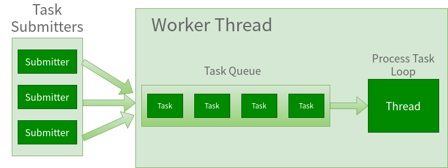
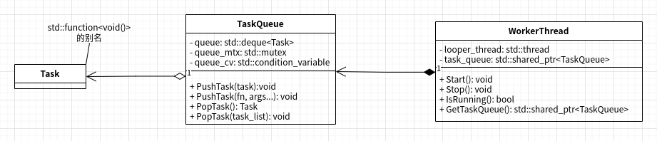

### 基于C++标准库实现工作线程类

**简介**

这篇文章将介绍如何基于C++标准库来实现工作线程类。
首先给出我们要实现的工作线程的定义：
我们可以将工作线程类简单的理解为简化的线程池类：只有一个工作线程的线程池类。
或者也可以类比于GUI编程里的eventloop线程。

我们先给出工作线程的基本数据结构和类对象的角色。如下图：



可能有人会问既然工作线程类可以由线程池类简化而成，为啥还要
单独实现工作线程类，我给出的答案很简单：简单，工作线程类的实现更简单；）
在简单的场景中，可以用工作线程类来简化程序的实现时，
单独的工作线程类实现更简单（相比线程池类），并给到更好的可读性（因为类名更具体化）。

其次，由于任务队列和工作线程是1对1的，也就是，工作队列里的任务是串行的（不用加锁），
这时可能有人会说这样一来不就失去并发性了么？其实不然，以GUI编程为例，mainloop里
为了及时响应用户操作和UI渲染，会把文件下载或加载等需要长时间阻塞的IO事件放到单独
一个线程里处理，这种情况工作线程就十分合适，既避免了每次创建线程的开销，又保证了任务队列
自动排队。

**实现**

下面我们通过一个具体多线程例子，来说明工作线程类的实现原理。

我们的原始实例代码是这样的，有两个线程： producer和consumer，
以及一个数据队列连接着两个进程。
- producer创建整数数据并放入数据队列中
- consumer从数据队列中读取整数数据，并调用处理函数处理数据。

由于C++标准库没有线程安全的队列，另外，这里也不想在原始的示例
代码中引入自己实现的线程安全队列，而分心读者，这里就给出了
python版本的原始示例代码，如下：

prodcons.py

```python
#!/usr/bin/env python

from random import randint
from time import sleep
from queue import Queue
from threading import Thread

def writeQ(queue, val):
    print('producing object for Q...:', val)
    queue.put(val)

def readQ(queue):
    val = queue.get(1)
    print('consumed object from Q...:', val)
    return val

def mul_two(i):
    print('mul_two({}) is {}'.format(i, i*2))

def producer(queue, loops):
    for i in range(loops):
        writeQ(queue, i)
        sleep(randint(1, 3))

    writeQ(queue, -1)

def consumer(queue, loops):
    while True:
        i = readQ(queue)
        if i < 0: break
        mul_two(i)
        sleep(randint(2, 5))

funcs = [producer, consumer]
nfuncs = range(len(funcs))

def main():
    nloops = randint(2, 5)
    q = Queue(32)

    threads = []
    for i in nfuncs:
        t = Thread(target=funcs[i], args=(q, nloops))
        threads.append(t)

    for i in nfuncs:
        threads[i].start()

    for i in nfuncs:
        threads[i].join()

    print('all DONE')

if __name__ == '__main__':
    main()
```

代码运行的结果如下：

```python
producing object for Q...: 0
consumed object from Q...: 0
mul_two(0) is 0
producing object for Q...: 1
consumed object from Q...: 1
mul_two(1) is 2
producing object for Q...: 2
producing object for Q...: -1
consumed object from Q...: 2
mul_two(2) is 4
consumed object from Q...: -1
all DONE
```

如果你在本地运行的结果和我这里的不一样，也不用担心，
代码中是有随机数的，所以数据量可能不同，两个线程的sleep时间也可能不同（造成某些时序不太一样）。

理解了原始示例代码里的代码逻辑，我们来看看如果改成用WorkerThread来实现，
代码又会长成什么样，这里给出C++版本的（是不是感觉跳跃有点儿大；）)

prodcons.cpp

```cpp
#include <iostream>
#include <thread>
#include <chrono>

#include "random.hpp"
#include "worker_thread.hpp"

void mul_two(int i) {
    std::cout << "mul_two(" << i << ") is " << i*2 << std::endl;
}

void consume(int i) {
    std::cout << "consume with data: " << i << std::endl;
    mul_two(i);
    std::this_thread::sleep_for(std::chrono::seconds(randint(2, 5)));
}

void producer(std::shared_ptr<TaskQueue> queue, int loops) {
    for (int i = 0; i < loops; i++) {
        std::cout << "pushTask with data: " << i << std::endl;
        queue->PushTask(&consume, i);
        std::this_thread::sleep_for(std::chrono::seconds(randint(1, 3)));
    }
}

int main() {
    int nloops = randint(2, 5);

    WorkerThread myworker("worker");
    myworker.Start();

    std::thread myproducer(&producer, myworker.GetTaskQueue(), nloops);
    myproducer.join();

    myworker.Stop();
    std::cout << "all DONE" << std::endl;

    return 0;
}
```

有没有很惊奇的感觉？因为相同功能的C++代码竟然比Python的代码还要短；）
我们简单的分析一下，首先C++代码里没有显式的数据队列（因为这里被WorkerThread的任务队列替代了），
另外，也看不到显式的consumer线程了，取而代之的是在producer线程里，把数据和consume函数一起打包
成一个个Task，直接丢到WorkerThread的TaskQueue里了，而从TaskQueue里取出任务并执行的代码逻辑
被封装到了WorkerThread的实现里，并且TaskQueue也是线程安全的。

虽然WorkerThread的代码实现很简单，但我们还是先给出类图，来给出类的接口列表和类之间的依赖关系：



我们按照类图从左到右分别介绍，

首先是Task类，Task就是一个std::function<void()>的别名，可以接收任何void()兼容的函数指针、函数对象或lambda函数。

然后是TaskQueue类，一个存放Task的线程安全队列，支持的接口如下：
- PushTask：向任务队列里放入一个Task对象，并且重载了类似std::thread构造函数的接口，可以减少调用者的代码量。
- PopTask：从任务队列里获取任务，这里也重载了两种，一种是一次获取一个任务，一种是一次获取队列中当前的所有任务。

PushTask接口是给任务提交者（也就是WorkerThread的使用者）用的，而PopTask则是WorkerThread的process task loop线程里用的。

最后是WorkerThread类，一个WorkerThread类对象持有一个TaskQueue类对象，支持的接口如下：
- Start：启动工作线程。
- Stop：停止工作线程。
- IsRunning：判断当前工作线程是否正在运行。
- GetTaskQueue：获取任务队列。

下面给出完整的实现：

task_queue.hpp

```cpp
#pragma once

#include <deque>
#include <functional>
#include <mutex>
#include <condition_variable>

using Task = std::function<void()>;

class TaskQueue {
public:
    using InternalQueueType = std::deque<Task>;

private:
    InternalQueueType queue;
    std::mutex queue_mtx;
    std::condition_variable queue_cv;

public:
    template <typename Fn, typename... Args>
    void PushTask(Fn&& fn, Args&&... args)
    {
        PushTask(Task(std::bind<void>(std::forward<Fn>(fn), std::forward<Args>(args)...)));
    }

    void PushTask(Task&& task) 
    {
        std::lock_guard<std::mutex> lck(queue_mtx);
        queue.push_back(std::move(task));
        queue_cv.notify_one();
    }

    Task PopTask() 
    {
        std::unique_lock<std::mutex> lck(queue_mtx);
        while (queue.empty()) {
            queue_cv.wait(lck);
        }
        auto task = std::move(queue.front());
        queue.pop_front();
        return task;
    }

    void PopTask(InternalQueueType& task_list)
    {
        std::unique_lock<std::mutex> lck(queue_mtx);
        while (queue.empty()) {
            queue_cv.wait(lck);
        }
        queue.swap(task_list);
        queue.clear();
    }
};
```

一个相对标准基于互斥量和条件变量实现的线程安全队列，没啥好说的。

worker_thread.hpp

```cpp
#pragma once

#include <thread>
#include <string>
#include "task_queue.hpp"

class WorkerThread {
public:
    WorkerThread(const std::string& name="");
    ~WorkerThread();

    WorkerThread(const WorkerThread&) = delete;
    WorkerThread& operator=(const WorkerThread&) = delete;

    WorkerThread(WorkerThread&&) = default;
    WorkerThread& operator=(WorkerThread&&) = default;

    void Start();
    void Stop();
    bool IsRunning();
    std::shared_ptr<TaskQueue> GetTaskQueue();
    const std::string& GetThreadName() const;

    static std::shared_ptr<TaskQueue> GetCurrentTaskQueue();
    static const std::string& GetCurrentThreadName();

private:
    std::string thread_name;
    std::thread looper_thread;
    std::shared_ptr<TaskQueue> task_queue;
};
```

GetThreadName()、GetCurrentTaskQueue()和GetCurrentThreadName()这三个接口在类图里没有体现，
主要是觉得这块不算我想介绍的WorkerThread类的主要部分。

worker_thread.cpp

```cpp
#include "worker_thread.hpp"

#include <cassert>
#include <atomic>

namespace {     // details

std::atomic<int> thread_count{};
thread_local std::shared_ptr<TaskQueue> current_thread_task_queue{};
thread_local std::string current_thread_name{};

// WorkerThreadInterrupt 
struct WorkerThreadInterrupt {
};

void this_thread_exit() {
    throw WorkerThreadInterrupt();
}

void process_task_loop(WorkerThread* worker_thread) {
    current_thread_task_queue = worker_thread->GetTaskQueue();
    current_thread_name = worker_thread->GetThreadName();

    TaskQueue& incoming_queue = *current_thread_task_queue;
	while (true) {
        std::deque<Task> working_list;
		incoming_queue.PopTask(working_list);
		while (!working_list.empty()) {
			auto task = std::move(working_list.front());
			working_list.pop_front();
            try {
                task();
            } catch (WorkerThreadInterrupt) {
                current_thread_name = "";
                current_thread_task_queue = nullptr;
                return;
            }
		}
	}
}

}   // namespace {

// WorkerThread
WorkerThread::WorkerThread(const std::string& name): thread_name(name) {
    int id = ++thread_count;
    thread_name += ":"+std::to_string(id);
}

WorkerThread::~WorkerThread() {
    if (IsRunning()) {
        Stop();
    }
}

void WorkerThread::Start() {
    if (IsRunning()) {
        Stop();
    }

    task_queue = std::make_shared<TaskQueue>();
    looper_thread = std::thread(&process_task_loop, this);
}

void WorkerThread::Stop() {
    task_queue->PushTask(&this_thread_exit);
    looper_thread.join();

    looper_thread = std::thread();
    task_queue = nullptr;
}

bool WorkerThread::IsRunning() {
    return looper_thread.joinable(); 
}

std::shared_ptr<TaskQueue> WorkerThread::GetTaskQueue() {
    return task_queue;
}

const std::string& WorkerThread::GetThreadName() const {
    return thread_name;
}

std::shared_ptr<TaskQueue> WorkerThread::GetCurrentTaskQueue() {
    return current_thread_task_queue;
}

const std::string& WorkerThread::GetCurrentThreadName() {
    return current_thread_name;
}
```

这块代码其是也没太多可说的，有一点点巧妙的地方的有三点：
- process_task_loop线程循环里，每次都获取当前TaskQueue里的所有任务，以减少调用TaskQueue::PopTask的次数从而减少获取和释放锁的次数
- process_task_loop线程是通过catch特定的异常类型（WorkerThreadInterrupt）来退出线程的
- GetCurrentTaskQueue()和GetCurrentThreadName()这两个接口使用了thread_local关键字

完整的工程项目代码：[工程代码](https://github.com/hexu1985/Collection.Of.Cpp.Utility.Tools/tree/master/code/worker_thread/blog/cxx)
当然，WorkerThread类最初是我仿照Google的Chrome源码中base库的MessageLoop类实现的超超简化版，所以WorkerThread类也经历了好几次演化，
所有的WorkerThread类实现的版本都在：[工程代码](https://github.com/hexu1985/Collection.Of.Cpp.Utility.Tools/tree/master/code/worker_thread/)

