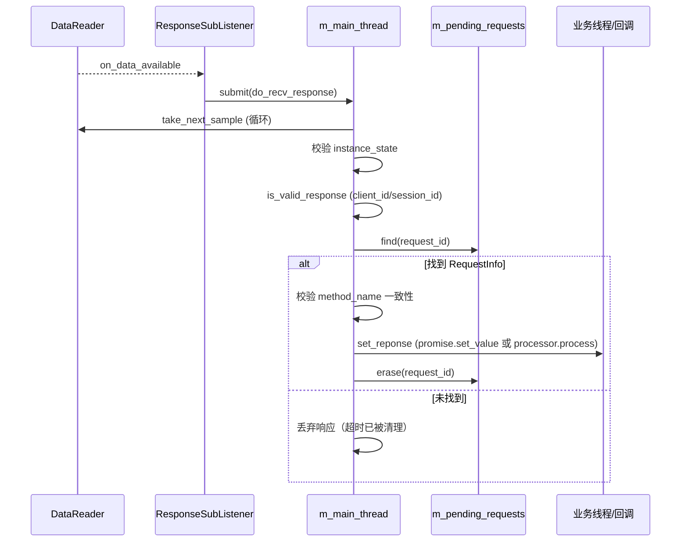
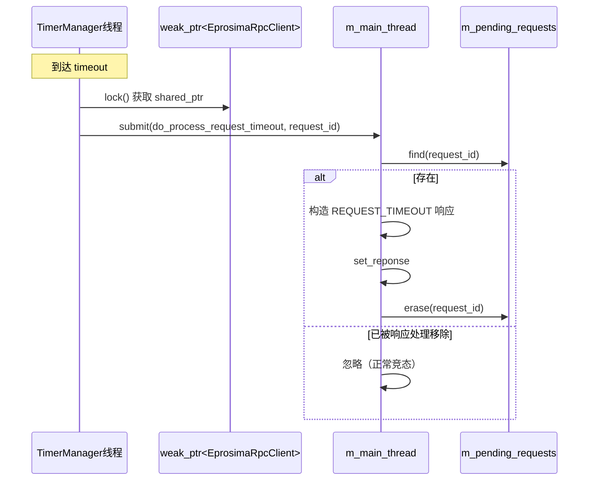
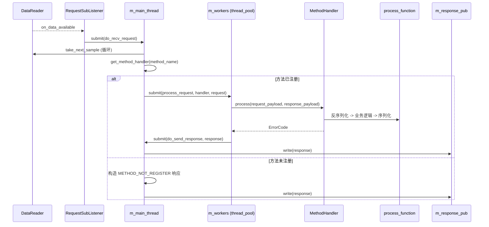
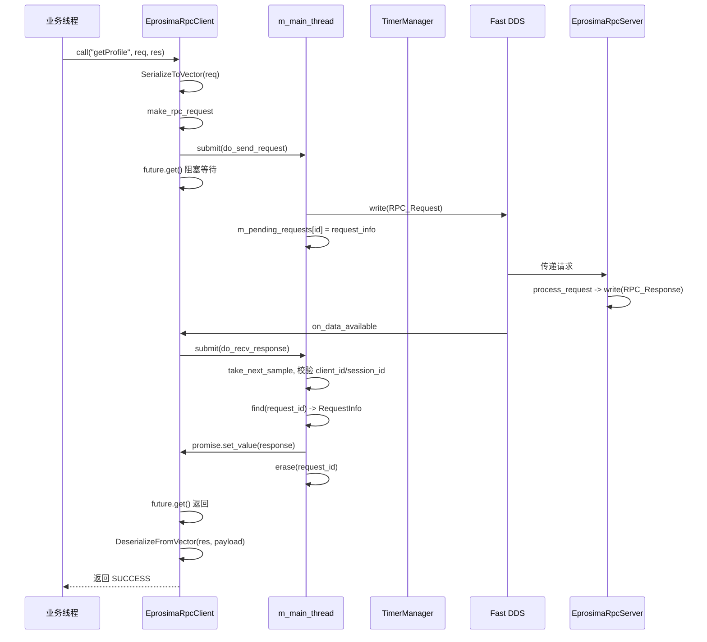
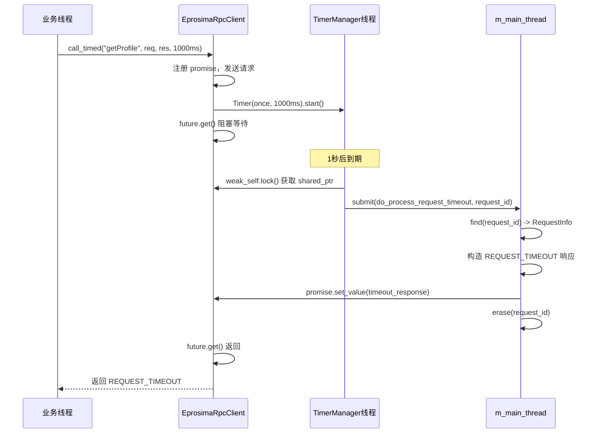
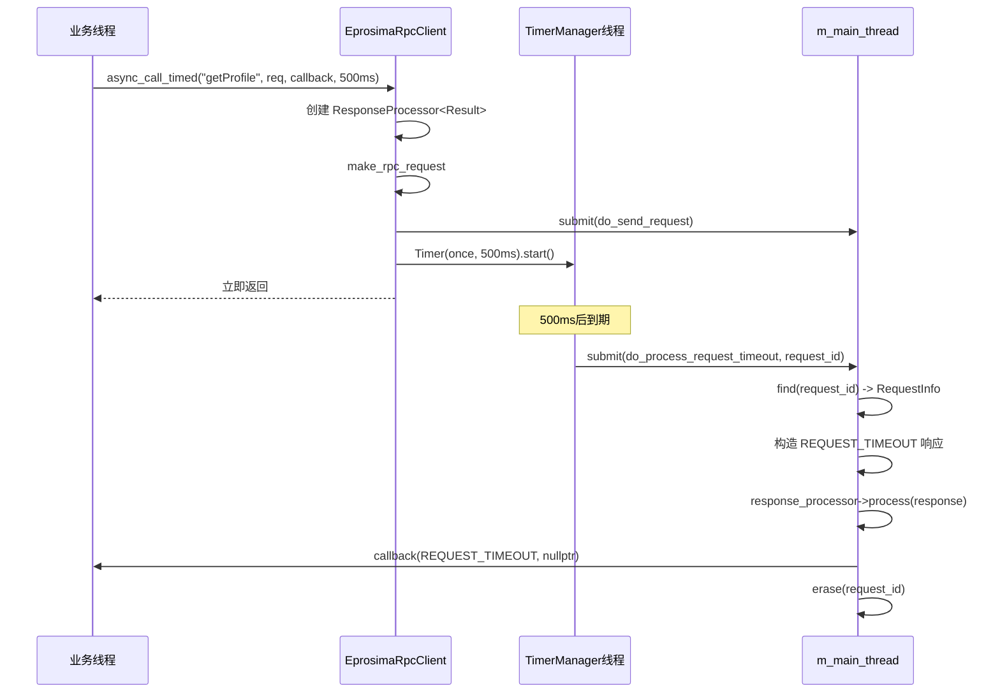

# 基于Fast DDS的SOA框架详细设计文档

| 版本 | 日期 | 作者 | 变更描述 |
| :--- | :--- | :--- | :--- |
| V1.0 | 2026-06-01 | AI Assistant | 初版，定义基本RPC框架 |
| V2.0 | 2026-06-20 | AI Assistant | 增加序列化接口与错误处理 |
| V3.0 | 2026-07-08 | AI Assistant | 增加call_timed与async_call_timed接口，完善超时控制与清理机制 |
| V4.0 | 2026-09-16 | AI Assistant | 结合现有实现更新：调整IDL为`soa_on_dds`模块，payload改用`sequence<octet>`；引入`Timer`/`TimerManager`、`thread_pool`、`worker_thread`等基础设施；补充实际实现细节与架构调整 |

## 1. 引言

### 1.1 编写目的

本文档旨在详细描述一个基于 Fast DDS 实现的、面向服务的中间件框架（SOA Framework）的设计细节。该框架使用请求/响应模式（RPC 风格）实现服务间通信，对底层 DDS 协议进行封装，为上层业务提供类型安全、支持同步/异步调用、可灵活配置超时的 RPC 接口。

本文档与早期版本的主要区别在于：**当前版本完全基于已实现的代码**（`EprosimaRpcClient`、`EprosimaRpcServer`、`EprosimaPubWrapper`、`EprosimaSubWrapper`、`Timer`、`thread_pool` 等），而不是设计草案。文档中的类名、接口、数据结构均与代码保持一致。

### 1.2 设计目标

- **位置透明**：客户端无需关心服务端的物理位置，通过服务名即可发起调用。
- **多服务与多方法**：基于 Topic 实现服务发现与路由，通过 `header.method_name` 实现方法级寻址。
- **类型安全与易用性**：利用 C++ 模板和统一的序列化契约（`SerializeToVector` / `DeserializeFromVector`），让业务代码无需手动处理序列化细节，天然适配 Protobuf 及自定义类型。
- **并发与隔离**：支持多个客户端实例并发调用，通过 `client_id` 与 `session_id` 实现会话隔离，`request_id` 实现请求级匹配。
- **灵活的调用模式**：
    - `call`：阻塞式同步调用，不设置超时（依赖底层 DDS 保证或由业务自行控制）。
    - `call_timed`：阻塞式同步调用，用户指定超时时间。
    - `async_call`：基于回调的异步调用，不设置超时。
    - `async_call_timed`：基于回调的异步调用，用户指定超时时间。
- **可靠性**：提供超时、错误码等基本可靠性保障。
- **高性能**：利用 Fast DDS 的 RTPS 协议，通过线程池与工作线程实现请求的并发处理。

---

## 2. 总体架构

框架分为四层：**基础设施层（Timer / ThreadPool / WorkerThread / ThreadSafeQueue）**、**传输层（Fast DDS 封装）**、**核心框架层（RPC Client / Server）**、**业务层**。

```
┌─────────────────────────────────────────────────────────────┐
│                        业务层                                 │
│   Client业务代码          Server业务接口实现                   │
└──────────────┬──────────────────────────┬───────────────────┘
               │                          │
┌──────────────▼──────────────────────────▼───────────────────┐
│                    核心框架层                                  │
│   EprosimaRpcClient              EprosimaRpcServer            │
│   - call/call_timed              - register_method            │
│   - async_call/async_call_timed  - start/stop                 │
└──────────────┬──────────────────────────┬───────────────────┘
               │                          │
┌──────────────▼──────────────────────────▼───────────────────┐
│                  传输层（DDS 封装）                            │
│   EprosimaPubWrapper             EprosimaSubWrapper           │
│   - DataWriter封装               - DataReader封装             │
│   EprosimaRpcUtility（工具类）                                 │
└──────────────┬──────────────────────────┬───────────────────┘
               │                          │
┌──────────────▼──────────────────────────▼───────────────────┐
│               基础设施层                                       │
│   Timer/TimerManager   thread_pool   worker_thread           │
│   threadsafe_queue     EprosimaRpcUtility                    │
└─────────────────────────────────────────────────────────────┘
               │                          │
┌──────────────▼──────────────────────────▼───────────────────┐
│                    Fast DDS 中间件                             │
│   soa.rpc.<service>.request Topic                             │
│   soa.rpc.<service>.response Topic                            │
└─────────────────────────────────────────────────────────────┘
```

**关键组件说明：**

- **`EprosimaRpcClient`**：客户端代理，封装请求 DataWriter 和响应 DataReader。通过 `worker_thread` 串行化内部状态访问，通过 `Timer` 实现请求超时。
- **`EprosimaRpcServer`**：服务端骨架，封装请求 DataReader 和响应 DataWriter。通过 `worker_thread` 处理接收循环与方法注册，通过 `thread_pool` 并发执行业务方法。
- **`EprosimaPubWrapper` / `EprosimaSubWrapper`**：对 Fast DDS 的 Publisher/DataWriter 和 Subscriber/DataReader 的 RAII 封装，自动管理 DDS 实体生命周期。
- **`EprosimaRpcUtility`**：提供 Topic 命名、client_id / session_id 生成、时间戳获取、错误码转字符串、默认 DomainParticipant 管理等工具能力。
- **`Timer` / `TimerManager`**：基于 `std::chrono` 与优先队列（`std::list` 按到期时间排序）的定时器实现，用于请求超时控制。
- **`worker_thread`**：单线程任务队列，用于保证客户端/服务端内部状态的串行访问。
- **`thread_pool`**：固定大小线程池，服务端用于并发执行多个 RPC 方法调用。

---

## 3. 通信协议设计

### 3.1 Topic 命名与数据结构

遵循"一个服务，一对 Topic"的原则。

**Topic 命名规则（由 `EprosimaRpcUtility` 生成）：**

- **请求 Topic**：`soa.rpc.<service_name>.request`
- **响应 Topic**：`soa.rpc.<service_name>.response`

其中 `service_name` 由用户传入。所有 RPC 服务默认使用统一的 DomainParticipant（Domain ID = 40）。

### 3.2 IDL 定义

```idl
module soa_on_dds {

enum ErrorCode {
    SUCCESS,                          // 成功
    UPPER_LAYER_APPLICATION_ERROR,    // 上层业务异常
    CLIENT_SERIALIZE_ERROR,           // 客户端序列化失败
    CLIENT_DESERIALIZE_ERROR,         // 客户端反序列化失败
    SERVICE_SERIALIZE_ERROR,          // 服务端序列化失败
    SERVICE_DESERIALIZE_ERROR,        // 服务端反序列化失败
    SERVICE_NOT_AVAILABLE,            // 服务不可用
    METHOD_NOT_REGISTER,              // 方法未注册
    REQUEST_TIMEOUT,                  // 请求超时
    CLIENT_SEND_REQUEST_ERROR,        // 客户端发送请求失败
    CLIENT_NOT_INITIALIZE             // 客户端未初始化
};

struct RPC_Header {
    string method_name;               // 方法名，用于服务端路由
    string client_id;                 // 客户端唯一标识
    long session_id;                  // 会话ID（当前实现为进程PID）
    long request_id;                  // 请求ID，单调递增，用于匹配响应
    unsigned long long timestamp_ms;  // 请求/响应的发送时间戳（毫秒）
};

struct RPC_Request {
    RPC_Header header;
    sequence<octet> request_payload;  // 序列化后的业务参数
};

struct RPC_Response {
    RPC_Header header;
    ErrorCode error_code;
    sequence<octet> response_payload; // 序列化后的业务返回值
};

};  // soa_on_dds
```

### 3.3 头部字段语义与用途

| 字段 | 类型 | 作用 |
| :--- | :--- | :--- |
| `method_name` | `string` | 服务级路由键。ServiceA 下可能有 `login`、`logout` 等多个方法，服务端凭此字段分发到对应的处理函数。 |
| `client_id` | `string` | 客户端标识符。由 `client_name + "@" + hostname` 生成，用于服务端识别调用来源，也用于客户端过滤非本客户端的响应。 |
| `session_id` | `long` | 标识客户端实例的一次生命周期。当前实现使用进程 PID 生成。用于处理因客户端异常重启而导致的陈旧请求。 |
| `request_id` | `long` | 每次 RPC 调用的唯一序列号，单调递增。是客户端关联 Response 与 Request 的唯一凭证。 |
| `timestamp_ms` | `unsigned long long` | 请求/响应发送的毫秒级时间戳，用于日志分析和性能统计。 |

### 3.4 Payload 传输格式

与早期版本使用 `string` 存储序列化数据不同，**当前实现使用 `sequence<octet>`（即 `std::vector<uint8_t>`）**。这样做的好处是：

- 避免 `std::string` 与二进制数据的语义混淆（如 `\0` 问题）。
- 与 Protobuf 的 `SerializeToString` 输出可无缝转换。
- 减少一次 `std::string` 与 `std::vector<uint8_t>` 之间的拷贝。

---

## 4. 核心组件详细设计

### 4.1 EprosimaRpcClient（客户端代理）

#### 4.1.1 类定义

```cpp
namespace soa_on_dds {

class EprosimaRpcClient : public std::enable_shared_from_this<EprosimaRpcClient> {
public:
    static std::shared_ptr<EprosimaRpcClient> create_rpc_client(
            const std::string& client_name,
            const std::string& service_name,
            eprosima::fastdds::dds::DomainParticipant* participant = nullptr);

    virtual ~EprosimaRpcClient();

    bool init();
    bool is_ready();

    // 同步调用（无超时）
    template <typename Argument, typename Result>
    soa_on_dds::ErrorCode call(const std::string& method_name,
            const Argument& arg, Result& res);

    // 同步调用（指定超时）
    template <typename Argument, typename Result>
    soa_on_dds::ErrorCode call_timed(const std::string& method_name,
            const Argument& arg, Result& res,
            std::chrono::milliseconds timeout);

    // 异步调用（无超时）
    template <typename Argument, typename Result>
    void async_call(const std::string& method_name, const Argument& arg,
            std::function<void(soa_on_dds::ErrorCode,
                               std::shared_ptr<Result>)> callback);

    // 异步调用（指定超时）
    template <typename Argument, typename Result>
    void async_call_timed(const std::string& method_name, const Argument& arg,
            std::function<void(soa_on_dds::ErrorCode,
                               std::shared_ptr<Result>)> callback,
            std::chrono::milliseconds timeout);
};

}   // namespace soa_on_dds
```

#### 4.1.2 关键内部结构

```cpp
// 请求-响应处理器抽象，用于统一同步/异步的响应处理
class IResponseProcessor {
public:
    virtual void process(std::shared_ptr<RPC_Response> rpc_response) = 0;
};

// 同步调用使用的处理器：通过 promise 唤醒阻塞线程
using ResponsePromise = std::promise<ResponsePtr>;
using ResponsePromisePtr = std::shared_ptr<ResponsePromise>;

// 异步调用使用的处理器：执行业务回调
template <typename Result>
class ResponseProcessor : public IResponseProcessor {
    std::function<void(soa_on_dds::ErrorCode, std::shared_ptr<Result>)> m_callback;
    void process(std::shared_ptr<RPC_Response> rpc_response) override;
};

// 每个在途请求的元信息
struct RequestInfo {
    RequestPtr           request;           // 请求对象（保留以支持超时构造响应）
    ResponsePromisePtr   response_promise;  // 同步调用的 promise（异步时为空）
    IResponseProcessorPtr response_processor; // 异步调用的处理器（同步时为空）
    uint64_t             timestamps_ms;     // 发送时间戳
};

// 待处理请求表：request_id -> RequestInfo
std::unordered_map<long, RequestInfoPtr> m_pending_requests;
```

> **实现细节**：`m_pending_requests` 的所有访问（插入、查找、删除）都在 `m_main_thread`（`worker_thread`）中串行执行，**无需加锁**。这是当前实现相较于初版文档最大的架构差异——用"单线程串行化"代替"互斥锁保护"。

#### 4.1.3 生命周期管理

1. **构造**：
    - 若外部未传入 `DomainParticipant`，则使用 `EprosimaRpcUtility::get_default_rpc_participant()` 获取全局默认 participant（Domain ID = 40）。
    - 生成 `client_id = client_name + "@" + hostname`。
    - 生成 `session_id = getpid()`。
    - 绑定监听器 `m_up = this`。
    - 预分配 `m_cached_response`。

2. **`init()`**：
    - 调用 `init_request_pub()`：创建请求发布端（Topic: `soa.rpc.<service>.request`）。
    - 调用 `init_response_sub()`：创建响应订阅端（Topic: `soa.rpc.<service>.response`）。
    - 两者均使用 `PREALLOCATED_WITH_REALLOC_MEMORY_MODE` 内存策略。

3. **`is_ready()`**：
    - 检查 `m_request_pub_matched == 1 && m_response_sub_matched == 1`。
    - 只有 DDS 发现完成（发布/订阅两端都匹配到对端）后才返回 true。

4. **析构**：
    - 释放 `m_request_pub`、`m_response_sub`（RAII 销毁 DDS 实体）。
    - `m_main_thread` 在成员析构时自动停止并 join。

#### 4.1.4 同步调用实现

```cpp
template <typename Argument, typename Result>
soa_on_dds::ErrorCode EprosimaRpcClient::call_helper(
        const std::string& method_name, const Argument& arg,
        Result& res, std::chrono::milliseconds timeout) {
    // 1. 检查服务可用性
    if (!is_ready()) {
        return soa_on_dds::SERVICE_NOT_AVAILABLE;
    }

    // 2. 序列化 Argument
    std::vector<uint8_t> request_payload;
    if (!SerializeToVector(arg, request_payload)) {
        return soa_on_dds::CLIENT_SERIALIZE_ERROR;
    }

    // 3. 创建 Promise 并发送请求
    ResponsePromisePtr response_promise = std::make_shared<ResponsePromise>();
    send_request(method_name, request_payload,
                 response_promise, nullptr, timeout);

    // 4. 等待响应（无限等待；超时由 Timer 触发 set_value 唤醒）
    auto response_future = response_promise->get_future();
    auto rpc_response = response_future.get();
    assert(rpc_response != nullptr);

    // 5. 检查错误码
    if (rpc_response->error_code() != soa_on_dds::SUCCESS) {
        return rpc_response->error_code();
    }

    // 6. 反序列化 Result
    if (!DeserializeFromVector(res, rpc_response->response_payload())) {
        return soa_on_dds::CLIENT_DESERIALIZE_ERROR;
    }

    return soa_on_dds::SUCCESS;
}
```

> **关键设计点**：`call` 与 `call_timed` 的差异仅在于 `timeout` 参数。若 `timeout == 0`（`call`），则不创建 `Timer`，`future.get()` 会一直阻塞直至响应到达。若 `timeout > 0`，则创建一次性 `Timer`，到期后调用 `on_request_timeout(request_id)`，最终由 `do_process_request_timeout` 构造一个 `REQUEST_TIMEOUT` 的响应并 `set_value`，从而唤醒阻塞线程。

#### 4.1.5 异步调用实现

```cpp
template <typename Argument, typename Result>
void EprosimaRpcClient::async_call_helper(
        const std::string& method_name, const Argument& arg,
        std::function<void(soa_on_dds::ErrorCode,
                           std::shared_ptr<Result>)> callback,
        std::chrono::milliseconds timeout) {
    // 1. 检查服务可用性
    if (!is_ready()) {
        callback(soa_on_dds::SERVICE_NOT_AVAILABLE, nullptr);
        return;
    }

    // 2. 序列化 Argument
    std::vector<uint8_t> request_payload;
    if (!SerializeToVector(arg, request_payload)) {
        callback(soa_on_dds::CLIENT_SERIALIZE_ERROR, nullptr);
        return;
    }

    // 3. 创建异步响应处理器
    IResponseProcessorPtr response_processor =
        std::make_shared<ResponseProcessor<Result>>(callback);

    // 4. 发送请求（无 promise）
    send_request(method_name, request_payload,
                 nullptr, response_processor, timeout);
}
```

`ResponseProcessor<Result>::process` 负责：
1. 若 `error_code != SUCCESS`，直接回调 `(error_code, nullptr)`。
2. 否则反序列化 `response_payload` 到 `Result`，回调 `(SUCCESS, result)`。
3. 若反序列化失败，回调 `(CLIENT_DESERIALIZE_ERROR, nullptr)`。

#### 4.1.6 请求发送流程（`send_request` → `do_send_request`）

```cpp
void EprosimaRpcClient::send_request(
        const std::string& method_name,
        const std::vector<uint8_t>& request_payload,
        ResponsePromisePtr response_promise,
        IResponseProcessorPtr response_processor,
        std::chrono::milliseconds timeout) {
    // 1. 构造 RPC_Request（填充 header + payload）
    auto request = make_rpc_request(method_name, request_payload);

    // 2. 封装 RequestInfo
    auto request_info = std::make_shared<RequestInfo>();
    request_info->request = request;
    request_info->response_promise = response_promise;
    request_info->response_processor = response_processor;
    request_info->timestamps_ms = EprosimaRpcUtility::get_current_time_ms();

    // 3. 提交到内部 worker_thread 执行发送
    m_main_thread.submit(std::bind(&EprosimaRpcClient::do_send_request, this, request_info));

    // 4. 若指定了超时，创建一次性 Timer
    if (timeout != std::chrono::milliseconds::zero()) {
        std::weak_ptr<EprosimaRpcClient> weak_self = this->shared_from_this();
        long request_id = request->header().request_id();
        Timer timer([weak_self, request_id]() {
                auto self = weak_self.lock();
                if (self == nullptr) return;
                self->on_request_timeout(request_id);
            }, timeout);
        timer.start();
    }
}

void EprosimaRpcClient::do_send_request(RequestInfoPtr request_info) {
    auto request = request_info->request;

    // 设置发送时间戳
    set_send_timestamp_ms(*request);

    // 写请求
    if (!m_request_pub->write((void*)request.get())) {
        auto rpc_response = make_rpc_response(request, soa_on_dds::CLIENT_SEND_REQUEST_ERROR);
        set_reponse(request_info, rpc_response);
        return;
    }

    // 记录待处理请求
    m_pending_requests[request->header().request_id()] = request_info;
}
```

#### 4.1.7 响应处理流程



**关键步骤：**

1. `ResponseSubListener::on_data_available` 被 DDS 回调触发，立即向 `m_main_thread` 提交 `do_recv_response` 任务。
2. `do_recv_response` 在 `m_main_thread` 中循环调用 `take_next_sample`，直到无数据。
3. 对每个样本：
    - 跳过非 `ALIVE_INSTANCE_STATE` 的样本。
    - `is_valid_response` 校验 `client_id` 与 `session_id`。
    - 在 `m_pending_requests` 中查找 `request_id`。
    - 校验 `method_name` 一致性。
    - 调用 `set_reponse`：
        - 同步：`response_promise->set_value(rpc_response)`，唤醒业务线程。
        - 异步：`response_processor->process(rpc_response)`，执行业务回调。
    - `remove_pending_request(request_id)`。

#### 4.1.8 超时处理流程



**关键设计点：**

- **超时与响应同时发生**：由于两者都在 `m_main_thread` 中串行执行，天然避免了竞态。谁先被调度，谁就先处理 `m_pending_requests`。后到者 `find` 返回 `nullptr`，直接忽略。
- **Timer 弱引用捕获**：使用 `weak_ptr` 避免 Timer 延长客户端生命周期。若客户端已析构，回调中 `lock()` 返回空，直接返回。
- **TimerManager 全局单例**：所有 Timer 共享一个 `TimerManagerSingleton`，在独立线程中按到期时间顺序唤醒回调。

#### 4.1.9 客户端线程模型

| 线程 | 职责 |
| :--- | :--- |
| **DDS 内部线程** | 触发 `ResponseSubListener::on_data_available` 和 `RequestPubListener::on_publication_matched`。 |
| **`m_main_thread`（worker_thread）** | 串行执行：`do_send_request`、`do_recv_response`、`do_process_request_timeout`。保证 `m_pending_requests` 无锁安全。 |
| **`TimerManager` 线程** | 单例，负责所有 Timer 的到期检测与回调触发。 |
| **业务线程** | 调用 `call`/`async_call`，阻塞等待 promise 或立即返回。 |

---

### 4.2 EprosimaRpcServer（服务端骨架）

#### 4.2.1 类定义

```cpp
namespace soa_on_dds {

class EprosimaRpcServer {
public:
    static std::shared_ptr<EprosimaRpcServer> create_rpc_server(
            const std::string& service_name,
            size_t thread_pool_size,
            eprosima::fastdds::dds::DomainParticipant* participant = nullptr);

    virtual ~EprosimaRpcServer();

    bool start();
    void stop();

    template <typename Argument, typename Result>
    void register_method(const std::string& method_name,
            std::function<void(const Argument&, Result&)> process_function);

    void unregister_method(const std::string& method_name);
};

}   // namespace soa_on_dds
```

#### 4.2.2 方法处理器（类型擦除）

```cpp
class IMethodHandler {
public:
    virtual soa_on_dds::ErrorCode process(
            const std::vector<uint8_t>& request_payload,
            std::vector<uint8_t>& response_payload) = 0;
};

template <typename Argument, typename Result>
class MethodHandler : public IMethodHandler {
public:
    MethodHandler(std::function<void(const Argument&, Result&)> process_function)
        : m_process_function(process_function) {}

    soa_on_dds::ErrorCode process(
            const std::vector<uint8_t>& request_payload,
            std::vector<uint8_t>& response_payload) override {
        Argument arg;
        Result res;

        // 1. 反序列化 Argument
        if (!DeserializeFromVector(arg, request_payload)) {
            return soa_on_dds::SERVICE_DESERIALIZE_ERROR;
        }

        // 2. 执行业务逻辑（捕获异常）
        try {
            m_process_function(arg, res);
        } catch (...) {
            return soa_on_dds::UPPER_LAYER_APPLICATION_ERROR;
        }

        // 3. 序列化 Result
        if (!SerializeToVector(res, response_payload)) {
            return soa_on_dds::SERVICE_SERIALIZE_ERROR;
        }

        return soa_on_dds::SUCCESS;
    }

    std::function<void(const Argument&, Result&)> m_process_function;
};
```

#### 4.2.3 生命周期管理

1. **构造**：
    - 若外部未传入 participant，则使用默认 RPC participant。
    - 调整线程池大小（`[1, 5]` 区间）。
    - 绑定监听器 `m_up = this`。

2. **`start()`**：
    - `init_request_sub()`：创建请求订阅端（Topic: `soa.rpc.<service>.request`）。
    - `init_response_pub()`：创建响应发布端（Topic: `soa.rpc.<service>.response`）。
    - 请求 DataReader QoS：KEEP_LAST depth=1000，max_samples=1500。
    - 响应 DataWriter QoS：KEEP_LAST depth=1000，RELIABLE 可靠性。

3. **`stop()`**：
    - 提交 `do_stop` 到 `m_main_thread`，在其中重置 `m_request_sub` 与 `m_response_pub`（析构 DDS 实体）。

4. **析构**：
    - 调用 `stop()`。
    - `m_workers`（`thread_pool`）和 `m_main_thread`（`worker_thread`）成员析构时自动停止并 join。

#### 4.2.4 方法注册

```cpp
template <typename Argument, typename Result>
void EprosimaRpcServer::register_method(
        const std::string& method_name,
        std::function<void(const Argument&, Result&)> process_function) {
    auto method_handler =
        std::make_shared<MethodHandler<Argument, Result>>(process_function);
    register_method_helper(method_name, method_handler);
}

void EprosimaRpcServer::register_method_helper(
        const std::string& method_name, IMethodHandlerPtr method_handler) {
    // 提交到 m_main_thread，保证 m_method_handlers 的串行访问
    m_main_thread.submit(std::bind(&EprosimaRpcServer::do_register_method,
                                   this, method_name, method_handler));
}

void EprosimaRpcServer::do_register_method(
        const std::string& method_name, IMethodHandlerPtr method_handler) {
    m_method_handlers[method_name] = method_handler;
}
```

> **关键设计点**：`register_method` 是线程安全的，因为 `m_method_handlers` 的所有修改与读取都通过 `m_main_thread` 串行化。

#### 4.2.5 请求处理流程



**关键步骤：**

1. `RequestSubListener::on_data_available` 触发，向 `m_main_thread` 提交 `do_recv_request`。
2. `do_recv_request` 在 `m_main_thread` 中循环调用 `take_next_sample`，**每次循环最多处理 `MAX_THREAD_POOL_SIZE + 1` 个样本**，然后重新提交自身，避免长时间占用 `m_main_thread`。
3. 对每个请求：
    - 跳过非 `ALIVE_INSTANCE_STATE` 的样本。
    - `get_method_handler(method_name)`：
        - **找到**：向 `m_workers` 提交 `process_request`。
        - **未找到**：构造 `METHOD_NOT_REGISTER` 响应，直接在 `m_main_thread` 中调用 `m_response_pub->write`。
    - 为下一个样本重新分配 `rpc_request`（避免多个 worker 共享同一对象）。
4. `process_request` 在 worker 线程中执行：
    - 调用 `method_handler->process(request_payload, response_payload)`。
    - 构造 `RPC_Response`，填充 header、error_code、response_payload。
    - 向 `m_main_thread` 提交 `do_send_response`。
5. `do_send_response` 在 `m_main_thread` 中：
    - 设置发送时间戳。
    - `m_response_pub->write(response)`。

#### 4.2.6 服务端线程模型

| 线程 | 职责 |
| :--- | :--- |
| **DDS 内部线程** | 触发 `RequestSubListener::on_data_available`。 |
| **`m_main_thread`（worker_thread）** | 串行执行：`do_recv_request`、`do_register_method`、`do_unregister_method`、`do_send_response`、`do_stop`。保证 `m_method_handlers` 和 DDS 写操作的串行化。 |
| **`m_workers`（thread_pool）** | 并发执行 `process_request`，即实际的业务方法调用。线程数在 `[1, 5]` 之间。 |
| **业务线程** | 调用 `register_method` / `unregister_method`，提交任务到 `m_main_thread` 后立即返回。 |

---

### 4.3 传输层封装

#### 4.3.1 EprosimaPubWrapper

对 Fast DDS Publisher / DataWriter 的 RAII 封装。

```cpp
class EprosimaPubWrapper {
public:
    struct Config {
        DomainParticipant* participant = nullptr;
        TypeSupport type_support;
        PublisherQos publisher_qos = PUBLISHER_QOS_DEFAULT;
        TopicQos topic_qos = TOPIC_QOS_DEFAULT;
        std::string topic_name;
        DataWriterQos data_writer_qos = DATAWRITER_QOS_DEFAULT;
        DataWriterListener* data_writer_listener = nullptr;
    };

    bool init(const Config& config);
    bool write(void* data);

private:
    void reset();  // 逆序销毁 DataWriter -> Publisher -> Topic
};
```

**`init` 流程：**
1. 注册 TypeSupport。
2. 创建 Publisher。
3. 创建 Topic。
4. 创建 DataWriter。
5. 任一步骤失败则调用 `reset()` 回滚。

#### 4.3.2 EprosimaSubWrapper

对 Fast DDS Subscriber / DataReader 的 RAII 封装，与 `EprosimaPubWrapper` 对称。

```cpp
class EprosimaSubWrapper {
public:
    struct Config {
        DomainParticipant* participant = nullptr;
        TypeSupport type_support;
        SubscriberQos subscriber_qos = SUBSCRIBER_QOS_DEFAULT;
        TopicQos topic_qos = TOPIC_QOS_DEFAULT;
        std::string topic_name;
        DataReaderQos data_reader_qos = DATAREADER_QOS_DEFAULT;
        DataReaderListener* data_reader_listener = nullptr;
    };

    bool init(const Config& config);
    ReturnCode_t take_next_sample(void* data, SampleInfo* info);
};
```

#### 4.3.3 EprosimaRpcUtility

工具类，提供以下能力：

| 方法 | 说明 |
| :--- | :--- |
| `generate_rpc_request_topic(service_name)` | 返回 `soa.rpc.<service_name>.request` |
| `generate_rpc_response_topic(service_name)` | 返回 `soa.rpc.<service_name>.response` |
| `generate_rpc_client_id(client_name)` | 返回 `client_name@hostname` |
| `generate_rpc_session_id()` | 返回 `getpid()` |
| `get_current_time_ms()` | 返回当前系统时间的毫秒时间戳 |
| `ms_to_string(ms)` | 毫秒时间戳转可读字符串 |
| `error_code_to_string(code)` | ErrorCode 转字符串 |
| `get_default_rpc_participant()` | 返回全局默认 participant（Domain ID = 40） |
| `create_participant(domain_id, qos, listener)` | 创建 participant |
| `delete_participant(part)` | 删除 participant |

**序列化契约**（`EprosimaRpcUtility.hpp` 中定义）：

```cpp
// 空类型支持（用于无参方法）
struct VoidType {};
bool SerializeToVector(const VoidType&, std::vector<uint8_t>& output);
bool DeserializeFromVector(VoidType&, const std::vector<uint8_t>& input);

// std::string 支持
bool SerializeToVector(const std::string& str, std::vector<uint8_t>& output);
bool DeserializeFromVector(std::string& str, const std::vector<uint8_t>& input);
```

业务类型（如 Protobuf 消息）只需提供以下形式的适配函数即可：

```cpp
bool SerializeToVector(const MyType& value, std::vector<uint8_t>& output);
bool DeserializeFromVector(MyType& value, const std::vector<uint8_t>& input);
```

---

### 4.4 基础设施层

#### 4.4.1 Timer / TimerManager

**Timer** 是对外接口，**TimerManager** 是内部实现（单例）。

```cpp
class Timer {
public:
    using Callback = std::function<void()>;
    using Interval = std::chrono::microseconds;
    enum Type { once = 1, repeat = 2 };

    Timer(Callback function, Interval interval, Type type = once);
    void start();
    void cancel();
    bool isActive();

private:
    std::shared_ptr<Impl> pimpl_;
};
```

**TimerManager 核心机制：**

- 内部维护 `std::list<TimerPtr> timer_list_`，按 `expire_time_point` 升序排列。
- 独立线程 `timer_check_thread_` 运行 `check_timer_loop()`。
- `check_timer_once()`：
    1. 等待列表非空。
    2. 取出第一个 Timer。
    3. 若未到期，`wait_until(expire_time_point)`。
    4. 若期间有新 Timer 插入且到期时间更早，将当前 Timer 放回并重新调度。
    5. 到期后执行回调；`repeat` 类型重新计算到期时间并插入列表。
- `insert_timer` 保证列表按到期时间有序；若新 Timer 比当前等待的更早，`notify_one` 唤醒等待线程重新调度。

**在 RPC 框架中的使用**：`EprosimaRpcClient::send_request` 在 `timeout > 0` 时创建一个 `once` 类型的 Timer，到期回调 `on_request_timeout(request_id)`。

#### 4.4.2 worker_thread

单线程任务队列，保证任务串行执行。

```cpp
class worker_thread {
public:
    worker_thread();
    ~worker_thread();  // stop + join

    template <typename FunctionType>
    void submit(FunctionType f);
};
```

**在 RPC 框架中的使用**：
- `EprosimaRpcClient::m_main_thread`：串行化发送、接收、超时处理，保证 `m_pending_requests` 无锁安全。
- `EprosimaRpcServer::m_main_thread`：串行化请求接收、方法注册、响应发送，保证 `m_method_handlers` 和 DDS 写操作安全。

#### 4.4.3 thread_pool

固定大小线程池。

```cpp
class thread_pool {
public:
    thread_pool(unsigned thread_count = std::thread::hardware_concurrency());
    ~thread_pool();  // stop + join

    template <typename FunctionType>
    void submit(FunctionType f);
};
```

**在 RPC 框架中的使用**：`EprosimaRpcServer::m_workers` 并发执行业务方法（`process_request`）。线程数被限制在 `[1, 5]`。

#### 4.4.4 threadsafe_queue

线程安全队列，提供 `push`、`wait_and_pop`、`try_pop`、`empty` 等操作，供 `worker_thread` 和 `thread_pool` 使用。

---

## 5. 序列化策略详解

### 5.1 编译期契约

框架不强制要求 `Argument` 和 `Result` 继承自某个基类，而是采用 C++ 模板的编译期多态（鸭子类型）。业务类型只需提供以下两个自由函数（ADL 查找）：

```cpp
bool SerializeToVector(const T& value, std::vector<uint8_t>& output);
bool DeserializeFromVector(T& value, const std::vector<uint8_t>& input);
```

框架已内置对 `VoidType`（空类型）和 `std::string` 的支持。

### 5.2 与 Protobuf 的适配

对于 Protobuf 消息，可通过以下适配函数（或直接使用 `ByteSizeLong` + `SerializeToArray`）：

```cpp
inline bool SerializeToVector(const google::protobuf::Message& msg,
                              std::vector<uint8_t>& output) {
    output.resize(msg.ByteSizeLong());
    return msg.SerializeToArray(output.data(), output.size());
}

inline bool DeserializeFromVector(google::protobuf::Message& msg,
                                  const std::vector<uint8_t>& input) {
    return msg.ParseFromArray(input.data(), input.size());
}
```

### 5.3 自定义类型支持

对于自定义 C++ 结构体，只需手动实现两个适配函数：

```cpp
struct MyData {
    int id;
    std::string name;
};

bool SerializeToVector(const MyData& data, std::vector<uint8_t>& output) {
    // 例如用 JSON 库序列化
    std::string json = to_json(data);
    output.assign(json.begin(), json.end());
    return true;
}

bool DeserializeFromVector(MyData& data, const std::vector<uint8_t>& input) {
    std::string json(input.begin(), input.end());
    return from_json(json, data);
}
```

---

## 6. 关键场景流程示例

### 6.1 同步调用（`call`，无超时）



### 6.2 同步调用（`call_timed`，自定义超时）



### 6.3 异步调用（`async_call_timed`）



---

## 7. 错误处理

### 7.1 错误码定义

| 错误码 | 值 | 产生场景 | 处理方 |
| :--- | :--- | :--- | :--- |
| `SUCCESS` | 0 | 服务端成功处理请求。 | 客户端收到后正常反序列化。 |
| `UPPER_LAYER_APPLICATION_ERROR` | 1 | 业务方法抛出异常。 | 客户端收到后上报业务层。 |
| `CLIENT_SERIALIZE_ERROR` | 2 | 客户端 `SerializeToVector` 返回 false。 | 同步/异步调用立即返回错误。 |
| `CLIENT_DESERIALIZE_ERROR` | 3 | 客户端 `DeserializeFromVector` 返回 false。 | 同步/异步调用返回错误。 |
| `SERVICE_SERIALIZE_ERROR` | 4 | 服务端 `SerializeToVector` 返回 false。 | 服务端设置错误码后返回。 |
| `SERVICE_DESERIALIZE_ERROR` | 5 | 服务端 `DeserializeFromVector` 返回 false。 | 服务端设置错误码后返回。 |
| `SERVICE_NOT_AVAILABLE` | 6 | 客户端 DDS 发现未完成（`is_ready()` 为 false）。 | 客户端立即返回错误。 |
| `METHOD_NOT_REGISTER` | 7 | 服务端路由表中找不到 `method_name`。 | 客户端应检查方法名拼写或版本兼容性。 |
| `REQUEST_TIMEOUT` | 8 | 在指定超时时间内未收到响应。 | 同步：`call_timed` 返回；异步：回调收到。 |
| `CLIENT_SEND_REQUEST_ERROR` | 9 | `m_request_pub->write` 返回 false。 | 客户端返回错误。 |
| `CLIENT_NOT_INITIALIZE` | 10 | 客户端未调用 `init()`。 | 预留。 |

### 7.2 各调用模式的错误处理对比

| 调用模式 | 超时行为 | 错误返回方式 |
| :--- | :--- | :--- |
| `call` | 无超时（无限等待） | 返回 `ErrorCode` |
| `call_timed` | 用户指定超时 | 返回 `REQUEST_TIMEOUT` |
| `async_call` | 无超时 | 回调收到 `ErrorCode`，`result` 可能为 `nullptr` |
| `async_call_timed` | 用户指定超时 | 回调收到 `REQUEST_TIMEOUT`，`result` 为 `nullptr` |

---

## 8. 线程模型与并发安全

### 8.1 线程组成

**客户端：**

| 线程 | 数量 | 职责 |
| :--- | :--- | :--- |
| DDS 内部线程 | 若干 | 触发监听器回调。 |
| `m_main_thread` | 1 | 串行化发送、接收、超时处理。 |
| `TimerManager` 线程 | 1（全局单例） | 超时检测与回调触发。 |
| 业务线程 | N | 调用 RPC 接口。 |

**服务端：**

| 线程 | 数量 | 职责 |
| :--- | :--- | :--- |
| DDS 内部线程 | 若干 | 触发监听器回调。 |
| `m_main_thread` | 1 | 串行化请求接收、方法注册、响应发送。 |
| `m_workers` | `[1, 5]` | 并发执行 `process_request`。 |
| 业务线程 | N | 调用 `register_method` / `start` / `stop`。 |

### 8.2 并发安全保证

- **客户端 `m_pending_requests`**：所有访问都在 `m_main_thread` 中，无需加锁。
- **服务端 `m_method_handlers`**：所有访问都在 `m_main_thread` 中，无需加锁。
- **DDS 实体操作**：`m_request_pub` / `m_response_sub` / `m_request_sub` / `m_response_pub` 的创建、销毁、读写都在各自的 `m_main_thread` 中，避免 DDS 实体的并发访问问题。
- **`m_request_id_generator`**：`std::atomic<long>`，由业务线程调用 `++` 保证原子性。
- **`m_is_ready`、`m_request_pub_matched`、`m_response_sub_matched`**：`std::atomic`，DDS 监听器线程与业务线程并发访问安全。

### 8.3 竞态条件处理

**场景：响应到达与超时清理同时发生**

1. DDS 监听器触发 `on_data_available` → 提交 `do_recv_response` 到 `m_main_thread`。
2. Timer 到期触发 `on_request_timeout` → 提交 `do_process_request_timeout` 到 `m_main_thread`。
3. 两个任务在 `m_main_thread` 中串行执行：
    - **若 `do_recv_response` 先执行**：找到 `RequestInfo`，`set_value(response)`，`erase`。随后 `do_process_request_timeout` 的 `find` 返回 `nullptr`，直接忽略。
    - **若 `do_process_request_timeout` 先执行**：找到 `RequestInfo`，`set_value(timeout_response)`，`erase`。随后 `do_recv_response` 的 `find` 返回 `nullptr`，丢弃响应。

无论哪种情况，结果都是确定的，不会出现资源泄漏或重复回调。

### 8.4 服务端请求接收的公平性

`do_recv_request` 每次最多处理 `MAX_THREAD_POOL_SIZE + 1` 个样本，然后重新提交自身。这避免了：

- 单个 `do_recv_request` 长时间占用 `m_main_thread`，导致 `do_send_response` 等任务饥饿。
- 大量请求堆积时一次性取完，导致后续响应无法及时发出。

---

## 9. 代码组织与构建

### 9.1 目录结构

```
soa_on_dds/
├── idl/
│   └── soa_on_dds_types.idl
├── include/
│   └── soa_on_dds/
│       ├── soa_on_dds_types.h              // IDL 生成
│       ├── soa_on_dds_typesPubSubTypes.h   // IDL 生成
│       ├── EprosimaPubWrapper.hpp
│       ├── EprosimaSubWrapper.hpp
│       ├── EprosimaRpcUtility.hpp
│       ├── EprosimaRpcClient.hpp
│       ├── EprosimaRpcServer.hpp
│       ├── thread_pool.hpp
│       ├── threadsafe_queue.hpp
│       ├── worker_thread.hpp
│       ├── timer.hpp
│       └── timer.cpp
├── src/
│   ├── EprosimaPubWrapper.cpp
│   ├── EprosimaSubWrapper.cpp
│   ├── EprosimaRpcUtility.cpp
│   ├── EprosimaRpcClient.cpp
│   └── EprosimaRpcServer.cpp
└── examples/
    ├── client_main.cpp
    └── server_main.cpp
```

### 9.2 构建系统

- 使用 CMake 构建。
- 使用 `fastddsgen` 编译 `soa_on_dds_types.idl`，生成类型支持文件。
- 链接 Fast DDS 库（`fastdds`、`fastcdr`）。
- `EprosimaRpcClient.hpp` 和 `EprosimaRpcServer.hpp` 包含模板实现，需在头文件中完整定义（或在头文件末尾 `#include` 对应的 `.cpp`）。

### 9.3 典型使用示例

**服务端：**

```cpp
#include "EprosimaRpcServer.hpp"
#include "soa_on_dds_types.h"

int main() {
    auto server = soa_on_dds::EprosimaRpcServer::create_rpc_server(
        "ServiceA", 4);

    server->register_method<LoginRequest, LoginResponse>("login",
        [](const LoginRequest& req, LoginResponse& res) {
            res.set_token("xxxx");
            res.set_expiry(3600);
        });

    server->start();
    // 等待退出
    std::this_thread::sleep_for(std::chrono::hours(1));
    server->stop();
    return 0;
}
```

**客户端：**

```cpp
#include "EprosimaRpcClient.hpp"

int main() {
    auto client = soa_on_dds::EprosimaRpcClient::create_rpc_client(
        "MyClient", "ServiceA");

    while (!client->is_ready()) {
        std::this_thread::sleep_for(std::chrono::milliseconds(100));
    }

    LoginRequest req;
    req.set_username("alice");
    req.set_password("secret");

    // 同步调用（无超时）
    LoginResponse res;
    auto ec = client->call("login", req, res);
    if (ec == soa_on_dds::SUCCESS) {
        std::cout << "Token: " << res.token() << std::endl;
    }

    // 同步调用（2秒超时）
    ec = client->call_timed("login", req, res, std::chrono::milliseconds(2000));

    // 异步调用（默认超时）
    client->async_call<LoginRequest, LoginResponse>("login", req,
        [](soa_on_dds::ErrorCode ec, std::shared_ptr<LoginResponse> res) {
            if (ec == soa_on_dds::SUCCESS && res) {
                std::cout << "Token: " << res->token() << std::endl;
            }
        });

    return 0;
}
```

---

## 10. 设计优势与后续演进

### 10.1 设计优势

- **极简用户接口**：业务开发者只需关注序列化适配函数和业务逻辑，框架自动处理通信、路由、超时。
- **灵活的超时控制**：支持无超时和自定义超时两种模式，适应不同业务场景。
- **类型安全**：通过模板和编译期多态，类型错误在编译期即可暴露。
- **高可扩展性**：支持自定义序列化（Protobuf、JSON、自定义二进制均可），不绑定特定序列化协议。
- **标准化与解耦**：基于 DDS，天然支持发现、QoS 配置，客户端与服务端完全解耦。
- **线程安全设计清晰**：通过 `worker_thread` 串行化关键状态，减少锁的使用，降低死锁风险。

### 10.2 后续演进方向

- **性能优化**：
    - `EprosimaRpcClient::do_recv_response` 中对 `m_cached_response` 的 `make_shared` 可改为对象池，减少堆分配。
    - `TimerManager` 的 `std::list` 可替换为最小堆（`std::priority_queue`），提高大量并发 Timer 时的插入/删除效率。
    - 服务端 `do_recv_request` 中每个样本都 `make_shared<RPC_Request>()`，可考虑预分配缓冲区复用。
- **服务治理**：
    - 增加基于 DDS Content Filter Topic 的精细化路由。
    - 支持多服务端实例时的负载均衡策略。
    - 增加服务端心跳与健康检查机制。
- **QoS 外部配置化**：允许业务侧通过配置文件设定每个方法的超时时间、可靠性级别等。
- **连接池与多路复用**：对于高并发场景，一个 `EprosimaRpcClient` 可管理多个 DDS participant 实现资源隔离。
- **异步回调线程控制**：当前 `ResponseProcessor::process` 在 `m_main_thread` 中执行，若回调耗时较长会阻塞后续响应处理。可考虑将回调提交到独立的线程池。
- **`is_ready()` 的语义完善**：当前 `is_ready()` 每次调用都会重新计算并写入 `m_is_ready`，可优化为仅在匹配状态变化时更新。
