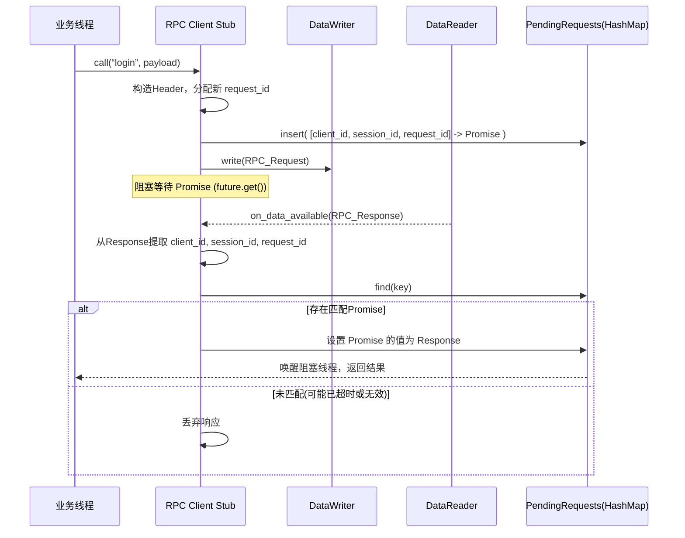
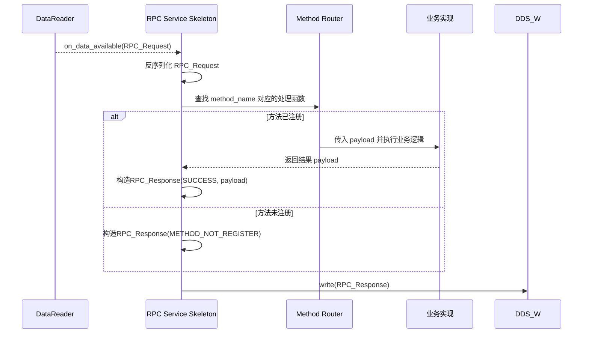

这是一份基于你提供的设计思路编写的详细设计文档。文档按照软件工程标准格式组织，重点阐述架构、通信协议、核心组件设计与交互流程。

---

# 基于Fast DDS的SOA框架详细设计文档

| 版本 | 日期 | 作者 | 变更描述 |
| :--- | :--- | :--- | :--- |
| V1.0 | 2026-07-07 | AI Assistant | 初始版本，定义核心通信架构与组件设计 |

## 1. 引言

### 1.1 编写目的
本文档旨在详细描述一个基于Fast DDS实现的、面向服务的中间件框架（SOA Framework）的设计细节。该框架使用请求/响应模式（RPC风格）实现服务间通信，对底层DDS协议进行封装，为上层业务提供简洁、类型安全的RPC调用接口。预期的读者包括系统架构师、高级开发工程师及后续维护人员。

### 1.2 设计目标
- **位置透明**：客户端无需关心服务端的物理位置，通过服务名即可发起调用。
- **多服务与多方法**：基于Topic实现服务发现与路由，通过Header实现方法级寻址。
- **并发与隔离**：支持多个客户端实例并发调用，通过`client_id`与`session_id`实现会话隔离。
- **可靠性**：提供超时、错误码等基本可靠性保障。
- **高性能**：利用Fast DDS的RTPS协议，实现高效、低延迟的数据分发。

## 2. 总体架构

框架分为三层：**传输层（Fast DDS）**、**核心框架层（RPC Stub/Skeleton）**、**业务层**。

-   **RPC Client (Stub)**：封装DDS的DataWriter（用于Request）和DataReader（用于Response），将本地调用透明地转换为远程调用。
-   **RPC Service (Skeleton)**：封装DDS的DataReader（用于Request）和DataWriter（用于Response），将接收到的请求分发给对应的业务方法，并返回结果。

组件交互全景图如下：
```mermaid
graph TD
    subgraph “客户端应用”
        A[业务代码] --> B[RPC Client Stub]
    end

    subgraph “服务端应用”
        C[业务接口实现] --> D[RPC Service Skeleton]
    end

    subgraph “Fast DDS 中间件”
        E[soa.rpc.ServiceA.request Topic]
        F[soa.rpc.ServiceA.response Topic]
    end

    B -- DataWriter --> E
    D -- DataReader --> E
    D -- DataWriter --> F
    B -- DataReader --> F
```

## 3. 通信协议设计

### 3.1 Topic命名与数据结构
遵循“一个服务，一对Topic”的原则。所有服务Topic均属于同一个DDS Partition，推荐命名为“SOA_DOMAIN”，以实现逻辑隔离。

**Topic定义示例（以ServiceA为例）：**
-   **请求Topic**：`soa.rpc.ServiceA.request`
-   **响应Topic**：`soa.rpc.ServiceA.response`

**IDL定义如下：**
```cpp
module fastdds_soa {

enum ErrorCode {
    SUCCESS,
    SERVICE_NOT_AVAILABLE,
    METHOD_NOT_REGISTER,
    REQUEST_TIMEOUT
};

struct RPC_Header {
    string method_name;  // 方法名，用于服务端路由
    string client_id;    // 客户端唯一标识，在客户端实例化时生成
    long session_id;     // 会话ID，标识客户端的一次完整生命周期
    long request_id;     // 请求ID，标识一次调用，用于匹配响应与请求
};

struct RPC_Request {
    RPC_Header header;
    string request_payload; // 序列化后的业务参数
};

struct RPC_Response {
    RPC_Header header;
    ErrorCode error_code;
    string response_payload; // 序列化后的业务返回值
};

};
```

### 3.2 头部字段语义与用途
-   **`method_name`**：
    -   **作用**：服务级路由键。ServiceA下可能有 `login`、`logout` 等多个方法，服务端凭此字段分发到对应的函数。
-   **`client_id`**：
    -   **作用**：客户端标识符。建议格式：`“client_” + UUID`。服务端可借此识别调用来源，实现差异化处理或会话保持。
-   **`session_id`**：
    -   **作用**：标识客户端实例的一次生命周期。客户端每次启动时生成一个新的`session_id`。用于处理因客户端异常重启而导致的陈旧请求。
-   **`request_id`**：
    -   **作用**：每次RPC调用的唯一序列号，单调递增。是客户端关联`Response`与`Request`的唯一凭证，也用于服务端的去重或幂等性保障。

## 4. 核心组件详细设计

### 4.1 RPC Client (客户端代理)

**职责**：提供 `call(method, params...) -> result` 的调用接口，管理底层DDS实体生命周期。

#### 4.1.1 生命周期管理
1.  **初始化**：
    -   创建`DomainParticipant`。
    -   根据服务名（如“ServiceA”）动态构建Topic：`soa.rpc.ServiceA.request` 和 `soa.rpc.ServiceA.response`。
    -   注册`RPC_Request`的TypeSupport，并创建`Publisher`和`DataWriter`。
    -   注册`RPC_Response`的TypeSupport，并创建`Subscriber`和`DataReader`。
    -   启动一个响应监听线程，等待匹配的`RPC_Response`。
2.  **销毁**：按序销毁DataReader, DataWriter, Publisher, Subscriber, Topic, Participant。

#### 4.1.2 同步调用核心流程
这是一个典型的“发送-等待-匹配”流程，是框架的核心。



**具体步骤：**
1.  **构建请求**：创建`RPC_Request`实例，填充`header`（method_name， client_id， session_id， 新生成的`request_id`），将业务参数序列化为`request_payload`。
2.  **注册悬垂调用**：在客户端维护的`std::unordered_map`中，以 `{client_id, session_id, request_id}` 三元组为Key，存入一个`std::promise<RPC_Response>`对象。
3.  **发送请求**：调用`DataWriter->write()`发送。
4.  **等待结果**：调用`promise`对应的`future.get()`，设定超时时间（如5秒）。
5.  **响应处理**：
    -   **正常**：监听线程收到匹配的`RPC_Response`，通过Key找到`promise`并`set_value`，唤醒业务线程。
    -   **超时**：`future.wait_for`超时后，从Map中移除对应的`promise`，并构造一个`ErrorCode`为`REQUEST_TIMEOUT`的`RPC_Response`返回。

#### 4.1.3 并发安全
-   `PendingRequests` Map的读写操作需使用互斥锁保护。
-   `request_id`使用`std::atomic<long>`保证线程安全的自增。

### 4.2 RPC Service (服务端骨架)

**职责**：等待请求、解析Header、路由分发、执行方法、返回响应。

#### 4.2.1 生命周期管理
1.  **初始化**：
    -   创建`DomainParticipant`。
    -   创建本服务`soa.rpc.ServiceA.request`的`Subscriber`和`DataReader`。
    -   创建本服务`soa.rpc.ServiceA.response`的`Publisher`和`DataWriter`。
    -   在内部完成`method_name`到业务处理函数的映射注册。
    -   设置`DataReader`的监听器，等待新数据。
2.  **销毁**：同客户端，按反序销毁所有DDS实体。

#### 4.2.2 请求处理流程


**具体步骤：**
1.  **请求监听**：`DataReader`的`on_data_available`回调被触发。
2.  **数据获取与解析**：调用`DataReader::takeNextData()`获取`RPC_Request`样本。
3.  **方法路由**：解析出`header.method_name`。在内部注册表中查找对应的可调用对象（如`std::function<void(const string& in, string& out)>`）。
    -   **命中**：将`request_payload`传给该函数，接收返回的`response_payload`，设置`error_code = SUCCESS`。
    -   **未命中**：设置`error_code = METHOD_NOT_REGISTER`。
4.  **构建并发送响应**：
    -   将原请求的`header`原封不动地拷贝到`RPC_Response`中（client_id, session_id, request_id 是关键匹配信息）。
    -   填充`error_code`和`response_payload`。
    -   调用对应的`DataWriter->write()`发布响应。

### 4.3 负载均衡与高可用设计（扩展点）
当前设计为一对一请求响应。可通过以下方式扩展为多实例：
-   **客户端策略**：服务端多个实例订阅同一个Request Topic。只有成功处理请求的实例发布响应。客户端可监听多个响应，采用“首个有效响应获胜”策略，丢弃后续重复响应。
-   **DDS QoS配置**：
    -   `RELIABILITY`：配置为`RELIABLE`，确保关键请求不丢失。
    -   `HISTORY`：配置为`KEEP_LAST`，深度根据系统吞吐量调整。
    -   `DURABILITY`：对于响应Topic，可配置为`VOLATILE`，避免离线客户端收到过期响应。

## 5. 关键场景流程示例

**场景：客户端调用“user.getProfile”**

1.  **客户端**：
    -   `client_id=“client_123”`， `session_id=5`， `request_id=1001`。
    -   生成`RPC_Request{ {“getProfile”, “client_123”, 5, 1001}, “{\”user_id\“:456}” }`。
    -   写入`soa.rpc.ServiceA.request`。
2.  **服务端**：
    -   收到请求，路由到`getProfile`的实现。
    -   执行业务逻辑，得到结果JSON：`“{\”name\“:\”Alice\“}”`。
    -   原样拷贝Header，生成`RPC_Response{ {“getProfile”, “client_123”, 5, 1001}, SUCCESS, “…” }`。
    -   写入`soa.rpc.ServiceA.response`。
3.  **客户端**：
    -   监听线程接收响应，通过(client_123, 5, 1001)匹配到PendingRequests中的`promise`。
    -   唤醒业务线程，解析`response_payload`，返回给业务层。

## 6. 错误处理

| 错误码 | 产生场景 | 处理方 |
| :--- | :--- | :--- |
| `SUCCESS` | 服务端成功处理请求。 | 客户端收到后进行正常的反序列化与业务逻辑。 |
| `SERVICE_NOT_AVAILABLE` | 客户端发现没有服务端匹配DataReader时（需通过DDS内置主题或快速超时断定）。 | 客户端可短暂休眠后重试。 |
| `METHOD_NOT_REGISTER` | 服务端路由表中找不到`method_name`。 | 客户端应检查方法名拼写或版本兼容性。 |
| `REQUEST_TIMEOUT` | 客户端在超时时间内未收到响应。 | 客户端本地生成该错误。可根据业务决定是否重试。 |

## 7. 代码组织与构建

### 7.1 目录结构建议
```
soa_framework/
├── include/
│   └── soa_rpc/
│       ├── rpc_client.h
│       ├── rpc_service.h
│       ├── rpc_header.h        // IDL生成的头文件
│       └── rpc_types.h
├── src/
│   ├── rpc_client.cpp
│   └── rpc_service.cpp
├── idl/
│   └── rpc_protocol.idl
└── examples/
    ├── service_a_main.cpp
    └── client_main.cpp
```

### 7.2 构建系统
-   使用CMake进行构建管理。
-   引入Fast DDS依赖。
-   使用Fast DDS Gen工具编译IDL文件，自动生成类型支持代码。

## 8. 设计优势与局限性

-   **优势**：
    -   **解耦性强**：Topic作为服务契约，天然解耦客户端与服务端。
    -   **类型安全**：通过IDL定义接口，编译期即可检查类型错误。
    -   **可扩展性**：轻松扩展至一对多（多服务实例），利用DDS的QoS策略可满足多种可靠性场景。
    -   **标准化**：完全基于OMG DDS标准，具备良好的互操作性。

-   **局限性**：
    -   **Topic爆炸**：服务数量与Topic成正比，大量服务时需规划好Topic命名与治理。可通过键（keyed Topic）进行优化，这在后续版本迭代中会是一个关键方向。
    -   **仅支持字符串序列化**：当前payload为string，需上层自行完成JSON/Protobuf等序列化。可考虑使用DDS XTypes的动态类型特性进行优化。