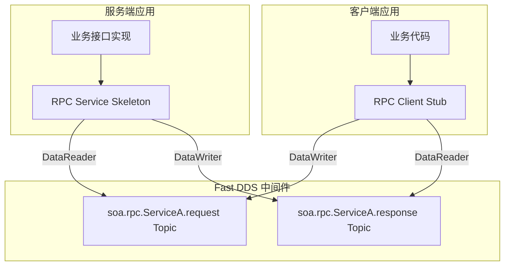
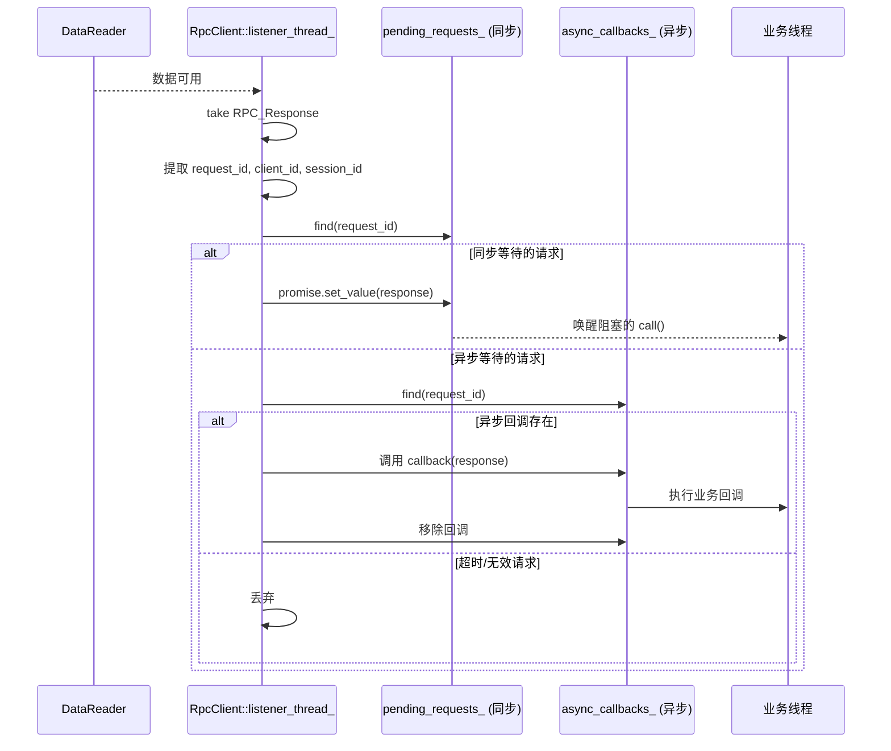
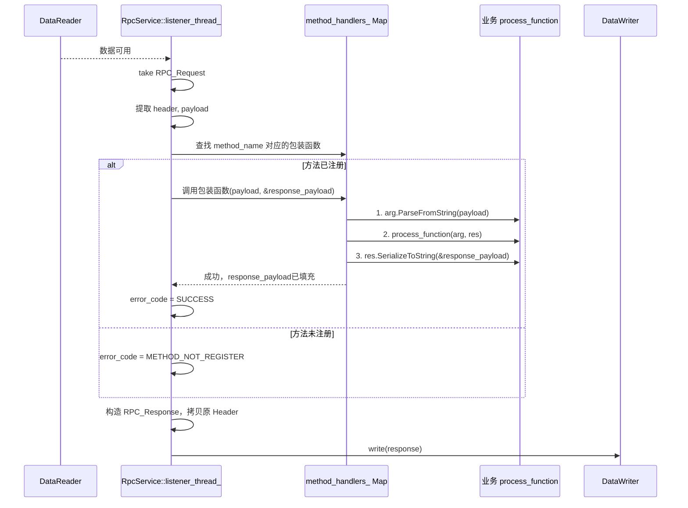

好的，根据你提供的接口定义和序列化要求，我对详细设计文档进行了更新和深化。

---

# 基于Fast DDS的SOA框架详细设计文档

| 版本 | 日期 | 作者 | 变更描述 |
| :--- | :--- | :--- | :--- |
| V2.0 | 2026-07-07 | AI Assistant | 补充RpcClient与RpcService的详细接口定义、模板函数实现、序列化策略及完整交互流程 |

## 1. 引言

### 1.1 编写目的
本文档旨在详细描述一个基于Fast DDS实现的、面向服务的中间件框架（SOA Framework）的设计细节。该框架使用请求/响应模式（RPC风格）实现服务间通信，对底层DDS协议进行封装，为上层业务提供类型安全、支持同步/异步调用的RPC接口。本文档将聚焦于接口定义、模板展开机制、序列化策略及内部实现细节。

### 1.2 设计目标
- **位置透明**：客户端无需关心服务端的物理位置，通过服务名即可发起调用。
- **多服务与多方法**：基于Topic实现服务发现与路由，通过Header实现方法级寻址。
- **类型安全与易用性**：利用C++模板和统一的序列化契约（`SerializeToString` / `ParseFromString`），让业务代码无需手动处理JSON/Protobuf，天然适配Protobuf类型。
- **并发与隔离**：支持多个客户端实例并发调用，通过`client_id`与`session_id`实现会话隔离，`request_id`实现请求级匹配。
- **同步与异步支持**：`call` 提供阻塞式同步调用语义；`async_call` 提供基于回调的异步调用语义。
- **可靠性**：提供超时、错误码等基本可靠性保障。
- **高性能**：利用Fast DDS的RTPS协议，实现高效、低延迟的数据分发。

## 2. 总体架构

框架分为三层：**传输层（Fast DDS）**、**核心框架层（RPC Stub/Skeleton）**、**业务层**。

- **RPC Client (Stub)**：封装DDS的DataWriter（用于Request）和DataReader（用于Response）。将本地调用透明地转换为远程调用，其核心是通过C++模板展开，自动完成 `Argument -> Request Payload` 和 `Response Payload -> Result` 的序列化与反序列化。
- **RPC Service (Skeleton)**：封装DDS的DataReader（用于Request）和DataWriter（用于Response）。将接收到的请求分发给对应的业务方法，其核心是通过 `register_method` 注册的 `process_function` 及模板展开，自动完成 `Request Payload -> Argument` 和 `Result -> Response Payload` 的转换。

组件交互全景图如下：


## 3. 通信协议设计

### 3.1 Topic命名与数据结构
遵循“一个服务，一对Topic”的原则。所有服务Topic均属于同一个DDS Partition，推荐命名为“SOA_DOMAIN”，以实现逻辑隔离。

**Topic定义示例（以ServiceA为例）：**
- **请求Topic**：`soa.rpc.ServiceA.request`
- **响应Topic**：`soa.rpc.ServiceA.response`

**IDL定义如下：**
```cpp
module fastdds_soa {

enum ErrorCode {
    SUCCESS,
    SERVICE_NOT_AVAILABLE,
    METHOD_NOT_REGISTER,
    REQUEST_TIMEOUT
};

struct RPC_Header {
    string method_name;  // 方法名，用于服务端路由
    string client_id;    // 客户端唯一标识，在客户端实例化时生成
    long session_id;     // 会话ID，标识客户端的一次完整生命周期
    long request_id;     // 请求ID，标识一次调用，用于匹配响应与请求
};

struct RPC_Request {
    RPC_Header header;
    string request_payload; // 序列化后的业务参数 (由Argument序列化而来)
};

struct RPC_Response {
    RPC_Header header;
    ErrorCode error_code;
    string response_payload; // 序列化后的业务返回值 (由Result序列化而来)
};

};
```

### 3.2 头部字段语义与用途
- **`method_name`**：
    - **作用**：服务级路由键。ServiceA下可能有 `login`、`logout` 等多个方法，服务端凭此字段分发到对应的函数。
- **`client_id`**：
    - **作用**：客户端标识符。由外部传入，确保全局唯一。服务端可借此识别调用来源，实现差异化处理或会话保持。
- **`session_id`**：
    - **作用**：标识客户端实例的一次生命周期。客户端每次`init()`时生成一个新的`session_id`。用于处理因客户端异常重启而导致的陈旧请求。
- **`request_id`**：
    - **作用**：每次RPC调用的唯一序列号，单调递增。是客户端关联`Response`与`Request`的唯一凭证，也用于服务端的去重或幂等性保障。

## 4. 核心组件详细设计

### 4.1 RpcClient（客户端代理）

#### 4.1.1 类定义
```cpp
namespace fastdds_soa {

class RpcClient {
public:
    // 构造函数：传入全局唯一的 client_id 和要调用的服务名
    RpcClient(const std::string& client_id, const std::string& service_name);

    // 初始化：创建DDS实体、启动监听线程
    void init();

    // 同步调用模板
    // 返回值: 0 成功, 非0 对应 ErrorCode
    template <typename Argument, typename Result>
    int call(const std::string& method_name, const Argument& arg, Result& res);

    // 异步调用模板
    template <typename Argument, typename Result>
    void async_call(const std::string& method_name, const Argument& arg,
            std::function<void(int, std::shared_ptr<Result>)> call_back);

private:
    // 等待/注册 悬垂请求
    void registerPendingRequest(long request_id, std::promise<RPC_Response> promise);
    void onResponseReceived(const RPC_Response& response);

    // DDS实体
    DomainParticipant* participant_;
    Publisher* publisher_;
    Subscriber* subscriber_;
    DataWriter* request_writer_;
    DataReader* response_reader_;

    // 客户端标识与会话
    std::string client_id_;
    long session_id_;
    std::atomic<long> request_id_generator_{0};

    // 服务名，用于构建Topic
    std::string service_name_;

    // 同步调用支持：存储 (request_id) -> promise的映射
    std::unordered_map<long, std::promise<RPC_Response>> pending_requests_;
    std::mutex pending_mutex_;

    // 响应监听线程
    std::thread listener_thread_;
    bool stop_listener_{false};
};

}   // namespace fastdds_soa
```

#### 4.1.2 生命周期管理
1. **构造**：存储`client_id`、`service_name`。不执行任何DDS操作。
2. **`init()`**：
    - 创建`DomainParticipant`。
    - 生成`session_id`（如使用时间戳+随机数）。
    - 根据`service_name`动态构建Topic：`soa.rpc.<service_name>.request` 和 `soa.rpc.<service_name>.response`。
    - 注册`RPC_Request`的TypeSupport，并创建`Publisher`和`DataWriter`（Topic: request）。
    - 注册`RPC_Response`的TypeSupport，并创建`Subscriber`和`DataReader`（Topic: response）。
    - 启动`listener_thread_`，循环监听`response_reader_`的数据可用事件。
3. **析构**：设置`stop_listener_=true`，等待`listener_thread_`结束。按序销毁DDS实体。

#### 4.1.3 同步调用模板实现 (`call`)
```cpp
template <typename Argument, typename Result>
int RpcClient::call(const std::string& method_name, const Argument& arg, Result& res) {
    // 1. 序列化Argument
    std::string serialized_arg;
    arg.SerializeToString(&serialized_arg);  // 依赖Argument类型的SerializeToString方法

    // 2. 构造RPC_Request
    RPC_Request request;
    request.header().method_name(method_name);
    request.header().client_id(client_id_);
    request.header().session_id(session_id_);
    long current_request_id = request_id_generator_++;
    request.header().request_id(current_request_id);
    request.request_payload(serialized_arg);

    // 3. 注册悬垂Promise
    std::promise<RPC_Response> response_promise;
    std::future<RPC_Response> response_future = response_promise.get_future();
    {
        std::lock_guard<std::mutex> lock(pending_mutex_);
        pending_requests_[current_request_id] = std::move(response_promise);
    }

    // 4. 发送请求
    request_writer_->write(request);

    // 5. 等待响应（带超时）
    auto status = response_future.wait_for(std::chrono::seconds(5));
    {
        std::lock_guard<std::mutex> lock(pending_mutex_);
        pending_requests_.erase(current_request_id); // 清理
    }

    if (status == std::future_status::timeout) {
        return static_cast<int>(ErrorCode::REQUEST_TIMEOUT);
    }

    // 6. 处理响应
    RPC_Response response = response_future.get();
    if (response.error_code() != ErrorCode::SUCCESS) {
        return static_cast<int>(response.error_code());
    }

    // 7. 反序列化Result
    if (!res.ParseFromString(response.response_payload())) { // 依赖Result类型的ParseFromString方法
        return -1; // 反序列化错误
    }

    return 0;
}
```

#### 4.1.4 异步调用模板实现 (`async_call`)
```cpp
template <typename Argument, typename Result>
void RpcClient::async_call(const std::string& method_name, const Argument& arg,
        std::function<void(int, std::shared_ptr<Result>)> callback) {
    // 1. 序列化Argument
    std::string serialized_arg;
    arg.SerializeToString(&serialized_arg);

    // 2. 构造RPC_Request
    RPC_Request request;
    request.header().method_name(method_name);
    request.header().client_id(client_id_);
    request.header().session_id(session_id_);
    long current_request_id = request_id_generator_++;
    request.header().request_id(current_request_id);
    request.request_payload(serialized_arg);

    // 3. 注册异步回调（在内部维护一个 callbacks_ 映射）
    {
        std::lock_guard<std::mutex> lock(pending_mutex_);
        async_callbacks_[current_request_id] = [callback](const RPC_Response& response) {
            auto result = std::make_shared<Result>();
            if (response.error_code() == ErrorCode::SUCCESS) {
                if (!result->ParseFromString(response.response_payload())) {
                    // 反序列化错误，回调传递特定错误码
                    callback(-1, nullptr);
                    return;
                }
            }
            callback(static_cast<int>(response.error_code()), result);
        };
    }

    // 4. 发送请求
    request_writer_->write(request);
}
```

#### 4.1.5 响应处理流程（listener_thread_）


**具体步骤：**
1. `listener_thread_` 线程阻塞等待 `response_reader_->wait_for_unread_message()`。
2. 收到消息后，调用 `response_reader_->take_next_sample()` 获取 `RPC_Response`。
3. 提取 `header` 中的 `client_id` 和 `session_id`，过滤掉不属于本客户端的消息（可能因DDS分区混入）。
4. 提取 `request_id`，加锁访问 `pending_requests_`：
    - 如果找到对应 `promise`，调用 `promise.set_value(response)` 唤醒同步调用的阻塞线程。
5. 加锁访问 `async_callbacks_`：
    - 如果找到对应回调函数，直接调用回调，并移除。
6. 如果两边都没找到，丢弃响应（可能已超时或被清理）。

### 4.2 RpcService（服务端骨架）

#### 4.2.1 类定义
```cpp
namespace fastdds_soa {

class RpcService {
public:
    // 构造函数：传入服务名
    RpcService(const std::string& service_name);

    // 注册一个RPC方法
    // process_function: 业务处理函数，接收反序列化后的Argument，将结果写入Result
    template <typename Argument, typename Result>
    void register_method(const std::string& method_name,
            std::function<void(const Argument&, Result&)> process_function);

    // 注销一个RPC方法
    void unregister_method(const std::string& method_name);

    // 启动服务：创建DDS实体，开始监听请求
    void start();
    // 停止服务：销毁DDS实体，停止监听
    void stop();

private:
    // 内部统一的请求处理入口
    void onRequestReceived(const RPC_Request& request);
    // 根据 method_name 查找并执行对应的处理函数
    void dispatchMethod(const std::string& method_name, const std::string& payload,
            std::string& response_payload, ErrorCode& error_code);

    // 存储注册的方法处理器，需要类型擦除
    // 使用 std::function<void(const std::string&, std::string&)> 存储一个包装函数
    std::unordered_map<std::string, std::function<void(const std::string&, std::string&)>> method_handlers_;

    // DDS实体
    DomainParticipant* participant_;
    Subscriber* subscriber_;
    Publisher* publisher_;
    DataReader* request_reader_;
    DataWriter* response_writer_;
    DataWriter* response_writer_;

    std::string service_name_;
    std::thread listener_thread_;
    bool stop_listener_{false};
};

}   // namespace fastdds_soa
```

#### 4.2.2 方法注册模板实现 (`register_method`)
```cpp
template <typename Argument, typename Result>
void RpcService::register_method(const std::string& method_name,
        std::function<void(const Argument&, Result&)> process_function) {
    // 类型擦除：将具体的 process_function 包装成一个接受和返回字符串的通用函数
    method_handlers_[method_name] = [process_function](const std::string& input_payload, std::string& output_payload) {
        // 1. 从 payload 反序列化出 Argument
        Argument arg;
        if (!arg.ParseFromString(input_payload)) {
            // 反序列化失败，不调用处理函数，由调用者设置错误码
            throw std::runtime_error("Failed to parse Argument from request payload");
        }

        // 2. 调用业务逻辑
        Result res;
        process_function(arg, res);

        // 3. 将 Result 序列化为 output_payload
        if (!res.SerializeToString(&output_payload)) {
            throw std::runtime_error("Failed to serialize Result to response payload");
        }
    };
}
```

#### 4.2.3 生命周期管理
1. **构造**：存储`service_name`。
2. **`start()`**：
    - 创建`DomainParticipant`。
    - 根据`service_name`动态构建Topic：`soa.rpc.<service_name>.request` 和 `soa.rpc.<service_name>.response`。
    - 注册`RPC_Request`的TypeSupport，创建`Subscriber`和`DataReader`（Topic: request）。
    - 注册`RPC_Response`的TypeSupport，创建`Publisher`和`DataWriter`（Topic: response）。
    - 启动`listener_thread_`，循环监听请求。
3. **`stop()`**：设置`stop_listener_=true`，等待线程结束，销毁DDS实体。

#### 4.2.4 请求处理流程


**具体步骤：**
1. **请求监听**：`listener_thread_`阻塞等待 `request_reader_->wait_for_unread_message()`。
2. **数据获取**：调用 `request_reader_->take_next_sample()` 获取 `RPC_Request`。
3. **分发与执行**：调用 `dispatchMethod`。
    - 加锁访问 `method_handlers_`。
    - 找到对应的包装函数后，传入 `request_payload`，得到 `response_payload`。
    - 设置 `error_code = SUCCESS`。
    - 若未找到，设置 `error_code = METHOD_NOT_REGISTER`。
4. **构建并发送响应**：
    - 将原请求的`header`原封不动地拷贝到`RPC_Response`中（client_id, session_id, request_id 是关键匹配信息）。
    - 填充`error_code`和`response_payload`。
    - 调用 `response_writer_->write(response)`。

## 5. 序列化策略详解

### 5.1 编译期契约
框架不强制要求 `Argument` 和 `Result` 继承自某个基类，而是采用C++模板的编译期多态（鸭子类型）。只要类型提供了以下两个方法，即可通过编译：
```cpp
bool SerializeToString(std::string* output) const;
bool ParseFromString(const std::string& data);
```

### 5.2 与Protobuf的天然适配
Google Protocol Buffers 生成的C++类完全满足上述契约：
```cpp
// 在 .proto 文件中定义
message LoginRequest {
    string username = 1;
    string password = 2;
}
message LoginResponse {
    string token = 1;
    int64 expiry = 2;
}
```

业务代码中使用时无需额外适配：
```cpp
// 客户端
LoginRequest req;
req.set_username("alice");
LoginResponse res;
client.call("login", req, res);

// 服务端
service.register_method<LoginRequest, LoginResponse>("login",
    [](const LoginRequest& req, LoginResponse& res) {
        // 业务逻辑
        res.set_token("xxxx");
    });
```

### 5.3 自定义类型支持
对于自定义的C++结构体，只需手动实现这两个方法：
```cpp
struct MyData {
    int id;
    std::string name;
    // 需要实现
    bool SerializeToString(std::string* output) const {
        // 例如用JSON库将其序列化为字符串
        return true;
    }
    bool ParseFromString(const std::string& data) {
        // 解析逻辑
        return true;
    }
};
```

## 6. 关键场景流程示例

**场景：客户端调用“ServiceA”的“getProfile”方法**

1. **准备**：
    - 服务端：`RpcService service("ServiceA");` -> `service.register_method<ProfileReq, ProfileRes>("getProfile", handler);` -> `service.start();`
    - 客户端：`RpcClient client("client_123", "ServiceA");` -> `client.init();`

2. **调用**：
    - 客户端调用：`client.call("getProfile", req_obj, res_obj);`
    - 客户端内部：`req_obj.SerializeToString()` -> 封装 `RPC_Request`（method="getProfile"， client_id="client_123"， session_id=5， request_id=1001） -> `write()`。

3. **处理**：
    - 服务端`listener_thread_`收到请求 -> 提取method_name="getProfile" -> 查找注册的包装函数。
    - 包装函数执行：`ProfileReq arg; arg.ParseFromString(payload);` -> `handler(arg, ProfileRes res_obj);` -> `res_obj.SerializeToString()`。
    - 封装 `RPC_Response`（拷贝原Header， error_code=SUCCESS） -> `write()`。

4. **响应**：
    - 客户端`listener_thread_`收到响应 -> 提取request_id=1001 -> 匹配到`promise` -> `set_value()`唤醒同步等待。
    - `call`函数继续：`res_obj.ParseFromString(response_payload)` -> 返回0。

## 7. 错误处理

| 错误码 | 产生场景 | 处理方 |
| :--- | :--- | :--- |
| `SUCCESS` | 服务端成功处理请求。 | 客户端收到后进行正常的反序列化与业务逻辑。 |
| `SERVICE_NOT_AVAILABLE` | 客户端在`init`或调用时发现无对端DataReader（需通过DDS内置主题或超时判断）。 | 客户端可休眠后重试或向上层报错。 |
| `METHOD_NOT_REGISTER` | 服务端路由表中找不到`method_name`。 | 客户端应检查方法名拼写或版本兼容性。 |
| `REQUEST_TIMEOUT` | 客户端在超时时间内未收到响应。 | 客户端本地生成该错误。可根据业务决定是否重试。 |
| `-1` (反序列化失败) | 客户端/服务端在`ParseFromString`时失败，通常是契约不匹配。 | 立即向上层报错，检查协议定义的一致性。 |

## 8. 代码组织与构建

### 8.1 目录结构建议
```
soa_framework/
├── include/
│   └── fastdds_soa/
│       ├── rpc_client.h
│       ├── rpc_service.h
│       ├── rpc_types.h      // IDL生成
│       └── rpc_protocol.h   // IDL生成
├── src/
│   ├── rpc_client.cpp
│   └── rpc_service.cpp
├── idl/
│   └── rpc_protocol.idl
└── examples/
    ├── service_main.cpp
    └── client_main.cpp
```

### 8.2 构建系统
- 使用CMake构建。
- 使用Fast DDS Gen工具编译`rpc_protocol.idl`，生成`rpc_types.h`等支持文件。
- `rpc_client.h` 和 `rpc_service.h` 包含模板实现，无需链接额外的库（仅依赖Fast DDS库）。

## 9. 设计优势与后续演进

- **优势**：
    - **极简用户接口**：业务开发者只需关注Protobuf定义和业务逻辑，框架自动处理通信与序列化。
    - **类型安全**：通过模板和编译期多态，类型错误在编译期即可暴露。
    - **高可扩展性**：支持自定义序列化，不绑定Protobuf。异步模式轻松应对高吞吐场景。
    - **标准化与解耦**：基于DDS，天然支持发现、QoS配置，客户端与服务端完全解耦。

- **后续演进方向**：
    - **性能优化**：引入对象池减少`shared_ptr`的频繁分配，支持零拷贝序列化（如FlatBuffers/Cap'n Proto适配）。
    - **服务治理**：增加基于DDS Content Filter Topic的精细化路由，以及负载均衡策略（多服务端实例时客户端的选择算法）。
    - **QoS外部配置化**：允许业务侧通过配置文件设定每个方法的超时时间、可靠性级别等。