# Fast DDS v2.8.2 数据流程代码解析

本篇文章基于Fast DDS v2.8.2版本，官方的发布端(publisher)和订阅端(subscriber)示例程序，来梳理FastDDS源码实现中的数据收发流程。

## 概览

首先，我们给出基于Fast DDS库应用的架构图，便于理解Fast DDS库的概貌。

**基于Fast DDS库应用的架构图**

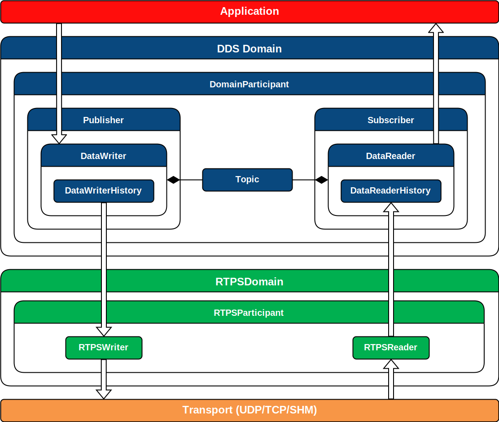

从上图我们可以看到，基于Fast DDS架构的应用程序主要分为四层：
- 应用层：在 分布式系统 中使用 Fast DDS API 实现通信的用户应用程序。
- Fast DDS层：DDS通信中间件的实现。 它允许部署一个或多个 DDS 域，其中在同一域中的 DomainParticipants 通过 发布(Publish)/订阅(Subscribe) Topic 来交换消息。
- RTPS层：实时发布订阅 (RTPS) 协议的实现 与 DDS 应用程序的互操作性。 该层充当传输层的抽象层。
- 传输层：Fast DDS 可基于各种传输协议收发数据, 例如不可靠的运输协议(UDP),可靠 传输协议(TCP)或共享内存传输协议(SHM)。

## 示例代码

下面介绍一下 fastdds 官网给出的示例代码，我们后面会根据这个示例来逐步分析fastdds 的源码：  
官方给出了发布端(publisher)和订阅端(subscriber)示例程序，前者是发送端程序，后者是接收端程序。  
如果跨网络通信，则两个程序运行在不同的机器上（两台机器在同一个局域网中）。  
当然发布端(publisher)和订阅端(subscriber)程序也可以运行在同一台设备上，这时候就是使用了dds的跨进程通信（共享内存）的能力。  

官方的发布(publishe)和订阅(subscribe)示例程序链接：
[Writing a simple C++ publisher and subscriber application](https://fast-dds.docs.eprosima.com/en/v2.8.2/fastdds/getting_started/simple_app/simple_app.html)  
<https://fast-dds.docs.eprosima.com/en/v2.8.2/fastdds/getting_started/simple_app/simple_app.html>  
附录也会列出完整的示例源代码。

下图给出了发布端（Publisher）和订阅端（Subscriber）示例程序的Fast DDS API调用流程。

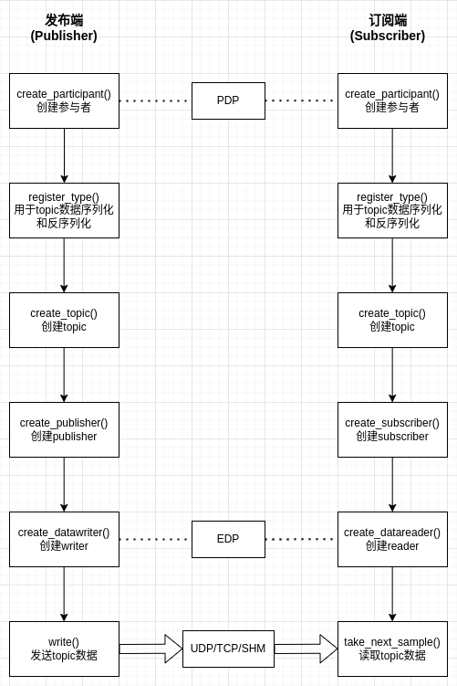

发布端（Publisher）的API流程如下：

- 第一步创建了DomainParticipant对象，这个对象包含很多内容，包括RTPSParticipant对象，可以理解为Fast DDS里的根对象，管理其它所有的子对象。
- 第二步调用了TypeSupport 的register_type，这里面主要是为了之后数据传输的过程中数据解析使用，约定传输数据的数据结构。如果type 不对，数据解析就无法进行。示例代码里对应的是HelloWorldPubSubType（通过HelloWorld.idl文件描述生成）
- 第三步创建了Topic 对象，topic 就是通信的主题，只有在同一topic下才能互相通信。
- 第四步创建的Publisher对象，是在DomainParticipant内部创建的，DomainParticipant内部可以包含0到多个Publisher和Subsciber，Publisher对象是消息的发布者，Subsciber对象是消息的接收者。
- 第五步创建 DataWriter 对象。
- 第六步通过 DataWriter 对象的write()接口发送数据，前提是有匹配的订阅端。

订阅端（subscriber）的API流程如下：

- 第一步创建了DomainParticipant对象，这个对象包含很多内容，包括rtpsparticipant对象，可以理解为Fast DDS里的根对象，管理其它所有的子对象。
- 第二步调用了TypeSupport 的register_type，这里面主要是为了之后数据传输的过程中数据解析使用，约定传输数据的数据结构。如果type 不对，数据解析就无法进行。示例代码里对应的是HelloWorldPubSubType（通过HelloWorld.idl文件描述生成）
- 第三步创建了Topic 对象，topic 就是通信的主题，只有在同一topic下才能互相通信。
- 第四步创建的Subscriber对象，是在DomainParticipant内部创建的
- 第五步创建DataReader对象，并且注册了DataReaderListener的子类
- 第六步在DataReader收到数据时，会回调on_data_available()通知到上层应用，上层应用再通过DataReader的take_next_sample()接口读取数据。

我们主要介绍发布端（Publisher）和订阅端（Subscriber）之间的数据传输在Fast DDS库中的代码实现。所以Fast DDS库中，发布端（Publisher）和订阅端（Subscriber）的初始化部分代码（以及PDP和EDP协议流程）不会在本文中描述。

## 发布端（Publisher）在Fast DDS库中的数据发送流程

为了后续更容易的看懂函数调用的时序图，我们先给出Fast DSS库中跟发布端相关的类的关系图。

**发布端(publisher)涉及的类的静态关系图**

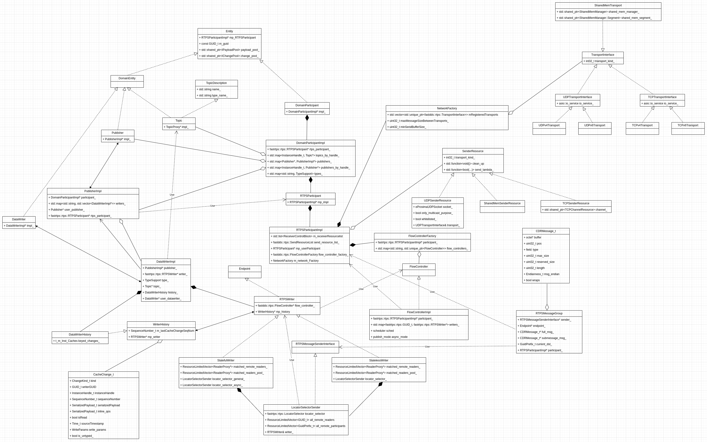

粗略看一下，有30多个类，这还只是跟发布端(publisher)相关的主要类，我们可以把上图中的类划分为：
- DDS域的类：
    + DomainParticipant和DomainParticipantImpl
    + Topic和TopicDescription
    + Publisher和PublisherImpl
    + DataWriter和DataWriterImpl
- RTPS域的类：
    + RTPSParticipant和RTPSParticipantImpl
    + RTPSWriter及其子类：StatefulWriter、StatelessWriter
    + 缓存WriterHistory和CacheChange_t 
    + RTPSMessageSenderInterface及其子类：LocatorSelectorSender
    + 网络传输相关的类：NetworkFactory，TransportInterface及其子类：UDPTransportInterface、UDPv4Transport、UDPv6Transport、TCPTransportInterface、TCPv4Transport、TCPv6Transport、SharedMemTransport
    + 发送相关的类：SenderResource及其子类：UDPSenderResource、TCPSenderResource、SharedMemSenderResource
    + 流控相关的类：FlowControllerFactory，FlowController及其子类：FlowControllerImpl
    + 消息相关的类：RTPSMessageGroup和CDRMessage_t

DSS域的类大部分都使用了Impl惯用法，我理解因为DSS域中的大部分类都是应用层（Applilcation）能看到的接口类，所以桥接模式可以减少耦合，避免内部定义（头文件）的暴露。  

而RTPS域的类虽然众多，但在发布端(publisher)扮演的角色其实就分类两大类：
- 数据组包
- 数据发送

其中WriterHistory类作为数据传输缓存很重要：

**WriterHistory 核心功能**

- **存储已发布的数据样本**：保存写入但尚未被所有订阅者确认的样本
- **支持样本回收**：当样本被所有订阅者确认后，可以回收内存
- **提供重传机制**：当检测到订阅者丢失数据时，可以从历史记录中重新发送
- **管理历史深度**：根据配置的历史深度限制，自动移除旧的样本

具体每个类的作用，我会在下面的时序图中，分别介绍。

**发布端(publisher)数据发送时序图**

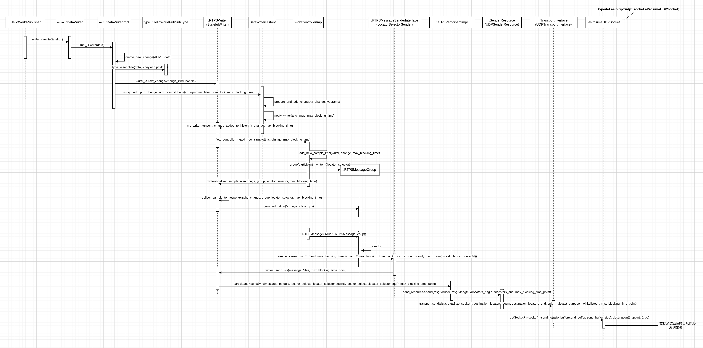

上图是我根据代码调用栈，将我认为关键的函数调用放入时序图，看上去好像很复杂，其实干的就是中间件数据发送的标准动作：序列化、组包、发送。  
接下来我将分段介绍整个发送流程。

**1. 序列化**

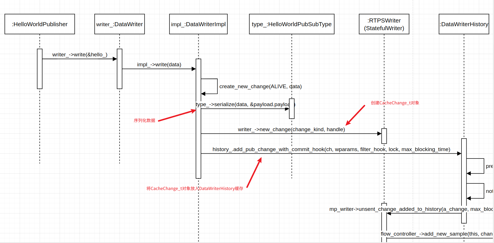

数据发送从`writer_->write(&hello_)`开始，对应于HelloWorldPublisher.cpp中的如下代码：

```cpp
    //!Send a publication
    bool publish()
    {
        if (listener_.matched_ > 0)
        {
            hello_.index(hello_.index() + 1);
            writer_->write(&hello_);
            return true;
        }
        return false;
    }
```

- write调用被DataWriter类转发給DataWriterImpl类
- 通过HelloWorldPubSubType类完成数据序列化
- 通过RTPSWriter类创建CacheChange_t对象，并将序列化的数据保存在其中。
- 将CacheChange_t对象放入DataWriterHistory缓存。

**2. 组包**

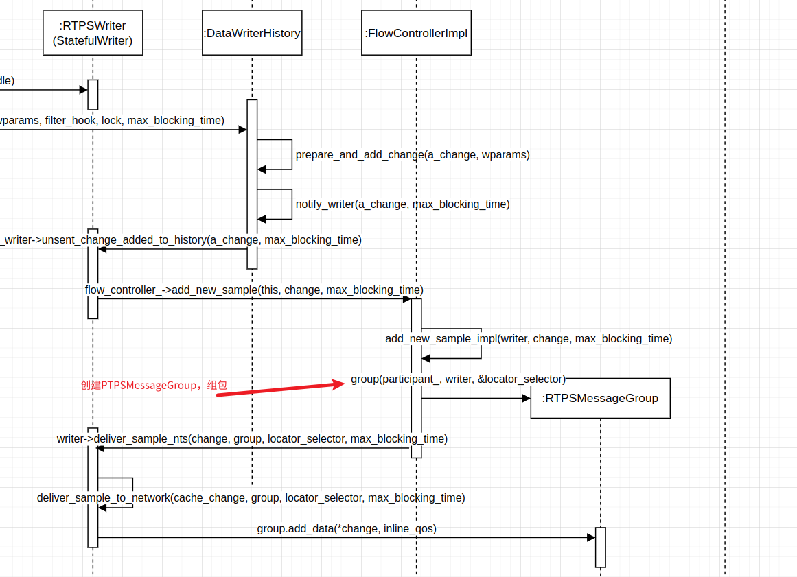

这块的流程看上去最为复杂，各种来回调用，其实最关键的就是为了创建RTPSMessageGroup对象，进行组包，而FlowControlImpl类的主要作用就是为了限制发送速率和支持 QoS 策略。

**3. 数据发送**

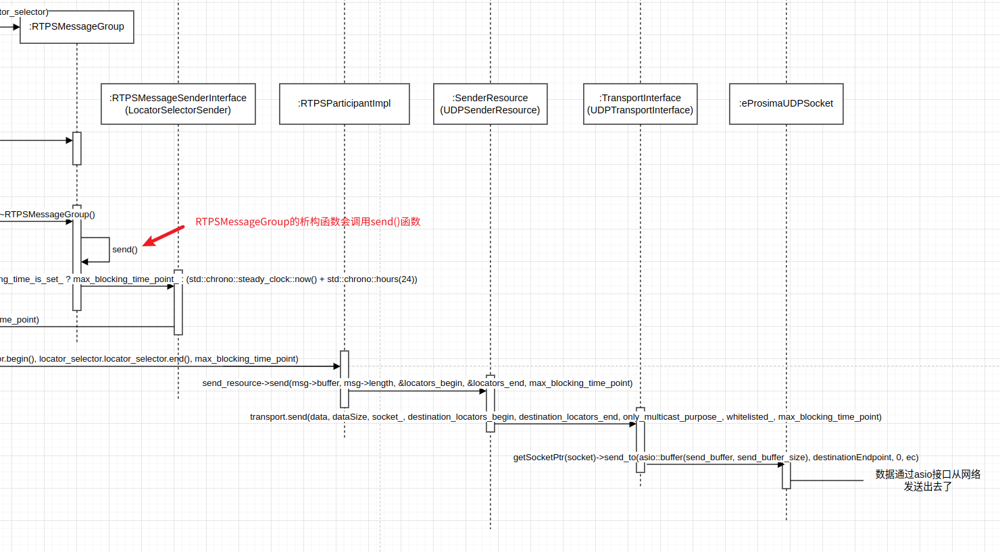

RTPSMessageGroup类会在析构函数中调用send函数，通过RTPSMessageSenderInterface(LocatorSelectorSender)对象，沿着  
- RTPSWriter(StatefulWriter)  
- RTPSParticipantImpl  
- SenderResource(UDPSenderResource)  
- TransportInterface(UDPTransportInterface)  
- eProsimaUDPSocket

最终通过UDP socket发送到对端。

这里要说明的一点是LocatorSelectorSender类，这个类是 **Fast DDS** 中用于 **管理数据发送的目标网络定位器（Locator）选择策略** 的核心辅助类。  
它负责在发送 RTPS 消息时，从多个可用的网络定位器（如 UDP、TCP、SHM 等）中选择最优的传输路径，以提高通信效率和可靠性。  
如果匹配的订阅端(subscriber)程序是在同一主机，那么默认就会通过共享内存（SHM）方式发送，如果匹配的订阅端(subscriber)程序是在局域网里的另外一台主机上，那么默认就会通过UDP方式发送。  
本篇文章主要是介绍通过UDP通信的调用过程。

## 订阅端（Subscriber）在Fast DDS库中的数据接收流程

为了后续更容易的看懂函数调用的时序图，我们先给出Fast DSS库中跟发布端相关的类的关系图。

**订阅端（Subscriber）涉及的类的静态关系图**

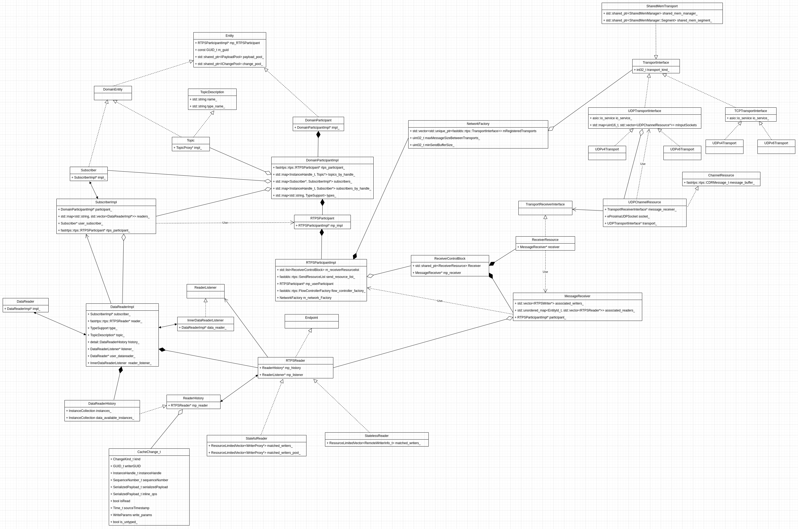

订阅端(subscriber)跟发布端(publisher)有很大一部分类是公共的，另外一部分类是对应关系，即Publisher vs Subscriber，writer vs reader等，我们按照之前类似的方式将上图的类划分为：
- DDS域的类：
    + DomainParticipant和DomainParticipantImpl
    + Topic和TopicDescription
    + Subscriber和SubscriberImpl
    + DataReader和DataReaderImpl，以及相关的listener类（观察者模式）：InnerDataReaderListener（ReaderListener的子类）
- RTPS域的类：
    + RTPSParticipant和RTPSParticipantImpl
    + RTPSReader及其子类：StatefulReader、StatelessReader
    + 缓存ReaderHistory和CacheChange_t 
    + 网络传输相关的类：NetworkFactory，TransportInterface及其子类：UDPTransportInterface、UDPv4Transport、UDPv6Transport、TCPTransportInterface、TCPv4Transport、TCPv6Transport、SharedMemTransport
    + 消息接收相关的类：ReceiverControlBlock、ReceiverResource、MessageReceiver、UDPChannelResource

缓存ReaderHistory的作用和WriterHistory类似，只不过是用在数据接收端：
- 存储 DataReader 接收到的所有数据样本（CacheChange_t），形成接收历史记录。
- 维护数据的 顺序性 和 完整性（特别是在可靠传输模式下）。

在订阅端(subscriber)的RTPS层里，最主要的两个类应该就是ReceiverResource 和 MessageReceiver了。

**ReceiverResource** 是 网络接收资源的封装，主要功能包括：
1. **管理底层传输层资源**  
   - 绑定到特定的传输协议（如 UDP、TCP、共享内存等）。
   - 监听指定的网络端口，等待数据到达。
2. **接收原始网络数据**  
   - 从传输层读取字节流。
3. **委托消息解析**  
   - 将接收到的数据传递给关联的 MessageReceiver 进行解析。

**MessageReceiver** 是 RTPS 消息的解析处理器，主要功能包括：
1. **解析 RTPS 消息**  
   - 解码接收到的二进制数据，提取 RTPS 子消息（如 DATA、HEARTBEAT、ACKNACK 等）。
2. **分发给对应的 RTPS 端点**  
   - 根据消息中的 GUID，将数据传递给匹配的 RTPSReader 或 RTPSWriter。
3. **处理消息逻辑**  
   - 执行订阅匹配、可靠性控制（如 ACK 回复）等。

两者协作完成 **"接收字节流 → 解析 RTPS 消息 → 触发业务逻辑"** 的完整链路

下面根据时序图，我们看一下订阅端(Subscriber)数据接收的整个流程。

**订阅端(Subcriber)数据接收时序图（1）**

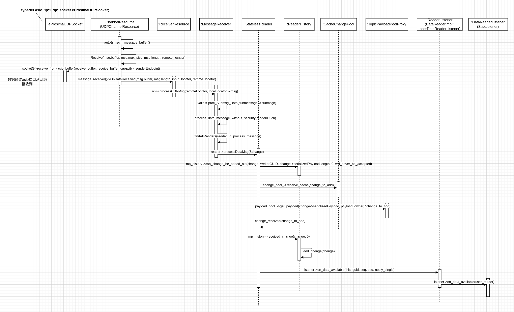

**订阅端(Subcriber)数据接收时序图（2）**

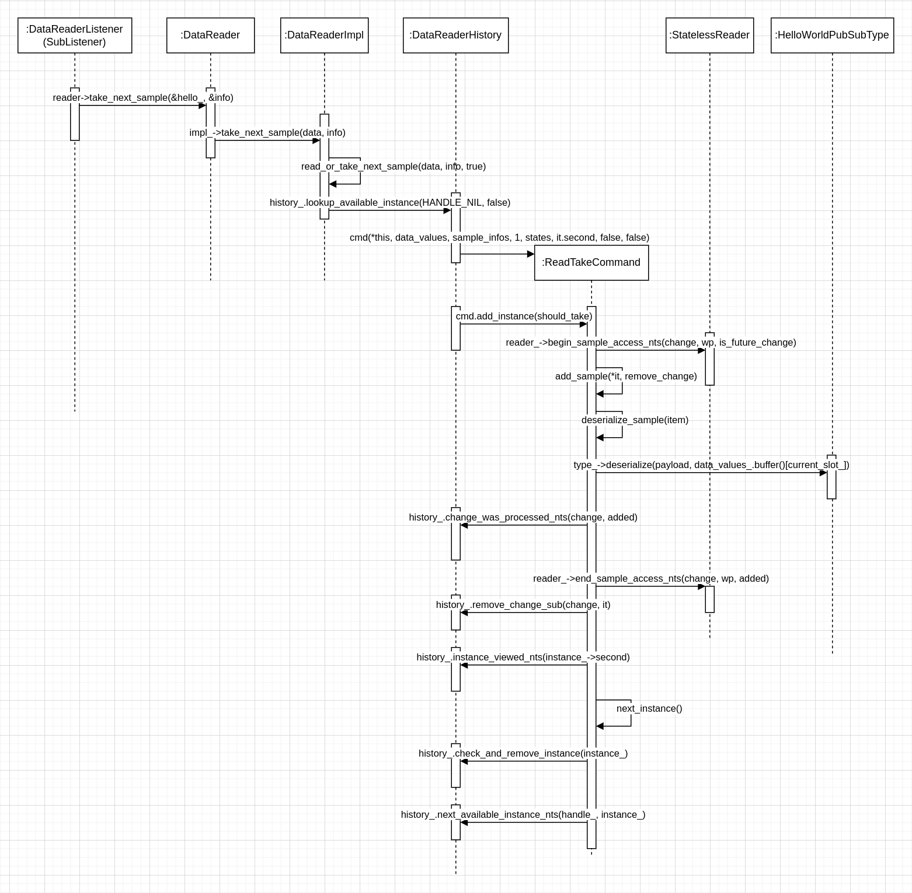

可能大家会好奇，为什么订阅端(Subcriber)的时序图会被拆成两个呢？其实我们看了示例代码就会很清楚了。

作为网络通信程序，订阅端(Subcriber)的处理逻辑应该和发布端(Publisher)正好相反，也就是：
- 数据接收
- 数据解包
- 反序列化

而Fast DDS的订阅端(Subcriber)数据接收是由RTPS层的接收线程完成的，然后RTPS层完成数据接收和数据解包后，通过回调函数（listener）的方式通知上层应用，然后上层应用再通过相应的接口，从缓存里读取和反序列化数据。

```cpp
    class SubListener : public DataReaderListener
    {
    public:
        // ...
        void on_data_available(
                DataReader* reader) override
        {
            SampleInfo info;
            if (reader->take_next_sample(&hello_, &info) == eprosima::fastrtps::types::ReturnCode_t::RETCODE_OK)
            {
                if (info.valid_data)
                {
                    samples_++;
                    std::cout << "Message: " << hello_.message() << " with index: " << hello_.index()
                              << " RECEIVED." << std::endl;
                }
            }
        }

        HelloWorld hello_;

        std::atomic_int samples_;

    }
```

上面的代码中，SubListener::on_data_available就是RTPS层会回调的函数，然后`reader->take_next_sample(&hello_, &info)`这行代码就是上层应用从缓存中读取和反序列化的过程。  
所以我们的序列图就自然的以SubListener::on_data_available函数为分界线，序列图(1)描述的就是数据接收和数据解包的过程，序列图(2)描述的就是上层应用主动读取和反序列化的过错。

接下来我们逐步说明订阅端(Subcriber)的时序图

**1. 数据接收**

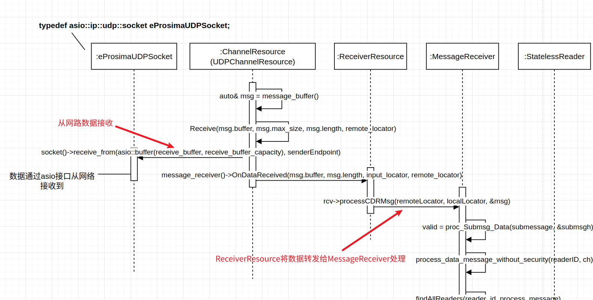

首先是UDPChannelResource::perform_listen_operation这个函数（图中没体现）是作为一个独立线程函数运行的，它里面是个无限循环，不断的调用socket的receive_from函数，从网络获取原始数据，然后把message_buffer发给ReceiverResource，而ReceiverResource将网络字节流转成CDRMessage_t对象，再传给MessageReceiver做后续处理。  
这段流程主要完成数据接收和传给数据处理模块的工作。

**2. 数据解包和分发**


上图流程主要是两大块：
- MessageReceiver解包，提取submessage的过程
- MessageReceiver将数据分发给RTPSReader的过程

经过这两步，数据就从DRMessage_t对象 转变成 CacheChange_t对象。

**3. 通知上层应用读取数据**

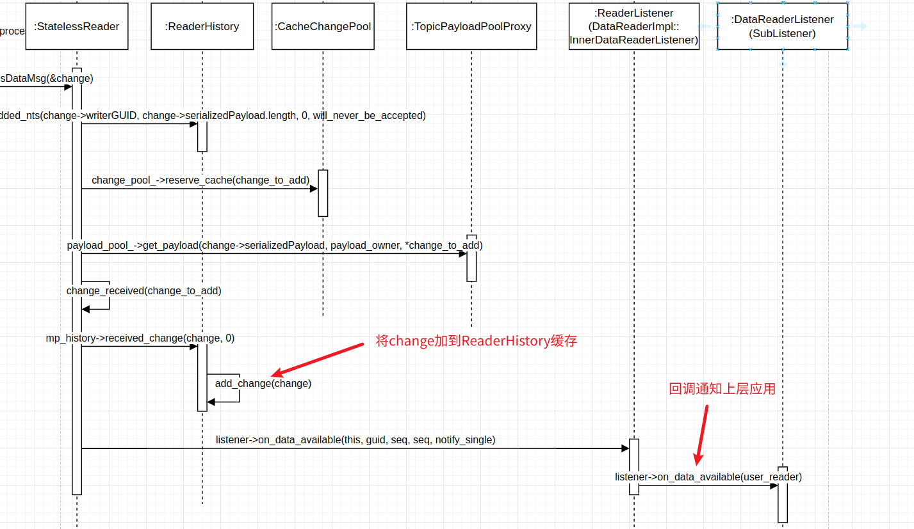

上图流程主要是两大块：

- RTPSReader将CacheChange_t对象缓存到ReaderHistroy中
- 回调通知上层应用

然后上层应用就可以通过`reader->take_next_sample(&hello_, &info)`语句从缓存里读取并反序列化数据。

**4. 读取和反序列化数据**


上图流程主要是两大块：

- 从ReaderHistroy中读取缓存数据，创建ReadTakeCommand
- ReadTakeCommand完成数据反序列化，并从ReaderHistory中删除已读的缓存数据

至此，整个订阅端(Subcriber)程序接收流程基本完成。

### 参考文档：
- https://fast-dds.docs.eprosima.com/en/v2.8.2/fastdds/getting_started/simple_app/simple_app.html
- https://fast-dds.docs.eprosima.com/en/v2.8.2/fastdds/library_overview/library_overview.html#architecture
